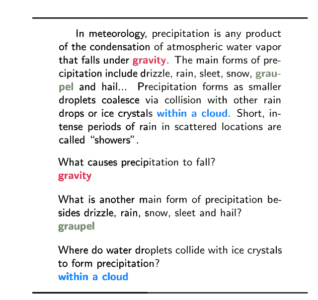
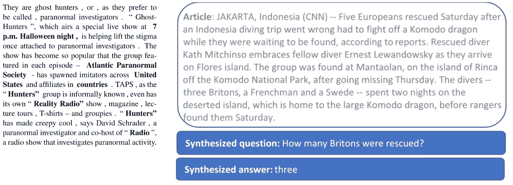

# 机器学习理解文本的能力有多强？

> 原文：<https://thenewstack.io/good-machine-learning-reading-understanding-documents/>

计算机阅读和理解文档的能力有多强？

当微软最近宣布在[斯坦福问答数据集](https://rajpurkar.github.io/SQuAD-explorer/) (SQuAD)上[已经与人类表现](https://blogs.microsoft.com/ai/microsoft-creates-ai-can-read-document-answer-questions-well-person/)相匹配时，这是机器阅读理解(MRC)的一个重要里程碑。紧随其后的是阿里巴巴，获得了类似的分数，几天后被哈尔滨工业大学和中国人工智能公司科大讯飞的系统击败。

这与我们在语音和图像识别方面看到的定期改进是一样的，像往常一样，开发人员可以期待看到一些技术打包在开源工具和商业 API 中供他们使用。

微软尚未公布 R-NET+系统的细节，但一个名为 R-NET 的早期版本此前在 SQuAD 上取得了创纪录的成绩。这是一个基于注意的门控循环网络，具有自我匹配阶段。递归神经网络使用单词嵌入来表示问题和为这些问题提供答案的文档(它挑选出神经网络应该注意的短语)，具有门控机制，该机制对文档的不同部分进行评分，以强调与答案相关的段落，并忽略不相关的段落。

递归网络使用节点之间的有向连接作为网络内部的存储器，但实际上，它们仅存储有限数量的上下文。这意味着网络正在处理的一个可能的答案可能不包括文档中包含答案线索的所有部分。自匹配层使用神经网络将源文档中的每个单词与文档的其余部分以及问题进行匹配，以确保所有可用信息都用于预测文档中的哪些单词是最佳答案。

## 读书还是理解？

但这一声明也引起了一些反弹，因为“阅读理解”这个术语听起来很像“阅读一份文件并像人一样理解它。”这可能是这个领域的长期目标，但这不是班数据集所衡量的。阅读理解在搜索和其他领域有非常广泛的用途，但现在它更像你可能记得的学校里的考试，你必须阅读一段文字，然后用它包含的信息回答问题。

SQuAD 有超过 100，000 个问题，所有这些问题都由 536 篇维基百科文章之一的一段文本来回答；这些问题是由机械土耳其人的工作人员提出的，他们被要求根据一篇文章的一小段提出尽可能多的问题。与以前的数据集相比，这是一个很大的改进，以前的数据集要小得多，或者采用了更简单的多项选择或填空方法，它确实需要逻辑推理来从源段落中推断答案(如将一个句子中的名字与下一个句子中的代词连接起来)，但它仍然不能反映用户向搜索引擎和智能代理提出的开放式问题。

SQuAD 问题也没有缩写或拼写错误，MRC 系统不必查看多个文档甚至文档中的多个段落来得出答案，因此它们不会合成信息或重写信息以使其与问题匹配。维基百科上的源文档也是干净的、高质量的文章；并非所有系统需要读取的文件都那么清晰。在小队文本中总会有答案，所以模型可以使用一些技巧，比如在一篇文章中选择唯一的日期，如果问题以“什么时候”开始的话这意味着它没有测试一个模型是否能够确定是否有足够的信息来回答一个特定的问题。

SQuAD 是成对的问题和答案以及它们来自的维基百科文本片段的数据集；这个例子就是为什么阿里巴巴自然语言处理首席科学家罗声称“像‘什么导致了雨’这样的客观问题现在可以由机器以很高的准确度来回答。”

正如 Maluuba 团队的高级研究科学家 Adam Trischler 向我们解释的那样，“SQuAD 涵盖了包括科学、政治和医学信息在内的一系列主题，这是一个很好的报道，但语言与你在小说或新闻文章中找到的非常不同，所以在 SQuAD 上训练的模型在概括(比如阅读新闻)方面有一些限制。”

他说，新闻搜索是一个特别有趣的领域。“我们看到问题回答和生成真正适用的地方之一是新闻等更短暂的大容量信息源。维基百科中有大量的知识，但更多的是静态的。新闻每天都在变化，因此机器理解阅读问答方法可以产生很大影响，因为它可以快速筛选新信息。”

Maluuba 团队还发布了基于用户和旅游专家之间对话的框架数据集，其中包含酒店、航班和目的地的详细信息，作为测试智能代理的一种方式，智能代理可以回答更复杂的问题，作为正在进行的对话的一部分，目标可能会根据他们提供的信息而改变。有效的 MRC 系统将需要处理广泛的数据源，并处理以不同形式出现的问题，因此多个数据集是提高理解模型的关键。

## 学会问问题

像往常一样，拥有大型数据集进行训练和测试有助于研究人员提高阅读理解模型的性能——但创建这些数据集既慢又昂贵，这使得在没有好的测试数据集可供学习的主题中使用机器阅读变得更加困难。

> “像‘什么导致了降雨’这样的客观问题现在可以由机器以很高的准确度来回答。”——阿里巴巴的罗是

微软研究院的另一个团队正在使用迁移学习为像新疾病这样的领域建立 MRC 系统，其中有大量的源文档，但我们没有现有的手动标记的问题和答案数据集来进行训练。 [SynNet](https://www.microsoft.com/en-us/research/publication/two-stage-synthesis-networks-transfer-learning-machine-comprehension/) 是一个两阶段合成网络，它首先学习文档中有趣的信息看起来像什么——关键事实、命名实体和经常使用的语义概念——将这些合成到答案中，然后学习使用双向长短期记忆网络生成“有趣”信息可以回答的自然语言问题。一旦经过训练，SynNet 就可以应用于一个新的领域，在这个领域中，它可以生成用于训练 MRC 系统的问题和答案。在 SQuAD 上训练 SynNet，然后将它与 NewsQA 一起使用，结果几乎与专门在 NewsQA 上训练的系统一样好。

微软[去年收购的 Maluuba 团队](https://blogs.microsoft.com/blog/2017/01/13/microsoft-acquires-deep-learning-startup-maluuba-ai-pioneer-yoshua-bengio-advisory-role/)使用来自 DeepMind Q &的 CNN 文章创建了拥有 120，000 个 Q & A 对的 NewsQA 数据集，该数据集包含不同人编写的问题和答案，并由其他人验证。还是那句话，不是所有的问题都有答案，所以系统在没有足够信息的时候必须识别；那些确实需要推理才能回答的；这包括综合来自多个句子的信息，识别使用同义词解释问题的答案，以及使用一般知识从不完整的信息或相关概念中推断答案。

像往常一样，拥有大型数据集进行训练和测试有助于研究人员提高阅读理解模型的性能——但创建这些数据集既慢又昂贵，这使得在没有好的测试数据集可供学习的主题中使用机器阅读变得更加困难。

有趣的事实和 SynNet 的综合问答。

Maluuba 团队还在研究教学系统，以提出更好、更有信息量的问题，使用强化学习，奖励集中在让问题变得更好的方面——比如流利的措辞。一个能提出好问题的系统需要更深层次的推理能力，因为它既要理解源文档，又要能生成自然语言问题。Trischler 告诉我们，它还必须知道什么时候一个问题的答案不能被一个文档完全回答，它需要问更多的问题或寻找更多的来源。

“有时你要找的信息不在你面前的文件中；你的知识库是不完整的，其中缺少信息。我们想解决当可用知识不足时的问题:你如何改进或增加它？你探索你知道的和不知道的极限，你理解的和需要进一步澄清的。作为人，如果有我们不知道的事情，我们首先做的事情之一就是问问题:问问题是我们用来填补空白和增加知识的基本行为。我们设想同样的事情会发生在识字机器上，”特里施勒说。

这也意味着 MRC 系统可以跨多个文档工作。“如果我是一名代理，我收到用户的一个问题，也许我找到了一个信息来源，但当我作为一台机器阅读它时，也许有些事情仍然不清楚，所以我想问更多的问题，也许这将我引向另一个文档，我可以参考它来回答更复杂的问题。”

## **识字机器**

由于语言的模糊性和复杂性，机器阅读比像图像识别这样的识别任务更困难。MRC 系统必须理解同义词和上下文(茶和咖啡都是热饮，Java 可以是咖啡种植区或编程语言，同一文档中提到的卡布奇诺和一杯咖啡可能是同一件事)。

这意味着使用源文档中可能没有的背景信息，以及从多个短语中合成信息(这意味着解析句子结构并跨句子连接名词、代词和动词)，并将其总结为与问题匹配的答案。

但是，如果像“为什么下雨”这样的问题的答案包括云和重力，那么系统就不必能够解释重力理论，除非这也在文档中提到。阅读理解是一个“艺术术语”，并不意味着人类意义上的理解，就像情感检测算法“理解”快乐和悲伤一样。

MRC 最明显的用途是在搜索中；它可以直接给出答案，而不是链接到某个文档或网页，该文档或网页在页面的某个地方有查询的答案。它还改进了对狭窄和特定领域的搜索，在这些领域中可能没有大量数据，搜索算法通常依赖这些数据来给出有用的结果。

但也可以帮助检查事实(文章中引用的统计数据或政治承诺是否得到引用文件的支持作为证据)、总结科学论文(所涵盖的两种方法中哪一种对给定任务产生了最佳结果、哪种药物对具有这些特征的患者具有最佳结果)、产品推荐(哪种产品仅获得正面评价)、诊断(哪些疾病具有这些症状、在这种情况下推荐什么治疗方法)、从手册中提取故障排除信息或回答关于税码如何应用于特定情况的问题。

问答格式很适合 Cortana 这样的智能助手，也是微软收购 Maluuba 的原因之一。宣布这一消息时，微软负责人工智能的执行副总裁 Harry Shum 谈到了一个人工智能代理，它将使用机器理解来回答复杂的问题，例如，税法如何应用于公司，就像“一个对公司内部工作和交易有直观了解的秘书”一样工作。该代理将能够通过更深入地了解您组织的文档和电子邮件的内容，以符合公司安全的方式回答您的问题，而不是像现在这样简单地通过关键字匹配来检索文档。”

为了实现这一点，Maluuba 试图创造产品经理 [Rahul Mehrotra](https://www.linkedin.com/in/rmehrotra/) 向我们描述的“识字机器”；可以像人类一样思考、推理和交流的机器，可以阅读文本、理解文本然后学习如何交流的机器，无论是书面的还是口头的。

“我们的目标是解决查找信息的问题。今天，我们使用关键字，你必须阅读所有这些信息，才能真正找到你要找的东西。我们最初的想法是建造一个识字的机器，可以回答用户的任何问题。(阅读理解的下一步是)我们如何才能从给出答案的多项选择转向更具提取性的东西，即系统可以阅读一篇新闻文章，并在没有多项选项可供它查看的情况下提取准确的答案。”

Trischler 建议，与代理的对话交流可以帮助缩小搜索结果的范围。“搜索树的图像将会有大量的返回结果。你可能在寻找更具体的东西。该算法不知道那是什么，但如果它有推理能力，它可以看着图像，将它们分成几类，并向你提问以消除歧义。你是在寻找夏天有绿叶的树，还是秋天有漂亮红叶的树？这可以帮助人们完善搜索，或者只是了解更多关于你的信息，以帮助你个性化你的工具。"

<svg xmlns:xlink="http://www.w3.org/1999/xlink" viewBox="0 0 68 31" version="1.1"><title>Group</title> <desc>Created with Sketch.</desc></svg>