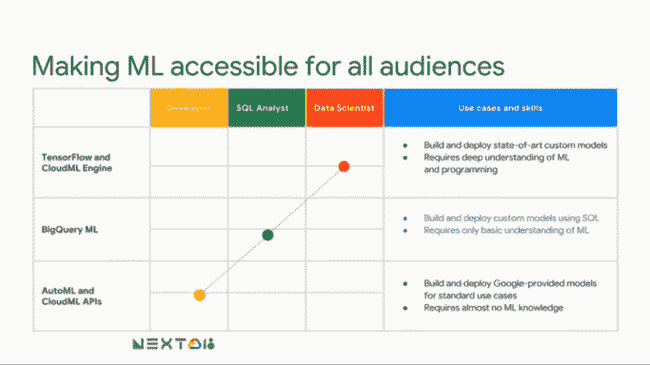

# 谷歌将机器学习建模加入 BigQuery

> 原文：<https://thenewstack.io/google-adds-machine-learning-modeling-to-bigquery/>

为了让机器学习(ML)对开发人员和数据科学家来说都更容易，谷歌在其 [BigQuery](https://cloud.google.com/bigquery/) 无服务器数据仓库服务中添加了内置的[机器学习建模功能](https://cloud.google.com/bigquery/#bigqueryml)。

该服务目前处于测试阶段，允许用户使用标准的 SQL 命令，直接从 BigQuery 中存储的数据开始创建机器学习模型。最初，BigQuery ML 支持两种不同类型的模型，用于预测的线性回归和用于预测两个类别之一的二元逻辑回归。可以自动调整学习速率，并且可以检查导出的模型权重。除了 SQL，还支持用户定义函数(UDF)。

“最棒的是，您的所有数据分析师都知道如何使用 SQL。现在他们可以直接在 BigQuery 中使用 SQL 来创建定制模型，”谷歌云产品管理总监 [Rajen Sheth](https://www.linkedin.com/in/rajensheth/) 在本周于旧金山举行的 [Google Next 2018](https://cloud.withgoogle.com/next18/sf/) 大会上介绍该技术的主题演讲中说道。

Sheth 吹嘘说，使用这项服务还有许多其他的好处。一个是因为可以直接对 BigQuery 数据库进行查询，所以不需要额外的提取、转换和加载(ETL)工具。检查 BigQuery 中的数据也加快了建模时间。

BigQuery 是一个可扩展的数据仓库服务，它代表客户保存了数 Pb 的数据，客户可以通过所有数据库管理员以及许多分析师和数据科学家都知道的标准结构化查询语言(SQL)来查询数据。BigQuery 是一个完全托管的无服务器服务，将用户从节点管理的负担中解放出来。

谷歌云产品经理[Abhishek kash yap](https://twitter.com/abhi_kash)[在后续的技术演示](https://www.youtube.com/watch?v=Ml2aCTn7kFY)中表示，通过不同的同类最佳应用程序进行机器学习的传统方法可能是一个繁琐的过程。首先，数据必须从其来源导出，包括重新格式化要分析的数据，这项工作本身可能需要一个数据科学团队(如果你很幸运有一个团队)几周的时间。建模过程也可能需要数月时间。

所有这些都假设你有一个数据科学家，他们正迅速成为稀缺商品——世界上有 10，000 名数据科学家和 400 万名程序员，Sheth 早些时候指出。在没有帮助的情况下，独立工作的分析师可以使用 Excel 和一个小样本来运行基本的回归，但这是另一个可能需要几个月的过程。

Kashyap 断言，BigQuery ML 旨在尽可能多地自动化这些数据准备和建模步骤。预测分析是一个用例。它不只是在历史环境中检查数据，而是可以用来预测未来的模式，通常使用公司已经存储在 BigQuery 中的现有数据。

谷歌云的机器学习服务及其各自的用户。

可以通过命令行工具、基于网络的用户界面、API 或第三方分析工具(如 Jupyter 笔记本或商业智能软件，如 [Looker](https://looker.com/) 或 [Tableau](https://www.tableau.com/) )来访问 BigQuery

媒体集团 20 世纪福克斯测试了该服务的早期版本，以了解其电影营销数据。营销团队有一个现有的用于受众分析的 SQL 查询，只附加了一个“创建模型”语句。由此，BigQuery 返回了一个线性回归模型，用于预测哪些观众会想看即将上映的电影，这些数据用于修改该电影的媒体规划。

报业巨头赫斯特公司也一直在使用该软件的早期版本。该公司已经在 BigQuery 中保存了关于订阅、时事通讯使用、用户人口统计的数据，因此使用 ML 的逻辑回归功能来确定哪些订户有不续订的风险。

[https://www.youtube.com/embed/Ml2aCTn7kFY?feature=oembed](https://www.youtube.com/embed/Ml2aCTn7kFY?feature=oembed)

视频

谷歌是新堆栈的赞助商。

特征图片:谷歌云产品管理总监 Rajen Sheth。照片由谷歌提供。

<svg xmlns:xlink="http://www.w3.org/1999/xlink" viewBox="0 0 68 31" version="1.1"><title>Group</title> <desc>Created with Sketch.</desc></svg>