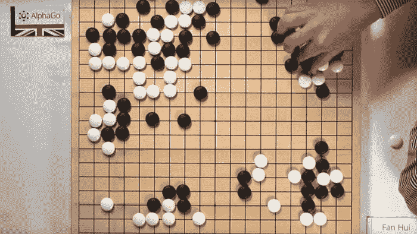
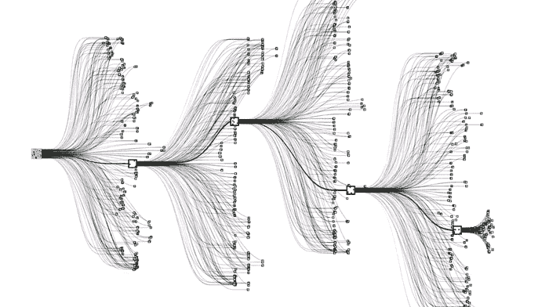

# 人工“想象”帮助谷歌人工智能大师围棋，这是有史以来发明的最复杂的游戏

> 原文：<https://thenewstack.io/google-ai-beats-human-champion-complex-game-ever-invented/>

过去，我们人类可能会觉得自己比机器略胜一筹，因为我们知道人类仍有一些事情可以做得更好:识别情绪、做 T2 梦和玩国际象棋等战略游戏。

但是在过去的几十年里，这种人类的优势正在缓慢但肯定地被侵蚀:IBM 的超级计算机[深蓝](https://en.wikipedia.org/wiki/Deep_Blue_(chess_computer))早在 1997 年就击败了国际象棋世界冠军加里·卡斯帕罗夫，而[沃森](https://en.wikipedia.org/wiki/Watson_(computer))在智力竞赛节目 *Jeopardy 中击败了顶尖的人类参赛者！*回到 2011 年。

现在，在被称为人工智能研究的突破中，谷歌科学家开发的一个程序首次在古老而复杂的围棋比赛中击败了职业人类选手。

为了让新的机器学习研究与最优秀的人类选手对抗，谷歌的“AlphaGo”计划由英国人工智能公司 DeepMind 的研究人员牵头，该公司于 2014 年被谷歌收购。

谷歌 DeepMind 的人工智能研究员戴密斯·哈萨比斯解释了这次胜利的意义:“围棋被认为是游戏人工智能研究的巅峰。自从深蓝在国际象棋中击败卡斯帕罗夫以来，这是人工智能面临的最大挑战，或者你可以称之为圣杯。围棋是一个非常漂亮的游戏，规则极其简单，但却非常复杂。事实上，围棋可能是人类有史以来设计的最复杂的游戏。”

[https://www.youtube.com/embed/SUbqykXVx0A?feature=oembed](https://www.youtube.com/embed/SUbqykXVx0A?feature=oembed)

视频

## 具有类似人类“想象力”的神经网络

围棋，也被称为“Igo”、“Weiqi”和“Baduk”，是中国、日本和韩国的一种流行游戏，可以追溯到至少 2500 年前。该游戏涉及两名玩家在一个网格棋盘上战略性地放置黑色或白色棋子，目的是获得比对手更多的领土。

围棋比国际象棋复杂得多，国际象棋平均每回合有 35 步棋；相比之下，Go 有 250，通过指数扩展，一些估计的可能移动的数量大于宇宙中的原子数量。

已经有计算机可以玩业余水平的围棋，但正是这种复杂性让许多人工智能研究人员预测(就在去年)还需要十年才能开发出一台在游戏中击败顶级人类的机器。

问题是，传统的“蛮力”人工智能方法可以生成许多可能走法的“搜索树”序列，在国际象棋游戏计算中可以很好地工作，但在围棋呈现的无限复杂的概率方面却令人遗憾地不够。

正如研究人员在这篇[帖子](http://googleresearch.blogspot.ca/2016/01/alphago-mastering-ancient-game-of-go.html)和发表在 *[自然](http://www.nature.com/nature/journal/v529/n7587/full/nature16961.html)* 上的论文中解释的那样，关键是通过使用和训练两个深度神经网络协同工作，来减少围棋中所有这些可能走法所呈现的“搜索空间”的巨大深度。

科学家们表示，通过这种方法，AlphaGo 的算法比以前的模型更像人类，甚至类似于一种人工“想象”。一个神经网络被指定为“政策网络”，它试图预测最有可能帮助它获胜的下一批可能的举措。

另一个网络被指定为“价值网络”，它向前搜索以评估每个位置的获胜者，但不是像传统的“蛮力”人工智能方法那样向前搜索到游戏结束，而是只在前面播放适度数量的可能性。

通过利用这些自我生成的模拟，AlphaGo 可以更好地预测和设计更有效的策略，其中程序的政策网络会提出最有利的策略来执行，而价值网络会判断这些策略中的哪一步最有可能帮助它获胜。

指数级复杂:围棋游戏中的每一步都有另外 250 种可能的走法。

## 更强 AlphaGo 的分布式计算

围棋固有的复杂性需要一种不同的方法来训练神经网络——以及大量的数据。

为了做到这一点，谷歌 DeepMind 的研究人员用人类围棋大师玩的游戏中的 3000 万步棋的数据库来训练策略网络。AlphaGo 然后使用这些数据开发新的策略，通过使用其神经网络与自己对弈，这是一种进化的、试错的机器学习方法，称为[强化学习](https://en.wikipedia.org/wiki/Reinforcement_learning)。

结果是一个自我训练系统，它不仅能打败最好的人工围棋程序，还能打败最好的人类棋手。

这里有趣的是分布式计算在制造更智能的 AlphaGo 中所起的作用，即使有 4 步障碍，alpha go 也能摧毁竞争。“当然，所有这些都需要巨大的计算能力，”研究人员说。“因此，我们广泛使用了[谷歌云平台](https://cloud.google.com/)，这使得从事人工智能和机器学习的研究人员能够按需访问弹性计算、存储和网络容量。此外，使用数据流图进行数值计算的新开源库，如 [TensorFlow](https://thenewstack.io/look-inside-tensorflow-googles-open-source-deep-learning-framework/) ，允许研究人员在多个 CPU 或 GPU 上高效部署深度学习算法所需的计算。”

图表显示了 AlphaGo(单机版和分布式版本)、欧洲冠军范辉和其他顶级围棋程序的 Elo 评级和大致排名，评估了数千场比赛。浅粉色的条柱表示在给定四步棋的情况下，其他程序的表现。

## 超越人类

但也许最重要的是，该团队没有使用专门的规则来创建一个“专家系统”；相反，一般的机器学习技术被用来创建一个强大的系统，它能够像人一样，在结构化的条件下自主学习。

游戏只是开始；研究人员设想，类似的方法可以应用于严重的现实世界问题——从机器人到气候变化缓解战略，到分析复杂的疾病或开发个性化的医疗方法，或者更智能的数字个人助理，使我们的日常生活更加富有成效。

当然，有些人可能会将这一突破视为未来可能的灾难。一些观察家，如特斯拉的埃隆·马斯克和科学家斯蒂芬·霍金，警告说超级智能、自主机器可能会横行无忌，对人类造成破坏。但是哈萨比斯仍然没有那么危言耸听，他说，“我们仍然在谈论一个游戏。”

然而，谷歌 DeepMind 的研究员大卫·西尔弗(David Silver)很坦率:“人类有弱点:他们会疲劳，会犯错，不会进行计算机可以进行的精确的、基于树的计算。也许最重要的是，人类一生中可以玩和处理的围棋游戏数量有限，而 AlphaGo 每天可以玩数百万场游戏。至少可以想象，如果有足够的处理、训练和搜索能力，AlphaGo 可能会达到超越任何人类的水平。”

[https://www.youtube.com/embed/g-dKXOlsf98?feature=oembed](https://www.youtube.com/embed/g-dKXOlsf98?feature=oembed)

视频

AlphaGo 现在计划在 3 月份的一场比赛中与过去十年的世界顶级围棋冠军 Lee Sedol 进行较量。在[谷歌研究](http://googleresearch.blogspot.ca/2016/01/alphago-mastering-ancient-game-of-go.html)和[自然](http://www.nature.com/nature/journal/v529/n7587/full/nature16961.html)阅读更多内容。

<svg xmlns:xlink="http://www.w3.org/1999/xlink" viewBox="0 0 68 31" version="1.1"><title>Group</title> <desc>Created with Sketch.</desc></svg>