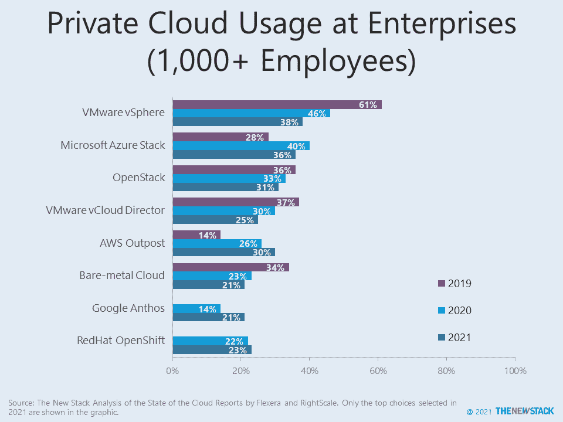
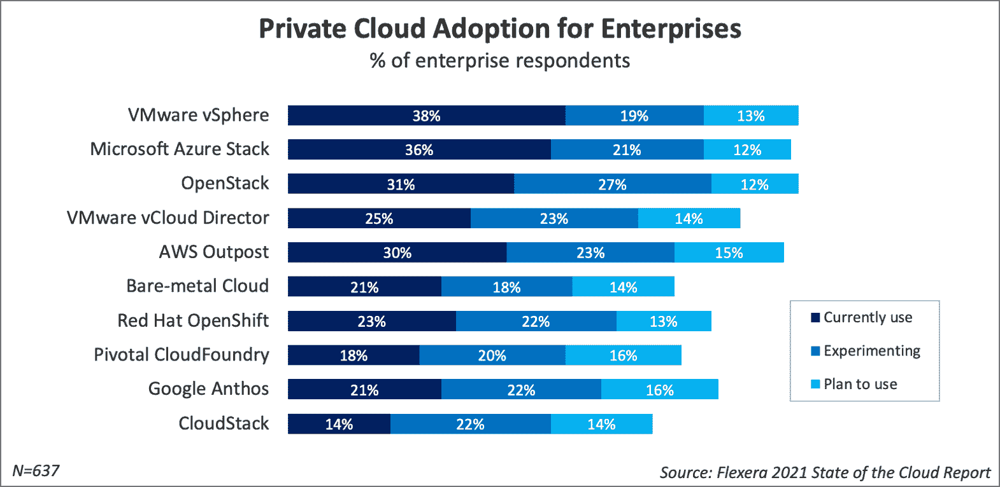

# 企业对谷歌和甲骨文云的采用翻倍

> 原文：<https://thenewstack.io/google-and-oracle-cloud-adoption-doubles-among-enterprises-2/>

这些数字好得令人难以置信。在接受 [Flexera 的](https://www.flexera.com/)、 [2021 年云状况报告](https://info.flexera.com/CM-REPORT-State-of-the-Cloud)调查的企业受访者中，有 49%使用[谷歌云平台](https://cloud.google.com/)，高于 2019 年研究中的 20%。Oracle 基础设施云同样从 16%飙升至 32%。然而，[亚马逊网络服务](https://aws.amazon.com/?utm_content=inline-mention) (AWS)和微软 Azure 仍然在公共云包之上。

所有主要的云提供商的采用率都有所提高，大多数提供商的支出也有所增加。这并不意味着它们实际上是客户特定多云架构的首选。超过四分之三的受访企业使用 AWS 和微软 Azure，客户通常使用它们运行大量工作负载。

相比之下，在 AWS、IBM 公共云和 Oracle 云上使用 [VMware](https://tanzu.vmware.com?utm_content=inline-mention) 的用户中，只有不到一半的人表示他们使用该供应商处理大量工作负载。谷歌云在中间。它获得了更多的工作负载，但仍然没有获得两个市场领导者那么多的份额。

在这项研究中，正在使用和试验的公共云的平均数量略有上升，从 3.4 升至 3.7，而在最新的研究中，私有云从 3.9 升至 4.9。这提醒我们“公众”并不是唯一的游戏。总体而言，如果公共云的数量只是逐步增加，但几个主要提供商的采用率大幅上升，这意味着较小的公司正在被抛弃。

在被问及的私有云中，Google Anthos 的增幅最大，在拥有 1000 多名员工的企业中，使用它的受访者从 14%上升到 21%。谷歌云可能也通过改变其定价策略赢得了客户。根据接受调查的客户，48%的客户获得了特别协商折扣，而在之前的研究中只有 18%的客户获得了特别协商折扣。

即使抽样是采用率大幅波动的部分原因，那么多主要云提供商的使用增加也绝非侥幸。公司在云上的花费越来越多。超过 90%的人声称新冠肺炎危机加速了他们的云计划，至少有同样多的人说他们有一个多云战略。目前，这已经转化为公司对几个主要云提供商的承诺。

通过 Pixabay 的特征图像。

<svg xmlns:xlink="http://www.w3.org/1999/xlink" viewBox="0 0 68 31" version="1.1"><title>Group</title> <desc>Created with Sketch.</desc></svg>