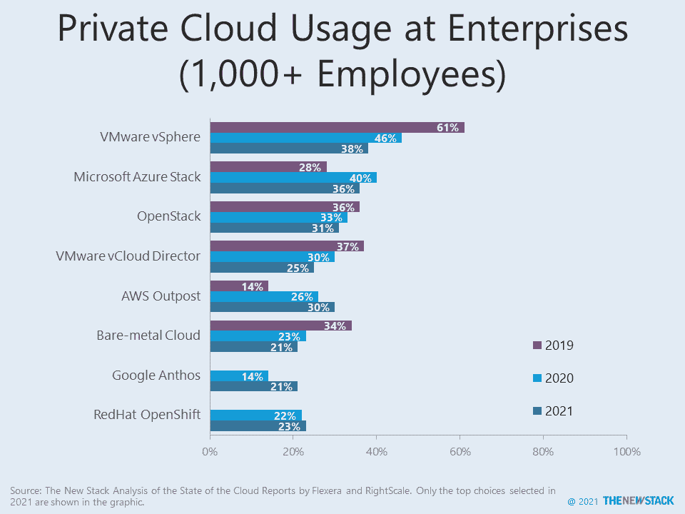

# 私有云正在激增吗？

> 原文：<https://thenewstack.io/google-and-oracle-cloud-adoption-doubles-among-enterprises-3/>

在最新研究 [Flexera 2021 云状态报告](https://info.flexera.com/CM-REPORT-State-of-the-Cloud)中，正在使用或试验的私有云的平均数量从 3.9 个跃升至 4.9 个。这比同一项研究中的平均 [3.4 公共云](https://thenewstack.io/google-and-oracle-cloud-adoption-doubles-among-enterprises-2/)还要多。谷歌 Anthos 迅速吸引了用户，[亚马逊网络服务](https://aws.amazon.com/?utm_content=inline-mention)的前哨也看到了收益。

在“私有云”方面，随着私有云概念的发展， [VMware 的](https://tanzu.vmware.com?utm_content=inline-mention) vSphere 继续面临损耗。近年来，许多公司已经过渡到以集装箱为中心的世界。调查中的其他数据表明，围绕用于管理基础架构的 Tanzu 产品组合，VMware 的市场地位正在稳定。

私有云的增加是因为它们的共同点，还是因为每个云的独特配置组合所使用的架构和技术堆栈的差异？

在过去 10 年中，公共云和私有云之间的区别已经变得不那么重要，尽管一些公司对私有云工作负载有更严格的限制。新堆栈自己的[研究](https://thenewstack.io/kubernetes-and-the-next-step-for-evolutionary-architecture/)表明，数据中心托管的工作负载预计会增长，更多是以传统 IT 为代价，而不是从公共云迁移来实现成本节约。

随着企业使用云原生技术取代过时的数据中心，他们将继续使用私有云。据报道，被推向边缘的工作负载的增加将会发现更多的私有云可用于管理它们。这些云是否会有一个标准的架构有待讨论，取决于行业硬件供应商、云提供商和在“边缘计算”类别中脱颖而出的公司之间的合作水平。

通过 Pixabay 的特征图像。

<svg xmlns:xlink="http://www.w3.org/1999/xlink" viewBox="0 0 68 31" version="1.1"><title>Group</title> <desc>Created with Sketch.</desc></svg>