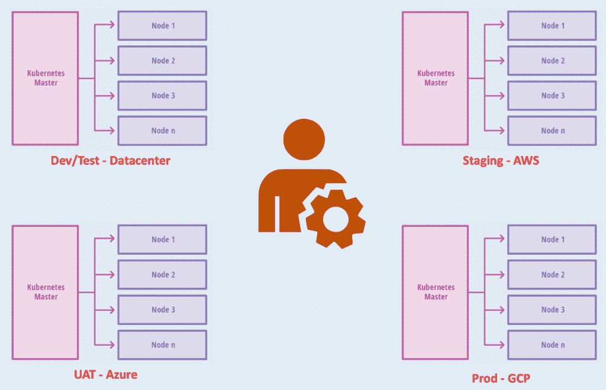
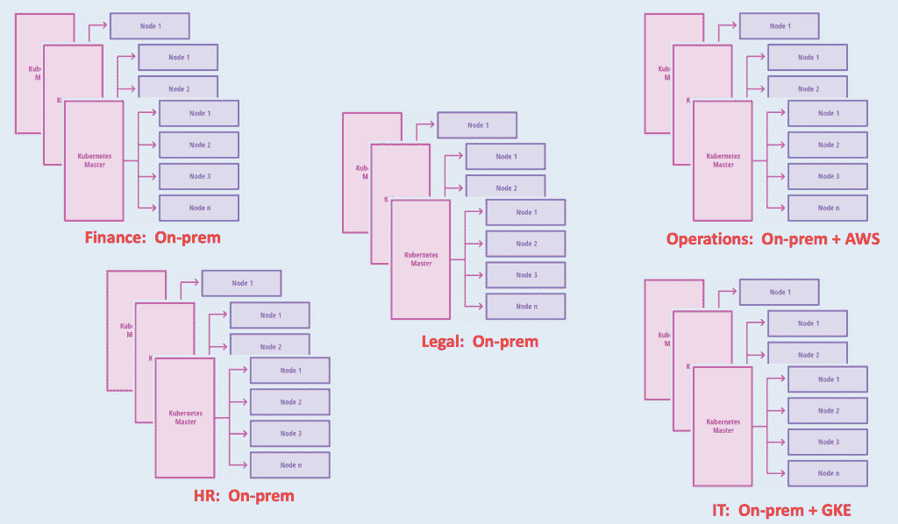
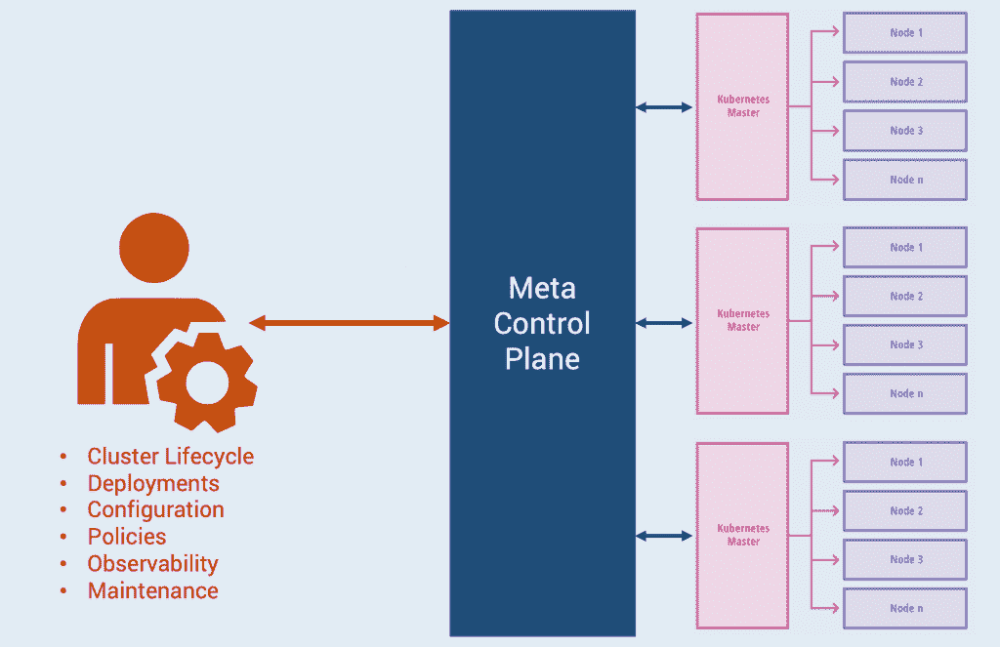
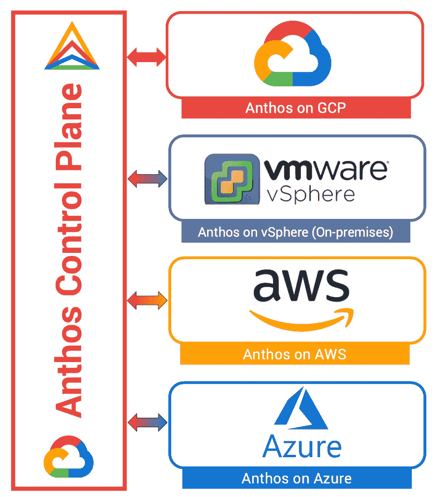
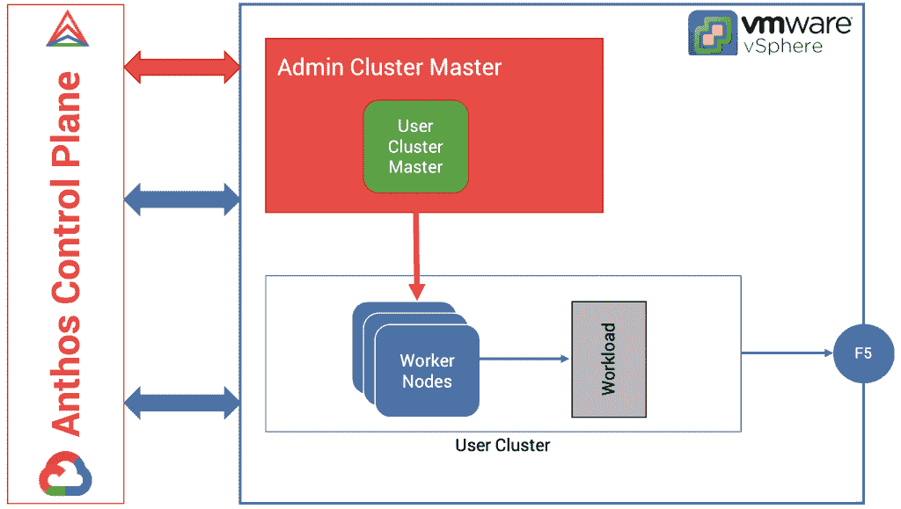
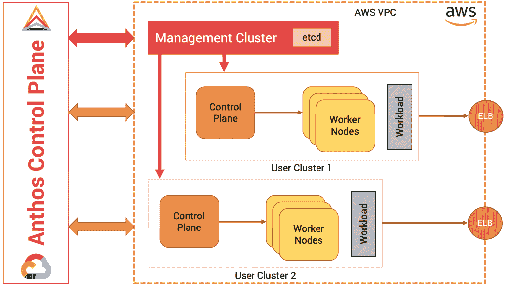
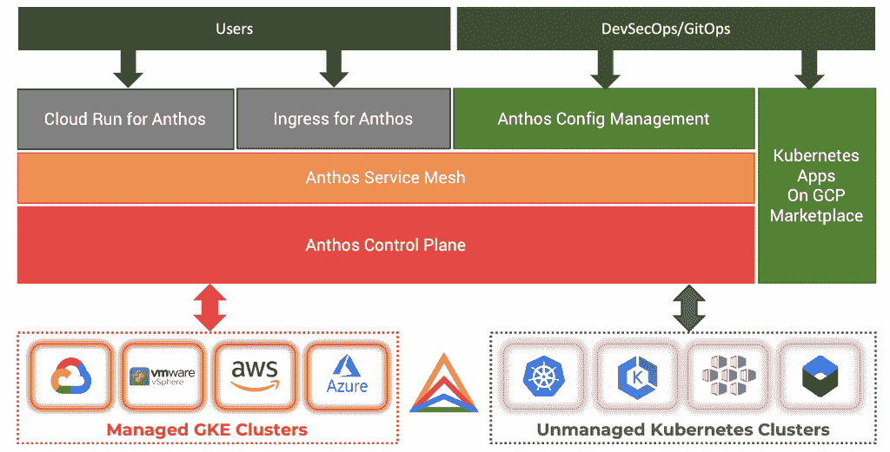

# 一个 Kubernetes 开发者眼中的 Google Anthos

> 原文：<https://thenewstack.io/google-anthos-from-the-eyes-of-a-kubernetes-developer/>

本周，分析师

[Janakiram MSV](https://thenewstack.io/author/janakiram/)

在新的堆栈上推出一个独家系列，关于谷歌云平台的 Kubernetes 服务，Anthos。本系列的每一部分都集中在 Anthos 的一个特定方面。该系列涵盖了集群注册、Anthos 配置管理以及从 GCP 市场启动“点击部署”应用程序。

谷歌云平台在 Cloud Next 2019 正式推出 [Anthos](https://cloud.google.com/anthos) 。Anthos 是谷歌为数不多的在如此短的时间内获得全面可用(GA)状态的技术之一。尽管已普遍可用，但 Anthos 并不是一个支持自助服务的 GCP 产品。差不多过了一年，它才出现在 GCP 的控制台上。与 GCP 的其他服务不同，文档很少且不完整。

除了 Anthos 是基于[谷歌 Kubernetes 引擎](https://cloud.google.com/kubernetes-engine) (GKE)这一明显事实之外，社区对这个平台了解不多。但事情在 2020 年开始发生显著变化。Anthos 现在可以在谷歌云控制台中使用。该文档提供了有关平台架构、安装和各种组件配置的详细信息。

即使谷歌在教育客户和社区方面付出了努力，Anthos 可能会让普通的 Kubernetes 用户感到困惑。

这里尝试向任何熟悉 Kubernetes 的开发人员或用户介绍 Anthos。

## 从虚拟机蔓延到群集蔓延

在过去十年中，企业 IT 面临着虚拟机(VM)蔓延的挑战。任何有权访问 VMware 环境的用户、开发人员或管理员都启动了新的虚拟机。很快，企业 IT 部门意识到，有数百台虚拟机跨多个部门运行，而这些部门对 IT 部门不可见，也不受 IT 部门管理。这导致失控和资源分散。企业 IT 引入了一个需要部门 IT 主管批准才能启动虚拟机的工作流。It 部门还实施了一项策略，以确保虚拟机是从 IT 部门集中管理的预先批准的映像中创建的。预先批准的映像充当包含强制安全策略和补丁的模板，确保每个虚拟机都基于经过强化、测试和信任的映像。

快进到 2020 年，企业 IT 正在经历 [Kubernetes 集群蔓延](https://thenewstack.io/container-sprawl-is-the-new-vm-sprawl/)。部门级用户正在内部、私有云和公共云环境中构建集群。每个部门都运行着多个集群，这些集群是通过 Kubespray 和 Kops 等工具或 Google Kubernetes Engine 和 Azure Kubernetes Service 等托管 CaaS 产品供应的。

企业 IT 在群集蔓延方面面临着与虚拟机蔓延同样的挑战。Kubernetes 集群已经成为应用程序的新部署边界。虽然名称空间提供了所需的隔离和边界，但是客户发现通过在不同的集群上运行应用程序来隔离它们是很容易的。

每个部门都有多个跨不同环境运行的集群—内部、私有云、公共云中的自我调配集群、公共云中的托管集群。列举和管理这些集群对 IT 和 DevOps 团队来说是一个巨大的挑战。

为了使所有集群达到期望的状态，需要在每个集群上运行一组 kubectl 命令，以确保它们具有一致的配置。将配置、策略、配额和 RBAC 角色应用到每个群集既费力又容易出错。

## 元控制平面——控制平面中的一个控制平面

企业 IT 需要的是一个元控制平面，作为组织内启动的所有 Kubernetes 集群的总体控制平面。通过元控制平面，它可以确保每个集群都符合一组预定义的策略。元控制平面还可以实施严格的规则，这些规则可以检测集群配置中的漂移，并将它们带回到期望的配置状态。

我们称之为元控制平面，因为它管理每个 Kubernetes 集群的控制平面——主节点。发送到元控制平面的命令被自动应用到每个集群的控制平面。

由于元控制平面可以看到每个集群，因此它可以收集和汇总与基础架构和应用程序运行状况相关的指标。元控制平面成为配置和可观察性的单一平台。

类似于 Kubernetes 控制器如何维护部署、状态集、作业和守护集的期望状态，元控制平面确保整个集群维护配置的期望状态。

例如，如果预期参与的集群运行角色和角色绑定，则元控制平面可以检测角色何时被删除，并自动重新应用配置。这类似于 Kubernetes 控制器维护部署副本的期望数量的方式。

因此，元控制平面对于 Kubernetes 集群就像控制器对于部署一样。

Kubernetes 主控制平面和元控制平面之间还有另一个共同点。调度工作负载时，可以通过标签/选择器或节点关联性的组合来影响放置。部署规范中的 nodeSelector 或 NodeAfffinity 子句将确保工作负载位于符合标准的一个节点上。类似地，可以指示元控制平面将部署、配置或策略仅推送到参与集群的子集。这种机制非常类似于 Kubernetes 调度的 nodeSelector 模式。与标记节点并在部署中使用选择器来定位特定节点类似，我们标记每个参与集群，并在元控制平面使用选择器来筛选目标集群。

随着组织内集群数量的增长，客户需要一个元控制平面来负责集群管理。元控制平面将确保参与的集群被规范化并与其配置一致。

### anthos——谷歌的元控制平面

Anthos 是什么？简单来说就是 Google 的 Kubernetes 的元控制平面。尽管这个定义在技术上是正确的，但它对平台并不公平。除了作为元控制平面之外，Anthos 还扮演着其他角色，这些角色对于管理混合云和多云环境中的基础架构和工作负载至关重要。

Anthos 的核心组件是牢牢扎根于 GCP 的元控制平面。大多数情况下，用户是看不到的。类似于 Google 隐藏 GKE 集群的主节点，它隐藏了 Anthos 控制平面。这个控制平面公开了用于管理 Kubernetes 集群生命周期和向 Anthos 注册外部集群的 API。

### anthos——混合和多云控制平面

尽管 Anthos 的控制平面在 GCP 环境中运行，但它可以在各种环境中启动托管的 Kubernetes 集群，包括内部数据中心、AWS 和 Azure。通过 Anthos 启动的托管 Kubernetes 集群具有与在 GCP 运行的典型 GKE 集群相同的可靠性和稳定性。

对于 Anthos 来说，要在内部推出托管的 Kubernetes 集群，它依赖于 vSphere 6.5、vCenter、vSphere storage 和 F5 BIG-IP 或基于 Google 开源项目的捆绑软件负载平衡器，该项目名为 [Seesaw](https://opensource.google/projects/seesaw) 。Anthos 首先在 vSphere 中提供一个管理集群，它可以生成多个用户集群。可以将管理集群视为本地 Anthos 控制平面，处理在 vSphere 中运行的受管集群的生命周期。

Anthos for Amazon Web Services 将于 2020 年 5 月全面上市，它可以在 AWS 环境下运行托管的 Kubernetes 集群。利用亚马逊 EC2、亚马逊 EBS、AWS VPC 和亚马逊 ELB，Anthos 可以启动跨多个可用性区域的高可用性 Kubernetes 集群。与 vSphere 中的管理集群类似，Anthos 首先在 AWS VPC 中启动一个管理集群，该集群负责启动其他用户集群。

当 Anthos for Azure 可用时，它将利用 Azure 虚拟机、Azure 高级存储、Azure 虚拟网络和 Azure 负载平衡器来运行 HA Kubernetes 集群。从技术上讲，Anthos 可以在任何支持以高可用性模式运行 Kubernetes 的可编程基础设施中启动托管集群。

除了管理通过 Anthos 启动的集群之外，该平台还支持将外部非托管集群连接到控制平面。两者之间的主要区别——托管与非托管——是生命周期管理。虽然 Anthos 可以拥有从托管集群的创建和终止的一切，但是它可以部分控制外部的非托管集群。

### Anthos 的关键组件

除了作为 Kubernetes 集群的混合、多云控制平面，Anthos 还可以管理跨集群部署的工作负载的网络策略、路由、安全性和配置管理。

让我们来看看 Anthos 的关键组件:

*   **Anthos 控制平面**:该组件是 Anthos 的元控制平面。它负责管理托管集群的生命周期以及外部非托管集群的注册和注销。Anthos 通过 Hub 和 Connect 服务为此公开了 API。
*   **Anthos 服务网格**:这个组件是 Istio 服务网格的商业实现，针对 Anthos 进行了优化。它提供三种功能——1)微服务之间的安全通信，2)网络和路由策略，以及 3)可观察性。
*   **Anthos 配置管理**:这个基于 GitOps 的组件支持一个集中式机制，将部署、配置和策略推送到所有参与的集群，包括托管和非托管集群。一个可集中访问的 Git 存储库充当所有集群的单一事实来源。每个集群中运行的 Anthos 配置管理代理将监控集群中的状态变化。当偏离 Git 中定义的内容时，代理会自动应用配置，这将使集群回到所需的状态。
*   **Cloud Run for Anthos**:Cloud Run 是一个在 GCP 运行容器的无服务器无集群环境。它是 Knative 之上的一层，提供了部署和运行容器的最佳开发人员体验，而无需启动 GKE 集群或定义 pod 规范。Cloud Run for Anthos 为托管集群带来了相同的开发人员体验。
*   Anthos 的入口(Ingress):该组件与通过 Anthos 服务网格配置的特使代理一起将流量路由到微服务。Anthos 的入口成为访问运行在 Anthos 集群中的工作负载的入口点。它目前只适用于运行在 Anthos 推出的 GKE 集群中的工作负载。
*   **GCP 市场上的 Kubernetes 应用**:这是针对 Kubernetes 的各种无状态和有状态工作负载的目录。客户只需按一下按钮，就可以在 Anthos 管理的集群中部署来自市场的应用程序，而不管它们是在哪里提供的。

在本系列的下一部分中，我们将通过向 Anthos 注册一个 GKE 集群、一个 Azure AKS 集群和一个亚马逊 EKS 集群来探索控制平面的 Hub 和 Connect 服务。敬请期待！

*贾纳基拉姆·MSV 的网络研讨会系列“机器智能和现代基础设施(MI2)”提供了涵盖前沿技术的信息丰富、见解深刻的会议。在 [http://mi2.live](http://mi2.live) 上注册参加即将举行的 MI2 网络研讨会。*

<svg xmlns:xlink="http://www.w3.org/1999/xlink" viewBox="0 0 68 31" version="1.1"><title>Group</title> <desc>Created with Sketch.</desc></svg>