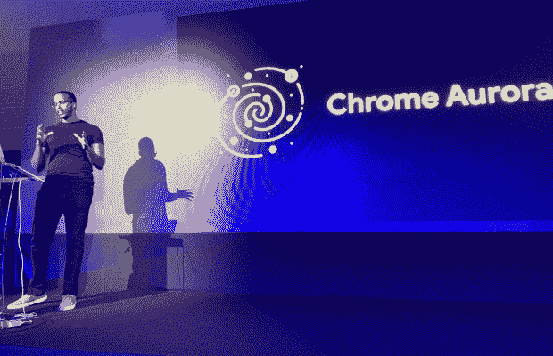

# Google Aurora:Chrome 和 Web 框架的结合

> 原文：<https://thenewstack.io/google-aurora-a-collab-between-chrome-and-web-frameworks/>

Aurora 似乎是科技项目的一个流行名称。继[亚马逊极光](https://thenewstack.io/amazon-web-services-wants-you-to-migrate-off-legacy-databases/)和 [Twitter 极光](https://thenewstack.io/twitters-aurora-relates-googles-borg-part-1/)之后，谷歌的极光项目是其 Chrome 浏览器团队与 Next.js、Nuxt 和 Angular 等开源网络框架之间的合作。它于去年 6 月在[发布，在最近的](https://developer.chrome.com/blog/introducing-aurora/) [Infobip Shift](https://shift.infobip.com/) 开发者大会上，我们收到了来自谷歌 [Houssein Djirdeh](https://twitter.com/hdjirdeh) 的更新。我在 Djirdeh 的演讲后采访了他，以获得更多的细节。

在他的演讲中，Djirdeh 概述了 Chrome 在使用 web 框架时的四个重点领域。内置图像优化是其一；这项工作至少从 2020 年 11 月就开始了，当时 Vercel 的 Guillermo Rauch 在 Next.js 中宣布了一个新的“[基于 React 的图像组件](https://thenewstack.io/next-js-and-google-best-practices-bad-news-for-web-standards/)”，该组件使用了 web 标准。Aurora 关注的其他领域包括高效加载第三方脚本、更好的自定义字体行为和“端到端一致性管道”谷歌使用术语[一致性](https://developer.chrome.com/blog/conformance/)来表示“保护开发人员不要编写会对用户体验产生负面影响的代码。”

谷歌 Chrome Aurora 工程师侯赛因·吉尔德(Houssein Djirdeh)

我问 Djirdeh Aurora 是什么时候开始的，动力是什么？他说这是几年前开始的，目标是“为什么我们不尝试与框架社区和开源社区更紧密地合作。”

他说，他们最初考虑建立自己的框架(指 Chrome 团队；而 Angular 起源于 Google，并不是来自浏览器团队)。他们还考虑开源现有的谷歌内部框架。但最终，Djirdeh 说，“有如此多的开源框架拥有数百万用户”，所以他们决定直接与他们合作。

## 关注 React

虽然 Aurora 正在与所有主要的 JavaScript 框架合作，但似乎特别关注 React——尤其是通过 Next.js。

“我们想专注于 React 当时我们是一个很小的团队，只有四五个人，”Djirdeh 说。“然后，当我们在 React 领域工作时，我们遇到了 Next.js 团队。很多我们想做的事情，我们以为他们已经做了。他们是建立在 React 之上的框架，他们试图尽可能降低包的大小，他们有服务器端的渲染，[…]他们做了很多事情，比如基于文件的路由。因此，如果我们的愿景如此一致，为什么不一起努力呢？”

谷歌与 Next.js 团队举行了每周一次的冲刺，他们在 2020 年 11 月宣布的图像优化上合作。

我问谷歌团队是否也与脸书的 React 团队合作，因为 React 库源自那里？他回答说，是的，他们每周或每两周与该团队会面一次。

“我们试图让 React 成员知道网络空间正在发生什么，”Djirdeh 说，“就像，嘿，这是一个新的 API，也许 React 的并发渲染可以使用它。有道理。很多时候，他们会给出很好的反馈。”

他补充说，谷歌 Chrome、脸书 React 和 Next.js 团队经常会在一起开会。

## 框架复杂性批评家

对于领先的浏览器厂商来说，与领先的 JavaScript 框架合作无疑是有意义的，但近年来这些框架日益增加的复杂性也带来了很多负面影响。一位著名的批评家是亚历克斯·罗素，一位有影响力的浏览器工程师，他曾在 Chrome 团队工作，但现在在微软 Edge 工作。我问 Djirdeh 他对这种抱怨有什么看法？

Djirdeh 承认，开发人员很容易“陷入框架的世界，而没有意识到哪些依赖项正在到来”，这可能会导致问题。他说他同意 Russell 写的大部分内容，并且 Aurora 正试图帮助改进核心框架。

最后，我问其他主要浏览器厂商 Mozilla 和苹果是否参与了 Aurora。

“在奥罗拉计划中没有我们希望的那么多，”他回答道。“我敢肯定，我们试图踢它了。我们正在与他们合作一些小的子项目。但这并不是非常具体的框架[……]我们也与许多其他 Chrome 团队合作，这些团队碰巧与 WebKit 和 Mozilla 有联系，所以我们最终会时不时地联系他们。”

*披露:Infobip 付钱让 Richard MacManus 去克罗地亚参加 Infobip 的轮班会议。*

<svg xmlns:xlink="http://www.w3.org/1999/xlink" viewBox="0 0 68 31" version="1.1"><title>Group</title> <desc>Created with Sketch.</desc></svg>