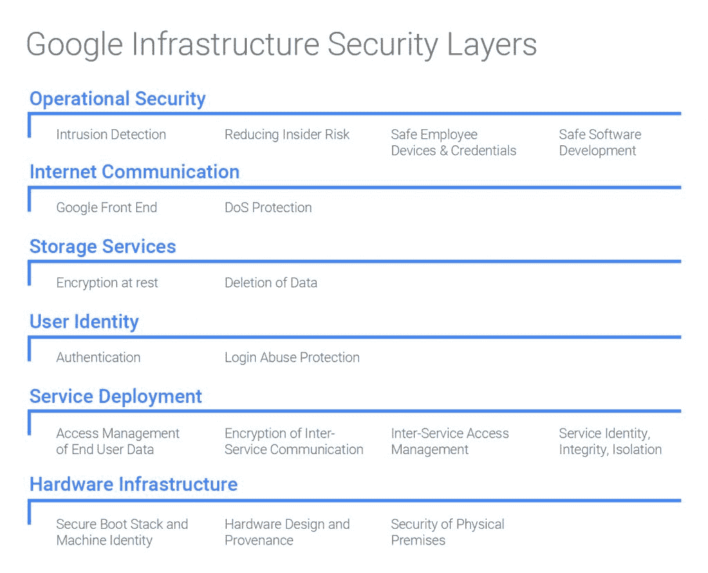

# 关于安全，谷歌能教给我们什么

> 原文：<https://thenewstack.io/google-can-teach-us-security/>

一个公司能有多安全？在这个世界上，即将上任的美国政府“网络沙皇”发现自己是黑客的受害者，有一种感觉是，公司将越来越不可能保证自己的安全。

对于大型组织来说，这是一个主要问题，他们必须向数百万客户证明他们自己的私人数据将得到保护。像脸书和谷歌这样的公司拥有数以百万计的用户，他们非常信任这些公司的系统。

谷歌迈出了有趣的一步，披露了自己的保护措施是如何运作的。该公司发布了一份文件，[谷歌基础设施安全设计概述](https://cloud.google.com/security/security-design/)，其中列出了该公司为保证自身安全而采用的核心原则。

谷歌的措施包括设计和控制自己的数据中心，使用基于定制硅([包括安全 ASIC](http://www.theregister.co.uk/2017/01/16/google_reveals_its_servers_all_contain_custom_security_silicon/))的定制服务器，不同的加密级别，最终用户数据的访问管理和许多其他技术。

这是一份非常重要的文件，因为它清楚地表明了云提供商对安全性的重视程度。仍然有潜在的云客户对选择云持谨慎态度，谷歌的举措显示了云提供商(亚马逊或微软可能会发布非常类似的东西)正在采取的步骤。

正如都柏林的安全顾问 Brian Honan 指出的那样，谷歌的文件为任何希望选择该公司云服务的人提供了极大的保证。

“谷歌正在修建道路，让你可以驾驶汽车，”他说。

谷歌的基础设施安全分层方法

## 给企业的教训

但是谷歌的结构是否提供了其他的经验？中等规模的企业能从谷歌的方法中学到什么吗？对于这些大公司来说，花费数百万美元很容易，但是一个普通的中型企业能复制谷歌的方式吗？此外，虽然他们无法设计自己的芯片，但这些公司可以做些什么来接近谷歌的安全水平。

据电信提供商 [JT 集团](http://www.jtglobal.com/Global/)的首席安全官大卫·卡特赖特称，谷歌正在采用的许多政策是大多数中型(或更大型)组织可以采用的策略。卡特赖特负责集团内不同公司的安全事务，对谷歌方法的彻底性印象深刻。

卡特赖特说，谷歌对“深度防御”的强调是如何分层设计安全的一个例证，考虑到了系统可能受到攻击的所有不同方式。

他说，在某些情况下，谷歌将这一点发挥到了极致。例如，“他们使用应用级加密来防止恶意硬盘固件，”他指出。这意味着“应用程序在将数据写入磁盘之前对其进行加密，因此磁盘控制器永远不会看到未加密的版本。”

卡特赖特说，还有许多其他领域可供其他公司采用。他特别强调了几个；[应用层安全](https://thenewstack.io/prevoty-embeds-defenses-within-application/)是专门叫出来的。“这是经常被遗漏的。有多少应用程序的前端网站使用系统管理员凭据连接到后端 SQL Server 数据库？”他问。这是任何公司都可以做的事情:当然，这需要额外的初始工作，但它增加了一个额外的安全层。

然后是命名用户的方法，这将极大地有助于故障排除。卡特赖特说:“工程师拥有独特的命名身份，因此可以放心地控制和记录访问，因此有一个用于法医分析的审计跟踪。”。“谷歌还自动化了所有的安全补丁——太多的公司表示，他们没有人力来保持一切更新。”

任何公司都可以(也应该)采用红队方法进行压力测试。Honan 说，这是对所有企业开放的，如果他们没有实地资源，第三方机构当然可以测试结构。

即使谷歌做了一些特别时髦的事情，比如定制的安全 ASIC，它也为其他公司提供了指导。虽然一般公司做不到这一点，但他们可以在底层实现类似的技术来确保安全性(例如，Windows 机器上的 BitLocker 可以防止从未经批准的磁盘启动时访问板载磁盘)。

卡特赖特说，该文件忽略的一点是培训。所有谷歌员工都有安全意识并需要额外培训，这是理所当然的吗？这可能是一个合理的假设，但一般公司肯定需要为额外的安全性实施高度的培训。

霍南说，公司还可以遵循其他措施——[云安全联盟](https://cloudsecurityalliance.org/group/security-guidance/)、[国家标准与技术研究所](https://www.nist.gov/node/591971?pub_id=909494)和 [SANS 研究所](https://www.sans.org/critical-security-controls/guidelines)都提供了云实施的最佳实践指南，但所有公司都会在谷歌的文档中找到一些有价值的东西:这些流程是业内最好的，将对安全水平做出巨大贡献。

通过 Pixabay 的特征图像。

<svg xmlns:xlink="http://www.w3.org/1999/xlink" viewBox="0 0 68 31" version="1.1"><title>Group</title> <desc>Created with Sketch.</desc></svg>