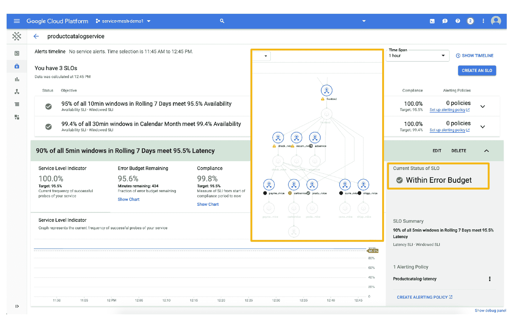

# 谷歌云通过无服务器服务网格扩展其托管的 Kubernetes 服务 Anthos

> 原文：<https://thenewstack.io/google-cloud-expands-its-managed-kubernetes-service-anthos-with-serverless-service-mesh/>

[谷歌云](https://cloud.google.com)继续扩展其 [Anthos 托管的 Kubernetes](https://cloud.google.com/anthos/) 服务，增加新功能，旨在让企业更容易使用云原生计算。一个基于[开源 Istio](/tutorial-explore-istios-traffic-rules-and-telemetry-capabilities/) 的服务网格已经被添加进来，谷歌利用其[的创造性工作](/how-knative-can-unite-kubernetes-and-serverless/)将无服务器作业整合到一个名为[云运行](https://cloud.google.com/run/)的功能中。

公司[还](https://cloud.google.com/blog/topics/hybrid-cloud/anthos-simplifies-application-modernization-with-managed-service-mesh-and-serverless-for-your-hybrid-cloud)用自动化功能以及强制执行组织策略的能力增强了 Anthos 配置管理。例如，二进制授权作为一个检查点，可以确保只有经过验证的映像才能进入构建过程。

通过所有这些服务，谷歌承担了管理和升级软件的责任，减轻了用户的负担。谷歌工程和产品管理副总裁 Eyal Manor 说:“不是每个企业都有工程带宽将所有东西集成在一起。

通过服务网格，谷歌承诺支持与最新的 Istio 版本完全相同的 API，该公司认为，这将用户从“锁定”谷歌中解放出来，因为他们可以在 Istio 的另一个副本上重新构建他们的应用程序。然而，谷歌云确实提供了一些仅靠 Istio 难以实现的功能，例如自动扩展和基于端到端仪表板的谷歌云上运行的服务的可见性。

通过云运行，Google 可以运行无状态工作负载，并可以选择在不需要的时候将部署规模缩减到零。您将事件驱动的代码打包在一个容器中，同样的无服务器作业可以在私有数据中心、另一个云平台或 Google Cloud 上运行。“它极大地简化了开发人员的体验。Manor 说:“你没有集群、自动扩展或配置，这对于开源软件来说会变得非常复杂。

随着更多云原生部署的出现，配置管理功能承担了逐渐增加的策略复杂性。Manor 说，这项服务类似于 GitOps approach T1。用户进行策略更改(例如阻止开发人员拥有与管理员相同的访问权限)会导致配置更改，服务会将该更改推广到多个集群和所有相关组件。

引起 [Savinay Berry](https://www.linkedin.com/in/savinayberry/) 、 [OpenText](https://www.opentext.com/) 云服务高级副总裁注意的新功能之一是服务对服务遥测，这可以帮助识别早期预警指标。今天，KeyBank 使用 Kafka 作为其一些 web 应用程序的事件总线，但当出现问题时，团队必须手动调试问题在哪里以及涉及到哪些依赖关系。“今天，我们还没有达到那种精细的水平，”McFee 说。

Chris McFee ， [KeyBank](https://www.key.com/personal/index.jsp) 的企业开发实践总监发现，CloudRun/Knative 的新闻对可能的无服务器工作很有兴趣:“我们还没有这方面的用例，但前瞻性的未来可能真的很有趣。”

特色图片 by _Alicja_ from Pixabay。

<svg xmlns:xlink="http://www.w3.org/1999/xlink" viewBox="0 0 68 31" version="1.1"><title>Group</title> <desc>Created with Sketch.</desc></svg>