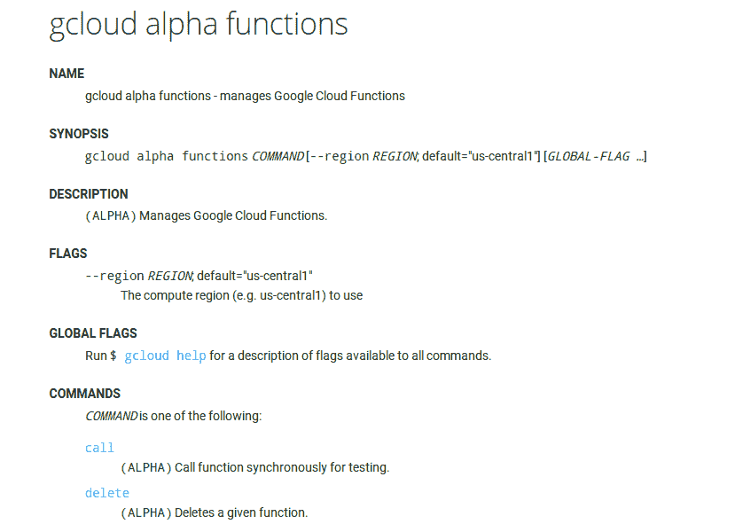
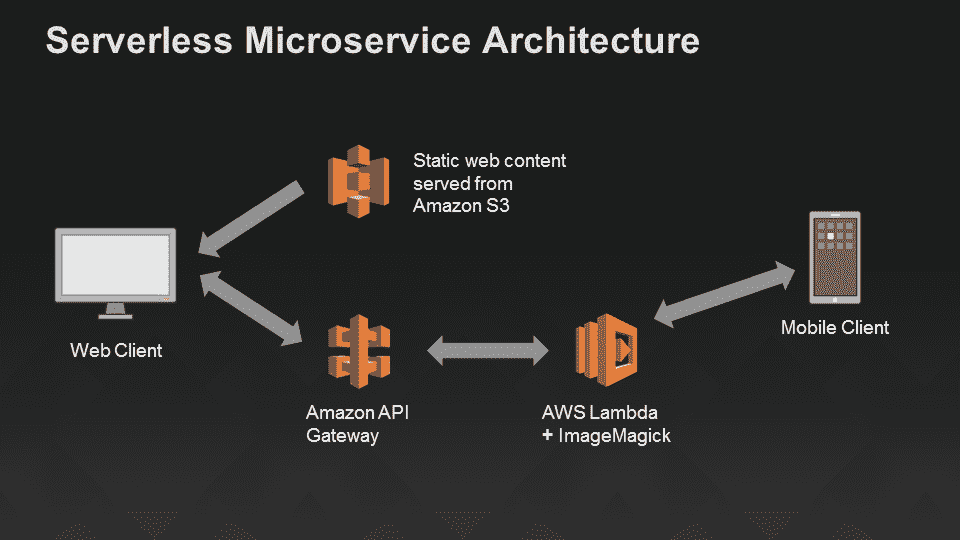

# 谷歌用云功能挑战 AWS Lambda

> 原文：<https://thenewstack.io/google-cloud-functions-arrives-challenge-aws-lambda/>

2014 年，亚马逊网络服务公司[推出了](https://thenewstack.io/aws-lambda-is-a-step-towards-creating-a-new-normal/)Lambda 无状态计算服务，目标是为开发人员提供一个主干，以便在云中用各种脚本语言创建运行匿名函数。对于那些创建事件驱动服务的人来说，AWS 为开发人员提供了一个上传代码的机会，并允许 Lambda 在某些外部事件(如 API 调用)触发时运行代码。

现在，谷歌也开始涉足这一领域。周三，该公司推出了[谷歌云功能](https://cloud.google.com/functions/docs)，它提供了一套类似的功能。

“谷歌云功能是一种轻量级、基于事件的异步计算解决方案，允许您创建小型、单一用途的功能来响应云事件，而无需管理服务器或运行时环境，”谷歌云功能的主页上写道。

Google Cloud Functions 增加了一个自动化级别，允许开发人员花费更少的时间来担心管理服务器时可能发生的许多问题。走向无状态允许应用程序在数据和堆栈的计算级别之间有一个抽象层，尽管这个术语有点用词不当。“无状态”计算并不是真正的无状态。

“最终，状态总是存在的，但为了扩展应用层，我们使用设计技巧让用户相信没有状态。IDC 软件开发研究项目主管 Al Hilwa 在一封电子邮件中说:“除其他外，这允许服务器横向扩展、发生故障、上下运行，并透明地移动到不同的硬件上。

Google Cloud Functions 为开发人员提供了在 Node.js 中编写应用程序的能力，当单个事件发生时就会触发。这可以简单到将媒体资产转换为。PNG 文件，用于验证扫描时已发送或接收的文档。

谷歌云阿尔法函数

自 Lambda 推出以来，亚马逊 AWS 已经为其创建了数百项服务。随着 Google Cloud 功能的引入，看到社区为触发 Google Cloud 功能中的事件而编写的各种 API 和服务将会非常有趣。

“最近，无服务器计算主要由于其简单性和‘NoOps’模型而获得了业界的关注。顾问[贾纳基兰·MSV](https://twitter.com/janakiramm)在[福布斯](http://www.forbes.com/sites/janakirammsv/2016/02/09/google-brings-serverless-computing-to-its-cloud-platform/#6db86dd325b8)上指出:“开发人员遵循一劳永逸的范式，他们上传与运行时各种事件挂钩的单独代码片段。"这个模型提供了一个低接触、无摩擦的部署机制，没有任何管理开销."

该服务响应来自运行在 Google Container Engine 上或编排在 Kubernetes 上的服务的调用。对于那些使用谷歌产品套件进行开发团队交流的人来说，云功能还为开发人员提供了在 Gmail 和其他谷歌产品中触发的功能之间创建挂钩的能力。

AWS Lambda 无服务器微服务架构

如果你想在谷歌云功能还处于测试阶段时就开始测试，你很幸运。有兴趣报名的人可以[填写一张简短的表格](https://docs.google.com/forms/d/1WQNWPK3xdLnw4oXPT_AIVR9-gd6DLo5ZIucyxzSQ5fQ/viewform)，希望能获得访问权。

通过 Pixabay 的特征图像

<svg xmlns:xlink="http://www.w3.org/1999/xlink" viewBox="0 0 68 31" version="1.1"><title>Group</title> <desc>Created with Sketch.</desc></svg>