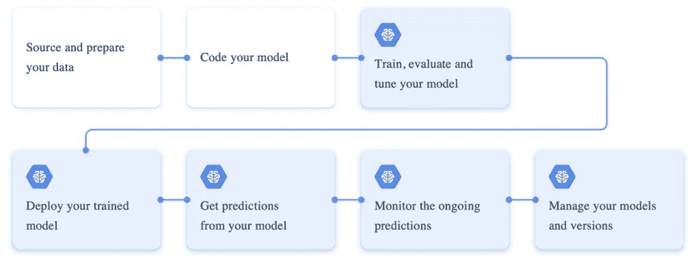

# 谷歌云 ML 引擎:训练和部署机器学习模型

> 原文：<https://thenewstack.io/google-cloud-ml-engine-train-and-deploy-machine-learning-models/>

谷歌云 ML 引擎是一个托管平台，用于大规模运行[机器学习](https://thenewstack.io/category/machine-learning/)训练作业和预测。该服务独立处理这两个过程(训练和预测)。通过利用 GPU 和 TPU 基础设施，可以使用[谷歌云 ML 引擎](https://cloud.google.com/ml-engine/)来训练一个复杂的模型。这一步的结果是一个经过全面训练的机器学习模型，可以托管在其他环境中，包括内部基础架构和公共云。该服务还可以用于部署在外部环境中训练的模型。Cloud ML Engine 自动提供所有资源并监控作业的运行。它还可以管理已部署模型及其版本的生命周期。

除了训练和托管，云 ML 引擎还可以执行影响预测准确性的超参数调整。如果没有自动超参数调整，数据科学家将不得不在评估结果准确性的同时试验多个值。

让我们仔细看看从部署在谷歌云 ML 引擎中的机器学习模型进行训练和预测所涉及的步骤。

## 数据准备

数据准备包括获取数据并为机器学习实验做好准备。这个阶段通常发生在 ML 引擎之外。谷歌云平台有几项服务有助于数据准备。

在数据准备过程中，数据科学家探索和分析数据的质量，包括将原始数据集转换为便于发展模型的格式。典型的步骤包括识别缺失数据、拆分现有列、删除重复项等等。BigQuery、Cloud DataProc、Cloud Dataflow 和 Cloud Dataprep 等 GCP 服务用于获取和准备数据。Cloud Dataprep 是一种基于 Trifacta 的服务，是一种智能的、无服务器的数据服务，用于可视化地探索、清理和准备结构化和非结构化数据。

这个阶段的最后一步是将准备好的数据集复制到 Google 云存储桶，这使得它可以用于 ML 引擎发起的分布式训练作业。甚至那些在谷歌云之外准备的数据集也可能被上传到云存储中。

## 模型创建

这是最重要的阶段，开发人员和数据科学家在他们的本地环境中对模型进行编码。Google Cloud ML Engine 支持基于 Python 的工具包，用于创建机器学习模型。

支持的框架和工具包包括 Scikit-learn、XGBoost，当然还有 TensorFlow。开发人员可以使用原始数据集的一个子集来测试和调试代码，然后将其作为培训作业提交到云中运行。

为创建模型而编写的 Python 程序可能没有特定于 Cloud ML 引擎的代码。他们可以遵循通常用于创建 ML 模型的标准约定和流程。

一旦彻底测试，代码就可以提交给 ML 引擎了。

## 模特培训

这是机器学习模型生命周期中的一个关键阶段，包括将训练数据输入模型，对其进行评估，并调整参数以提高准确性。

当训练一个模型时，我们将称为特征的已知数据点与作为标签的原始结果一起输入。在评估过程中，我们从测试数据集获取数据，并将预测值与实际标签进行比较。重复该过程，直到预测标签和实际标签之间的差异最小。对于复杂的模型，如人工神经网络，ML 引擎还提供超参数调整。当预测与数据集中大多数数据点的实际标签相匹配时，训练过程停止，最终的模型就可以使用了。

根据模型的复杂性和数据集的大小，训练作业可以在由 GPU 和 TPU 支持的机器集群上运行。ML 引擎让我们选择合适的层次来安排培训工作。运行作业所需的计算资源由 ML 引擎动态管理。

对于初始测试，ML 引擎可以在本地工作站上训练模型。然而，在大多数情况下，训练是在云中进行的，利用了基于 CPU 和 GPU 集群的强大基础设施。

## 模型部署

在这个阶段，模型被序列化为支持的格式，并上传到 Google 云存储桶。例如，Scikit-learn 模型保存为 PKL 和 Joblib 文件，TensorFlow 模型序列化为 Checkpoint 或 ProtoBuf 文件。

然后在 Cloud ML 引擎中注册一个模型，该模型指向上传序列化对象的云存储桶的位置。

由于新模型通常是基于新数据发展而来的，因此较新版本的模型可以注册到云 ML 引擎。

## 预言

机器学习的核心价值来源于准确的预测。谷歌云 ML 引擎托管了经过充分训练的预测模型。与跨多个资源管理培训作业一样，模型托管所需的基础设施也由 ML Engine 动态管理。

有两种方法可以从已定型的模型中获取预测值，即在线预测(也称为 HTTP 预测，有时也称为“在线预测”)和批量预测。在线预测一次处理一个数据点，而批量预测可以接受整个数据集。在这两种情况下，我们将输入数据传递给云托管的机器学习模型，并为每个实例获取推论。

## 监视

云 ML 引擎预测与 GCP 的监控工具 Stackdriver 紧密集成。我们可以通过调用 API 检查正在运行的作业来持续监控预测。

开发人员和 DevOps 工程师可以通过 CLI 或 Google Cloud SDK 提供的 API 来管理上面讨论的大多数阶段。

在本系列的下一部分，我们将学习如何在 Google Cloud 中训练、评估和托管一个简单的机器学习模型。敬请期待！

<svg xmlns:xlink="http://www.w3.org/1999/xlink" viewBox="0 0 68 31" version="1.1"><title>Group</title> <desc>Created with Sketch.</desc></svg>