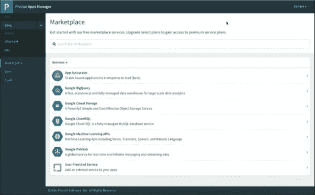

# 谷歌云会成为 Cloud Foundry 的大本营吗？

> 原文：<https://thenewstack.io/google-cloud-now-become-cloud-foundrys-home-base/>

基础设施资源——计算、内存、存储和带宽——在云领域变得如此高度商品化，以至于该领域的领导者(谷歌是其中之一)更难将其与竞争对手区分开来。就像巴顿将军对荣耀的解释一样，价格优势转瞬即逝。

因此，这些领导者需要新的接触方式，提供独特的服务，并在可能的情况下，独家或优先接触客户。

上周正式宣布在谷歌云平台上推出 Pivotal Cloud Foundry(商业版 Cloud Foundry)的,表明谷歌希望为潜在用户提供独特的东西，或者至少提高可能被视为商品的标准。

“如果你看看谷歌或亚马逊或微软 Azure 正在提供什么，你可以粗略地将提供给任何人消费的服务归类为接近真正商品化的东西——基础设施能力，”[云铸造基金会](https://www.cloudfoundry.org/)的首席技术官 [Chip Childers](https://twitter.com/chipchilders) 在接受新堆栈采访时解释道。“然后你会得到这些更高价值的服务，这些服务可能完全是那个特定平台独有的。”

## 原材料

Pivotal 的 Cloud Foundry 环境包括一个名为 Pivotal Apps Manager 的功能，这是一种面向开发人员的内部“应用商店”，他们可以在其中提供服务以集成到 PaaS 中。在谷歌云平台的情况下，诸如[其大表 NoSQL 数据库](https://cloud.google.com/bigtable/)、[其云机器学习 API](https://cloud.google.com/ml/)和[其云发布/订阅消息队列](https://cloud.google.com/pubsub/)等服务都可以通过这个应用管理器看到和访问。

在上一届 Cloud Foundry Summit Europe(在谷歌正式宣布之前)上，谷歌工程师[科琳·布里安特](https://twitter.com/ccbriant)和[埃里克·约翰逊](https://github.com/erjohnso)展示了 CF 与 GCP 的合作如何让谷歌的服务在 Pivotal Apps Marketplace 中占据显著位置。[Briant](https://thenewstack.io/google-cloud-platform-connects-cloud-foundry-using-bosh/)表示，她在服务代理功能方面的工作实现了这种配对，通过 Google 现有的身份和访问管理服务将 GCP 资源暴露给 CF 应用程序。

她说，这个 Google IAM 身份管理服务将通过认证服务账户将 CF 登录到 Google 的系统中，认证服务账户“就像用户账户一样，但应该由你的应用程序使用。它可以做用户帐户可以做的任何事情，所以您仍然可以对它们设置特定的权限。要使用 Service Broker，您基本上需要创建一个根级别的服务帐户，该帐户拥有项目级别的所有者权限，这使它能够创建新的服务帐户，这些帐户是我们将在 **[cf bind](https://docs.cloudfoundry.org/devguide/services/managing-services.html#bind)** 上提供给您的凭证。”

她指的是使用 Cloud Foundry 的本机语法绑定的服务实例。谷歌实际上负责贡献 [CF 的云提供商接口](https://github.com/cloudfoundry-incubator/bosh-google-cpi-release)，该接口将基础设施提供商连接到 CF 的 [BOSH](https://thenewstack.io/bosh-hooks-cloud-foundry-google-cloud-platform-offers-large-scale-vm-lifecycle-management/) 生命周期管理工具。

Cloud Foundry 的架构师希望由此实现向无服务器化的转变，CF 和 Google Cloud 作为同一平台的一部分相互识别和认证，同时为较低层的客户级用户提供便利。在这样的方案下，CF 开发人员会将公共云和 PaaS 平台视为一个大设备，然后由它来管理分别进行身份验证的用户的应用程序访问。他们可能会感知到服务器，但开发人员不必感知。

“Cloud Foundry 提供了抽象底层基础设施的能力，”Cloud Foundry Foundation 负责行业战略的副总裁 Abby Kearns 解释道，“为开发人员提供了一种简单易用的体验。Cloud Foundry 提供的抽象允许您作为开发人员部署和管理您的应用程序，并获得一致的体验，而不管底层基础架构如何。我这么说是因为这是 Cloud Foundry 为企业空间提供的价值。

“Cloud Foundry 是一个平台，”Kearns 曾说过。“使一个平台持久和成功的是广泛的服务。我们的目标是让更多的应用程序运行在 Cloud Foundry 上，但为了做到这一点，我们需要服务。服务和应用构成了平台的两端，使其能够继续构建和推动网络效应。”

“服务在很多不同层面上都很重要，”她说。“它们很重要，因为 Cloud Foundry 能够打包服务，并允许以前不被视为独立软件开发商或以数字为中心的公司建立商业模式，并向其他人提供这些服务。但它也提供了一种广泛获取服务的方式，以使这些应用程序更加成功，并创造更多价值。”

## 相互作用

Kearns 的论点指向第三层客户:在开发人员之下，比服务器端应用程序的用户低一层。随着越来越多基于云的应用成为服务提供商面向客户的一部分，他们自己也有了最终用户。因此，Pivotal Apps Marketplace 成为代表服务提供商的开发人员的一种供应模型，他们自己可能供应较低层的服务提供商来访问功能。

Kearns 在这里直接暗示的是，从现在开始，任何 PaaS 的竞争价值都将由其自助服务门户决定。这个组件成为开发人员可以构建的所有东西的目录，代表其他人组装面向客户的应用程序。

Cloud Foundry 和 Google 云平台之间的这种联系是否有效地锻造了完整的 PaaS 生态系统？换句话说，一旦这两者结合在一起，还有可互换的部分吗？

例子#1: OpenStack。当然，CF 在许多企业数据中心的 OpenStack 上托管， [IBM 一直倡导这样做](https://www.ibm.com/blogs/bluemix/2016/05/cloud-foundry-openstack-better-together/)。谷歌已经[开始接受连接到 OpenStack 的想法](https://cloudplatform.googleblog.com/2016/04/OpenStack-users-backup-your-Cinder-volumes-to-Google-Cloud-Storage.html)，如果不是完全集成的话。但是通常是谷歌之外的[开发者首先获得荣誉。](https://www.mirantis.com/blog/integrating-openstack-and-kubernetes-with-murano/)

当然，OpenStack 的全部目的是通过混合部署实现虚拟化。就目前而言，诀窍可能是平衡 OpenStack 和 GCF 作为不同的(尽管可能是并发的)部署目标。

“如果这两个基础设施目标存在差异，”CFF 的 Childers 告诉我们，“[*和*]让我们假设基础设施的性能足够接近，甚至可以说，每个云铸造集群中的服务目录可能只是略有不同。但更有趣的是，您实际上可以想象一些非常好的场景，在这些场景中，您将应用程序推送到主机，这些主机恰好是在您的私有云的 OpenStack 中运行的虚拟机，但您仍然向这些应用程序公开类似 Bigtable 的东西。对于一个组织来说，这绝对是一种可行的可能性。”

这并不是真正的单一托管层，尽管它是多个层上的多个服务相互交互的一种方式，就好像它们在同一层上一样。连接，如果还没有集成的话。

例#2: [Kubernetes](/category/kubernetes/) 。自去年以来， [Pivotal 已经明确表示](https://thenewstack.io/pivotal-says-new-cloud-foundry-supports-docker-images-not-docker-ecosystem/)虽然它拥抱集装箱化的理想，但它与 Docker 竞争。最近 [Kubernetes 发现自己保持着类似的立场](https://thenewstack.io/cri-o-make-kubernetes-center-container-ecosystem/)如果不是如此大胆地声明。Cloud Foundry 的编排经理是[迭戈](https://docs.cloudfoundry.org/concepts/diego/diego-architecture.html)。GCP 的配器经理是 Kubernetes。但当被要求解释 CF 和 GCP 的配对中哪一个胜出时，CFF 的 Abby Kearns 非常强调，甚至有点尖锐地提醒新堆栈，Cloud Foundry 是一个平台。

“是的，库伯内特斯和迭戈之间有一些竞争的性质，”卡恩斯说。“但是，我们也看到了以非常不同的使用情形同时运行两者的机会。根据您尝试完成的应用程序工作负载，将它部署在 GCP 的 Cloud Foundry 上可能是有意义的，或者直接部署在 GCP 上也是有意义的，这取决于您正在做什么。”

但是这些依赖是什么呢？Kearns 说她相信，随着越来越多的企业大规模部署容器，他们更喜欢依赖平台(这个词又出现了)。

“我们发现像 Kubernetes、Docker Swarm、[*和*]Mesos 这样的编排工具只占用于管理容器的工具集的一小部分，”她说。“对于这些公司来说，管理具有关键工作负载、安全性、合规性和法规需求的大规模容器是一件非常不同的事情。因此，当我们考虑在 GCP 这样的基础上运行 Cloud Foundry 的价值时，它允许这些公司利用公共云，但仍然拥有以安全和合规的方式大规模运行应用程序所需的框架和结构。”

## 占优势的阿尔法

那么是什么让 Cloud Foundry 成为比 Kubernetes 更好的容器生态系统中心竞争者呢？是什么让 GCP 上的 CF 成为可扩展性和安全性的平台，而 Kubernetes(有或没有 Cloud IAM，这可能是 Pivotal 门户中显示的另一个应用)不是平台？

卡恩斯的回应始于 1979 年， [**chroot**](https://wiki.debian.org/chroot) 和第一个独立名称空间的基础。她认为，孤立地运行程序的最初目的是通过更大的密度来解决提高利用率的基本问题。她认为，今天的集装箱化环境有着非常不同的目的。

“就在去年，我们已经看到了集装箱对人们的意义发生了转变，”她解释道。“他们越来越少地将容器用于密度，而更多地用于版本化运行时或一致的开发人员体验等方面，这些方面表明了数字化转型的转变，公司正在将容器视为垫脚石，使他们能够建立持续的交付实践。”

随着我们讨论的深入，卡恩斯和查尔德斯对 Cloud Foundry 和谷歌云平台将扮演的角色的描述越来越像是 GCP 是一个补充性的服务提供商，而不是一个主机。他们希望 CF 被视为完整的平台，而 GCP 被视为通过服务提升其价值的手段。Kubernetes 不在这些服务之列。

“随着组织开始考虑容器对他们的作用，”Kearns 说，“他们开始考虑，‘我如何大规模地运行它们，同时利用它们来满足我的需要？’也就是说，开发迭代地、持续地开发应用程序并将其部署到云的能力。"

不是“云”不是任何一片云。谷歌的也不行。因此，如果有人认为上周的声明将谷歌置于云铸造生态系统的中心，请三思。

[Cloud Foundry Foundation](https://www.cloudfoundry.org/) 是新堆栈的赞助商。

标题图片，[“巴巴里狮子”阿尔弗雷德·爱德华·皮斯爵士【1893】](https://commons.wikimedia.org/wiki/File:Barbary_lion.jpg)，在公共领域。

<svg xmlns:xlink="http://www.w3.org/1999/xlink" viewBox="0 0 68 31" version="1.1"><title>Group</title> <desc>Created with Sketch.</desc></svg>