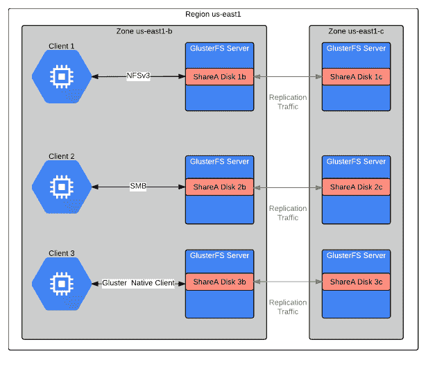

# Google Cloud 通过 Red Hat Gluster 提供符合 POSIX 的文件存储

> 原文：<https://thenewstack.io/google-cloud-offers-posix-compliant-file-storage-red-hat-gluster/>

红帽的数据管理软件包，云中红帽 Gluster Storage (RHGS)，在[谷歌云平台](https://cloud.google.com/) (GCP)。

“Red Hat Gluster Storage 提供了一个高度可用和容错的共享文件系统，可以垂直和水平扩展，”谷歌云解决方案架构师 Vic Iglesias 在宣布可用性的博客文章中写道。“Red Hat Gluster Storage 利用连接了磁盘的计算实例来提供分布式横向扩展文件系统。

RHGS 登陆 GCP 是谷歌和红帽合作关系的延续。回到 2014 年[，Red Hat Enterprise Linux (RHEL)在谷歌云平台](https://googlecloudplatform.blogspot.com/2014/04/announcing-red-hat-enterprise-linux.html)上可用，允许客户在 GCP 上运行 RHEL，就像他们在本地运行它一样。最近，这两家公司为 GCP 客户带来了 Red Hat 的 OpenShift(托管容器应用平台)。

“把它想象成下一波解决方案。存储现在可以在谷歌计算云上提供，”红帽副总裁兼存储和大数据总经理 Ranga Rangachari 在电话采访中说。

[RHGS](https://www.redhat.com/en/technologies/storage/gluster) 是 Red Hat 的开源 [GlusterFS](https://www.gluster.org/) 横向扩展网络附加存储文件系统的商业支持发行版。在谷歌的参与下，红帽 Gluster 存储现在可以在所有三大公共云平台上使用——AWS、微软 Azure 和谷歌云平台。

Red Hat Gluster 存储完全符合 POSIX 标准。Rangachari 表示，POSIX 兼容的分布式文件系统通过提供兼容的通用存储平台，无需重写应用程序，就可以将各种应用程序部署到谷歌云平台上。

RHGS 还使系统设计人员能够在内部和公共云平台(如 Google Cloud)上部署相同的存储技术，并具有弹性可扩展性。

现在，GCP 的客户可以创建一个更安全、高度可用的存储池，通过聚合多个 Google 持久磁盘，可以在几分钟内无中断地扩展到数 Pb 的数据。

Iglesias 写道:“集群中的每个节点都可以利用高达 64TB 的磁盘，以及高达 15，000 个 IOPS。”

“Red Hat Gluster 存储的优势在于，客户可以在物理环境和虚拟环境中运行它；公共云和私有云环境。它使组织能够根据其工作负载和 SLA 之类的东西运行他们选择的任何东西，”Rangachari 说。

它使管理员能够前所未有地轻松管理存储，因为数据或应用程序在哪里都无关紧要；他们可以轻松地在内部和公共云之间转移工作负载。

Rangachari 分享了一些 Red Hat Gluster 存储的使用案例。媒体渲染领域(图形和电影工作室类型的环境)中有一些 Red Hat 客户，他们希望在计算和存储方面都实现扩展。这些客户通常会在这些公共云中运行此类操作，因为这样他们就不会受到数据中心的限制。

许多客户从内部基础架构开始。但是，当他们需要额外的容量时，他们不会出去构建自己的存储结构，而是利用 RHGC 的可扩展特性，像手风琴一样扩展到公共云。

一个有趣的用例是灾难恢复。由于 RHGC 具有固有的复制和分布式文件功能，它可以与灾难恢复计划集成。它实际上是将私有数据中心的数据复制到公共云中。如果有任何灾难，客户可以切换到云，并几乎立即开始使用它。

如果 Red Hat 的认证云和服务提供商(CCSP)计划确保作为 CCSP 的一部分运行的所有 Red Hat 产品都受到该公司的完全支持，那么也简化了云使用的途径。

他们通过 Red Hat 订阅获得的所有价值都会随之转移到这些公共云中。

红帽是新堆栈的赞助商

通过像素的特征图像。

<svg xmlns:xlink="http://www.w3.org/1999/xlink" viewBox="0 0 68 31" version="1.1"><title>Group</title> <desc>Created with Sketch.</desc></svg>