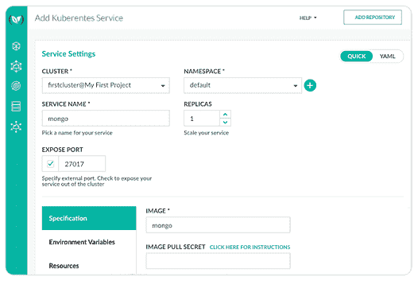
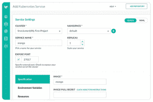
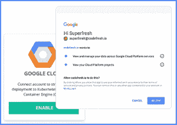

# 谷歌和 CodeFresh 合作让 Kubernetes 更容易访问

> 原文：<https://thenewstack.io/google-codefresh-collaborate-make-kubernetes-accessible-smaller-organizations-new-users/>

容器技术是一个美丽的东西。创建一个单一平台来在任何云(公共云或私有云)上部署应用程序，然后协调它们的运行方式和位置，这是可扩展性、灵活性和可移植性(所有容器功能)的极致。Kubernetes 正在迅速成为行业标准的容器编制者；[最近对 200 多家公司](http://www.prnewswire.com/news-releases/rush-to-hybrid-cloud-deployments-drives-demand-for-enterprise-container-infrastructure-451-research-study-reveals-300466044.html)的调查显示，71%的受访者表示 K8s 是他们自动化容器部署、扩展和管理的首选系统。谷歌云在提供托管的 Kubernetes 托管服务方面处于领先地位，其他云供应商也紧随其后。

尽管 Kubernetes 很受欢迎，但是它的强大功能并不是每个组织都能掌握的。 [Codefresh](https://codefresh.io/) 的联合创始人兼首席执行官[拉结尔·塔比](https://www.linkedin.com/in/razielt)说:“Kubernetes 的部署可能很复杂，这对开发团队来说是一个很高的准入门槛。“对于无法投入大量资源来提升这项新技术的中小型组织来说，采用这项技术尤其困难。”

Codefresh 针对 Kubernetes 的配置 UI

Codefresh 是第一个将容器映像放在平台中心的 Docker-native CI/CD 平台的制造商，它现在宣布与谷歌云合作，创建一个新的快速启动集成，用于部署到[谷歌容器引擎](https://cloud.google.com/container-engine/)(谷歌云的托管 Kubernetes 服务)。这种集成结合了谷歌云的最佳 Kubernetes 平台和 Codefresh 的容器管理平台，Tabib 说，这使得“任何开发人员都可以在短短 10 分钟内自动将他们的应用程序部署到 Kubernetes。”

新的集成通过将容器创建和测试过程与在 Kubernetes 上部署容器的更简单方法相结合，简化了开发体验。新用户可以轻松地在 Kubernetes 上开始部署，而不会影响对强大功能的访问，自动化管道可以加快开发速度，减少任何 Kubernetes 公民的错误。

8 月 30 日，Codefresh 和谷歌将[联合举办一场网络研讨会](https://www.brighttalk.com/webcast/10619/272279)来展示新的流程和整合。谷歌容器引擎的产品经理威廉·丹尼斯和 Codefresh 的工程师[丹·加菲尔德将解释如何使用新的集成来加快 Kubernetes 管道的开发速度。需要注册；点击上面的链接注册。](https://www.linkedin.com/in/dan-garfield)

主题将包括:

*   建立您的第一个 Kubernetes 集群。
*   部署您的第一个应用程序的完整指南。
*   自动部署到谷歌容器引擎(GKE)。
*   测试微服务的策略。
*   Docker 注册表中高质量控制的图像标记策略。

此前，Google Cloud 和 Codefresh 已经合作将 Google Container Registry 集成到 Codefresh 的平台中，以便为开发人员提供 Docker registry，让他们直接从 CI/CD 流中使用。

“谷歌容器引擎降低了成本，简化了供应和维护集群的过程，而 Codefresh 简化并加速了应用程序在 Kubernetes 上的部署，”Tabib 说。“真是绝配。”

<svg xmlns:xlink="http://www.w3.org/1999/xlink" viewBox="0 0 68 31" version="1.1"><title>Group</title> <desc>Created with Sketch.</desc></svg>