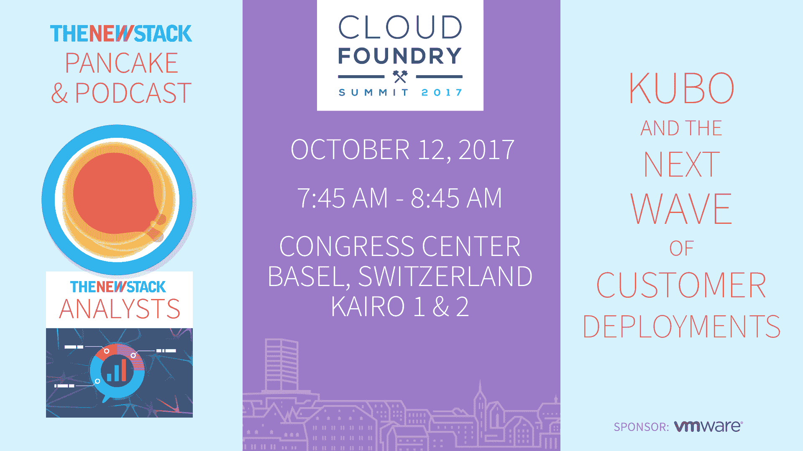

# 谷歌容器引擎快速集成 Kubernetes 1.8

> 原文：<https://thenewstack.io/google-container-engine-quickly-integrates-kubernetes-1-8/>

随着 [Kubernetes 1.8](https://thenewstack.io/kubernetes-1-8-arrives-improvements-simplicity-stability-security-storage-improvements/) 的发布，与 Google Container Engine 集成的声明也紧随其后。当然，Kubernetes 起源于谷歌，但在 2015 年作为种子技术捐赠给了新成立的[云本地计算基金会](https://www.cncf.io/)。它与开源项目的持续密切合作使它成为集成新版本的最佳选择。

“这对于开源项目和 GKE 来说都是一个重大的发布，”Kubernetes 和谷歌容器引擎(GKE)的首席软件工程师[蒂姆·霍金](https://github.com/thockin)说。

“对于在[容器引擎](https://cloudplatform.googleblog.com/2017/09/google-container-engine-kubernetes-18.html)上运行的人来说，我们有很多关于混合企业功能和安全性的特性，我们开始将支持容器和 Kubernetes 的谷歌云视为一等公民。我们将一路走向云 API。”

它在 GKE 的功能中吹捧增加的自动化。

[节点自动修复](https://cloud.google.com/container-engine/docs/node-auto-repair)处于测试阶段，可选择加入。它使用 Kubernetes 节点问题检测器来修复节点和集群。

“在此版本之前，Container Engine 始终为您托管您的主服务器，因此您不必担心管理或升级您的主服务器。但升级节点仍然是用户驱动的操作，”霍金说。

“我们发现这是人们的软肋。他们不太知道如何去做，或者被这个过程吓倒了。因此，如果您选择加入，我们将为您管理您的节点。你会给我们一个维护窗口，然后我们会升级你的节点，并确保你运行的是最新、补丁最多的 Kubernetes 版本。”

[节点自动升级](https://cloud.google.com/container-engine/docs/node-auto-upgrade)一般可用，也可选择加入。

“根据我们使用 Kubernetes 的经验，我们已经积累了关于机器出现故障时意味着什么的知识。通过自动修复过程，我们将开始自动更换由于某种原因而出现故障的机器，这消除了人们遇到的绝大多数短暂问题，因此您不会因为磁盘空间不足、文件系统损坏或类似情况而停机。我们会拆掉你的集装箱，在一台新的机器上重新启动，然后把你下面的机器换掉。你不必担心，”他说。

它还解决了容器联网问题，具有测试版的 [IP 别名](https://cloud.google.com/container-engine/docs/ip-aliases)等功能。别名 IP 仅适用于新集群；对迁移现有集群的支持将在即将发布的版本中添加。

“这是我们第一次将管道容器概念深入到基础设施。

“…别名 IP 使我们能够保留容器 IP 地址，一直到 GCP (Google 云平台)基础架构。现在这是一流的东西，它不仅仅是我们以前使用的 API 的副作用。这对用户影响不大，但对系统影响很大，因为这意味着我们现在可以更全面地整合 GCP 提供的一切，”他说。

例如，将使用 GCP 的 [VCP 对等](https://cloud.google.com/compute/docs/vpc/vpc-peering)功能的云托管产品将使用 IP 别名，这在以前是不可能的。我想你会看到这只是许多 API 适应谷歌和其他云提供商的容器的第一步。我认为所有的云提供商都看到了不祥之兆:他们必须让容器成为他们的 API 能够理解的东西。"

有了 1.8 版对 Spark 的原生支持，Kubernetes 上的 Spark 现在可以使用 bigdata-interop 连接器与 Google BigQuery 和 Google 云存储进行通信，作为 Spark 的数据源和接收器。

alpha 即将推出的两个特性包括多集群入口和[共享 VPC](https://cloud.google.com/compute/docs/shared-vpc/) 支持。

多集群入口允许您在不同的区域运行多个 GKE 集群，使用[谷歌云负载平衡](https://cloud.google.com/load-balancing/)通过使用最近的集群始终获得最佳延迟和性能。您可以在一个区域内的最多三个区域中运行 Kubernetes 主节点和节点，以确保高可用性。你可以[报名](https://docs.google.com/forms/d/e/1FAIpQLSdR0OGKrSqod1LE8zIXdVurZkaVIGAaLdXdb19lmtJhO-OJmA/viewform)参加组织内多个项目共享 VPC(虚拟私有云)的早期测试。

客户还可以在谷歌云上的一个容器化应用程序中注册英伟达的特斯拉 P100 GPU 的 alpha 测试。

Ubuntu node image 现在也普遍可用，用户可以在使用它和 Google 的托管映像之间进行选择。

并且节点可分配特性通常是可用的，该特性保护节点组件免受资源不足问题的影响。Hockin 说，它对机器上实际发生的事情提供了更好的解释，所以你不会过度使用机器。

谷歌云和 CNCF 是新堆栈的赞助商。

通过 Pixabay 的特征图像。

<svg xmlns:xlink="http://www.w3.org/1999/xlink" viewBox="0 0 68 31" version="1.1"><title>Group</title> <desc>Created with Sketch.</desc></svg>