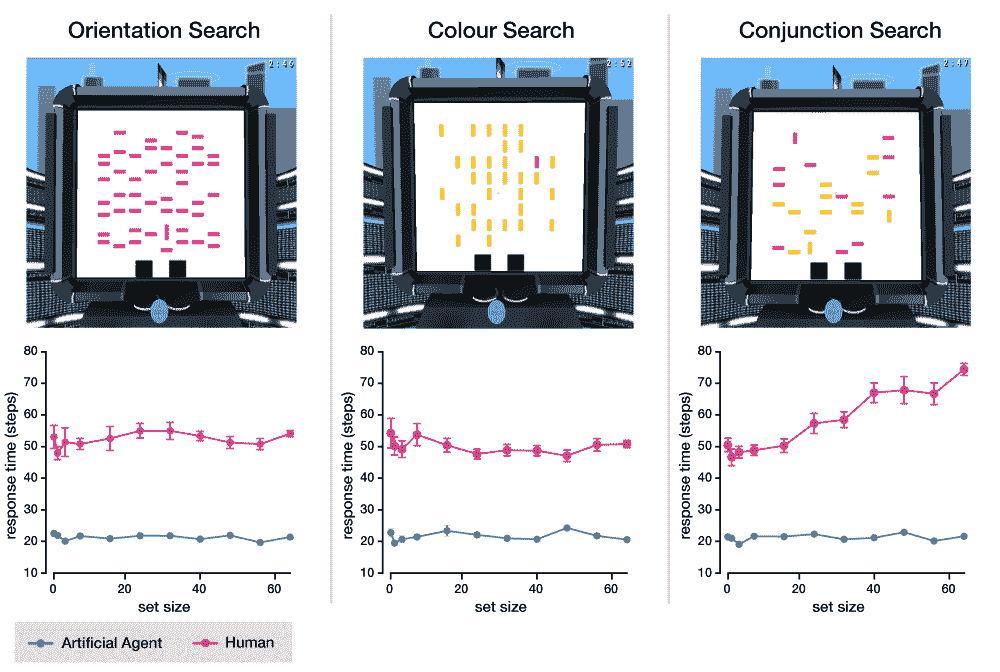

# 谷歌 DeepMind Psychlab 用认知心理学评估 AI

> 原文：<https://thenewstack.io/google-deepmind-psychlab-assesses-ai-with-cognitive-psychology/>

近年来对人工智能的研究一直专注于开发普遍智能的人工智能，这意味着人工智能不是专门掌握一项特定任务——例如玩一种游戏——而是可以学习和获得各种技能，就像人类一样。

但是，即使是最简单的任务也会涉及许多认知功能。因此，即使人工智能研究开始从人类大脑如何工作中获取更多线索，以开发新型算法和架构，但当人工智能代理成功完成任务时，仍然不总是完全清楚使用了哪些人工认知技能。

为了帮助更好地识别这些认知组件是如何发挥作用的，谷歌的人工智能研究实验室 [DeepMind](https://deepmind.com/) 最近发布了一个开源工具包，允许开发人员在受控环境中研究人工智能行为，类似于认知心理学家可能使用为研究人类行为过程(如注意力、感知、记忆、思维、创造力和解决问题)而设计的测试。

根据[网站上的帖子](https://deepmind.com/blog/open-sourcing-psychlab/)，DeepMind 的 [Psychlab](https://github.com/deepmind/lab/tree/master/game_scripts/levels/contributed/psychlab) 平台建立在 [DeepMind Lab](https://deepmind.com/blog/open-sourcing-deepmind-lab/) 之上，这是一个可定制的第一人称模拟 3D 环境，用于在各种任务中训练和测试自主 AI 代理。

就像人类心理学实验在临床环境中的组织方式一样，Psychlab 建立了一个等效的框架，在 DeepMind 实验室的虚拟环境中，测试人工智能代理和人类受试者的认知能力。

“这通常包括参与者坐在电脑显示器前，用鼠标对屏幕上的任务做出反应，”DeepMind 研究员乔尔·雷博解释道。“同样，我们的环境允许虚拟主体在虚拟计算机显示器上执行任务，利用其凝视的方向做出反应。这使得人类和人工智能都可以进行相同的测试，从而最大限度地减少实验差异。它也更容易与认知心理学中的现有文献联系起来，并从中汲取真知灼见。”

Psychlab 提供的一些“经典实验任务”包括:视觉搜索(测试在一系列项目中搜索目标的能力)；连续识别(测试记忆中不断增长的项目清单)；任意视觉运动映射(测试刺激-反应配对的回忆)；变化检测(测试检测延迟后重新出现的对象数组中的变化的能力)；视敏度和对比敏感度(测试识别小的和低对比度刺激的能力)；玻璃图案检测(测试整体形状感知)；随机点运动辨别(测试感知连贯运动的能力)和多目标跟踪(测试随时间跟踪移动目标的能力)。

[https://www.youtube.com/embed/54AS3a6niPo?feature=oembed](https://www.youtube.com/embed/54AS3a6niPo?feature=oembed)

视频

转移这些指标有一些很大的好处。“Psychlab 使分析实验数据的方法成为可能，这些实验数据在心理学中很常见，但在人工智能研究中相对未知，”论文作者写道。“例如，我们描述了可以直接与人类相比的人工制剂的心理测量功能、检测阈值和反应时间的测量方法。”

此外，人类测试对象在虚拟 DeepMind 实验室测试环境中获得的结果与现实世界中的测试结果相同。例如，在视觉搜索测试中，通过让参与者从许多不同的物体中找出一个特定的物体来测量选择性注意力，该团队发现，如果只有一个因素存在差异，人类能够在真实和虚拟环境中相对相同的时间内完成任务——与其他人相比，搜索一个不同颜色的条形或一个方向不同的条形。然而，当存在不止一个差异因素时，人类的反应时间会略有增加——例如在一组包括不同颜色*和*形状的条形中寻找一个粉色条形。相比之下，实验中的人工智能代理在相同的时间内完成了各种视觉搜索任务，而不管这些对象之间有多少不同。

Psychlab 中视觉搜索任务中人类和人工智能反应时间的差异。

根据该团队的说法，这些发现表明，人工智能代理的某些认知功能与人类的工作方式不同，毫无疑问，这将有助于了解人工智能在未来是如何设计的。随着人工智能研究越来越多地从其他学科如[神经科学](https://thenewstack.io/stronger-artificial-intelligence-needs-neuroscience-inspiration/)中汲取灵感，这样的发展是朝着创造人工智能迈出的一步，人工智能不仅像人类一样学习，而且可能像人类一样思考和行为。

其他人可以建立他们自己的认知任务，让他们的人工代理来执行。DeepMind 的开源、“灵活易学”的 Psychlab can 可以在 [Github](https://github.com/deepmind/lab/tree/master/game_scripts/levels/contributed/psychlab) 上找到，此外还有他们的研究论文 [here](https://arxiv.org/pdf/1801.08116.pdf) 。

图片:DeepMind。

<svg xmlns:xlink="http://www.w3.org/1999/xlink" viewBox="0 0 68 31" version="1.1"><title>Group</title> <desc>Created with Sketch.</desc></svg>