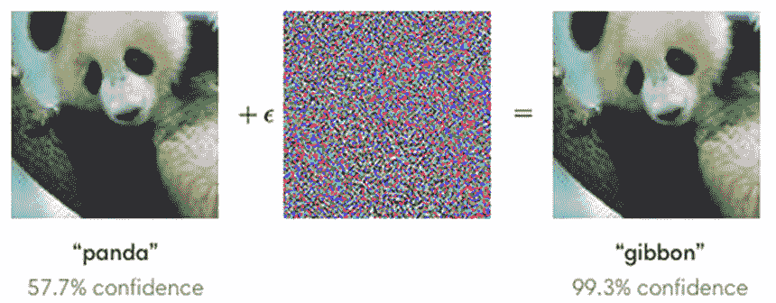
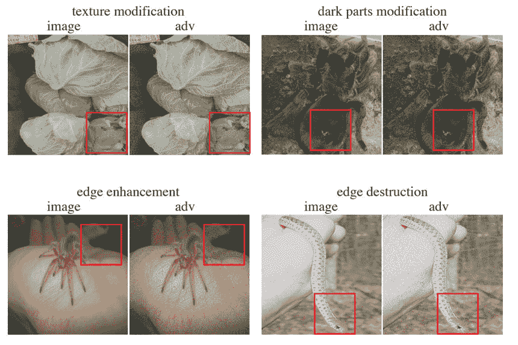
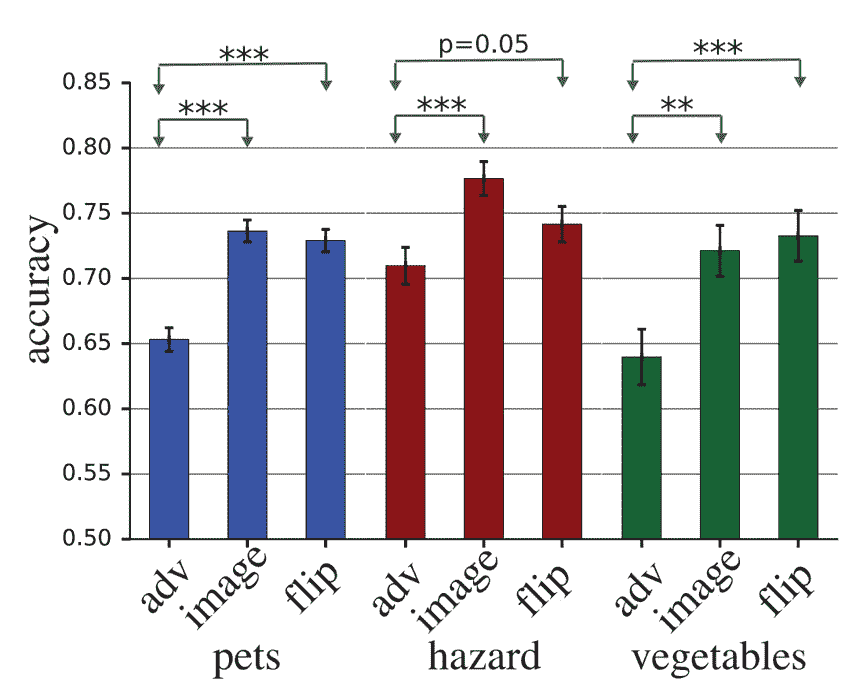

# 谷歌开发了愚弄人类和计算机的“反面例子”图像

> 原文：<https://thenewstack.io/google-develops-adversarial-example-images-that-fool-both-humans-and-computers/>

我们知道人工智能技术正变得越来越强大:它可以帮助我们更准确地诊断疾病，帮助汽车自动识别行人，甚至提高建筑行业的生产率。

但是我们知道机器，不管它们有多聪明，也会犯错误——有时会带来非常悲惨的后果。有时，机器可能会被故意愚弄，所谓的[对抗例子](https://en.wikipedia.org/wiki/Adversarial_machine_learning)——例如，当自动驾驶汽车中的计算机视觉系统被隐藏在路标上的涂鸦欺骗，完全将它们解读为其他东西。

但令人惊讶的是，人类显然也可能成为迷惑人工神经网络的同样对抗性诡计的牺牲品。至少，这是谷歌大脑研究人员在开发一种算法时发现的，这种算法产生的额外信息可以叠加在现有图像上，导致机器和人类错误识别内容。正如上面的主图所示，在被这个软件修改后，人类和计算机都错误地将一张猫的图片归类为一张狗的图片。

然而，正如之前的研究表明的那样，愚弄机器学习模型并不难，因为它们看待世界的方式与我们人类不同。视觉分类模型使用一种被称为[卷积神经网络](https://en.wikipedia.org/wiki/Convolutional_neural_network) (CNN)的人工神经网络，在它们能够可靠地识别一个对象之前，它可能需要数百万个不同的训练图像。相比之下，生物视觉系统的效率要高得多，训练样本也少得多；人类儿童可能只看到几个不同版本的“猫”，然后他们可能会做出推断并概括出所有这些都符合“猫”的概念:耳朵、眼睛、身体等的特定形状。

另一方面，即使训练有素的人工智能模型也很容易被愚弄，做出错误的识别，只需增加一层称为扰动的视觉“噪声”。正如在这个熊猫的例子中所看到的，在添加这种干扰后，机器在 99%的情况下都会被误导识别为长臂猿，这是人眼无法察觉的。

## 阻挠人类的反面例子

但是正如谷歌大脑团队在他们的[论文](https://arxiv.org/pdf/1802.08195.pdf)中解释的那样，人类也可能被对立的例子所愚弄，尤其是那些以更“强大”和明显的方式精心制作的例子，它们被定制成成功地阻碍人类的视觉。知道具有不同架构的不同计算机视觉系统仍然会受到相同敌对例子的影响，该团队在这里的目标是看看机器中的这种漏洞是否可以“转移”到人类看待事物的方式上。

“我们(调整)了机器学习模型，以模仿人类的初始视觉处理，使对立的例子更有可能从模型转移到人类观察者，”该团队写道。“为了更好地匹配人类视觉系统的初始处理，我们为每个模型输入预先添加了一个视网膜层，其中包含了人眼执行的一些转换。在这一层中，我们对图像进行了偏心率相关的模糊处理，以逼近人类受试者的视觉皮层通过其视网膜网格接收到的输入。”

为了实现这一点，研究人员对物体的边缘进行了处理，要么软化或增强它们，要么改变对比度和纹理，要么修改图像的黑暗区域。向人类受试者展示图像，按照宠物、蔬菜和危险生物(蜘蛛、蛇等)的类别分组——这些图像要么未经修改，要么经过扰动层修改，要么经过上下颠倒的扰动层修改(标记为“翻转”)——这是实验的控制案例，以观察对抗性扰动是否真的对人类视觉产生影响。参与者只有大约 60 到 70 毫秒的时间快速浏览图片，然后他们必须对图片进行分类。

足够有趣的是，人类和计算机在应用垂直扰动层的情况下，总是以更高的速度对图像进行错误分类。在这个有一张狗的照片的例子中，当使用敌对层(标记为“adv”)时，机器和人都倾向于不太准确地识别它，这一趋势也反映在其他图像组中。

## “神经网络的超常刺激”

但这些发现只是冰山一角，在神经科学和人工智能的交汇点上，还有更多答案有待发现。

研究人员写道:“我们的研究提出了一些基本问题，如对立的例子如何工作，CNN 模型如何工作，以及大脑如何工作。”“对抗性攻击从 CNN 转移到人类，是因为 CNN 中的语义表征与人脑中的相似吗？他们转而转移是因为 CNN 和人类大脑中的表征都类似于某种与现实自然对应的内在语义表征吗？”

这些都是非常吸引人的问题，但是如果对立的例子被用于更邪恶的目的，可能会有更广泛的影响。例如，深度学习模型可以被训练来评估人脸的可信度。研究人员说，在这种情况下，“就有可能产生对抗性的干扰，增强或减弱人们对可信度的印象，这些干扰的图像可能会被用于新闻报道或政治广告中”。

研究小组在对立的例子和自然发生的现象之间画出了一些额外的相似之处，一些动物使用某些“超常”的感官刺激来侵入其他动物的大脑反应，以利用它们。例如，布谷鸟雏鸟会这样做，以便其他物种的鸟来喂养它们，而不是它们自己的雏鸟。

“对立的例子可以被视为神经网络的一种超常刺激，”作者说。“一种令人担忧的可能性是，旨在影响人类行为或情绪的超常刺激，而不仅仅是图像的感知类别标签，也可能从机器转移到人类。”

知道了人工智能已经可以用来创建令人震惊的有说服力的假新闻视频来愚弄人类观众，不难想象人工智能可以在更微妙的层面上被用来创建以更潜意识的方式影响我们的敌对图像，就在意识的地平线以下——这是一个潜在的强大工具，如果落入坏人手中会很危险。

图片:谷歌大脑。

<svg xmlns:xlink="http://www.w3.org/1999/xlink" viewBox="0 0 68 31" version="1.1"><title>Group</title> <desc>Created with Sketch.</desc></svg>