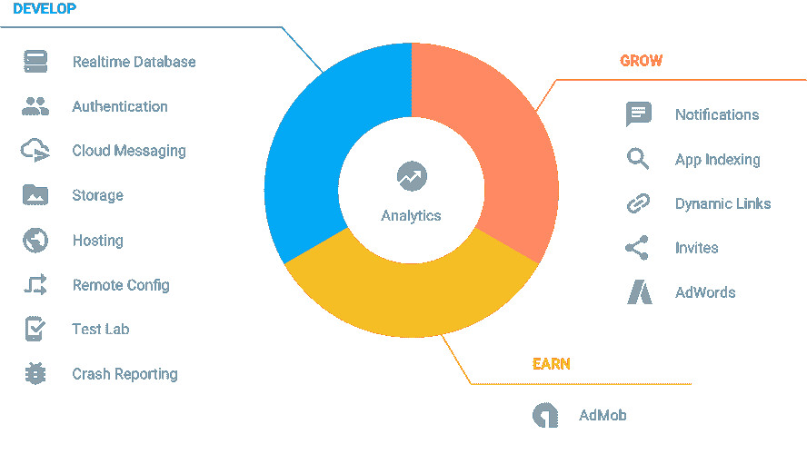

# Google Firebase 精简中间层以加快应用程序开发

> 原文：<https://thenewstack.io/google-firebase-trims-middle-tier-faster-app-dev/>

上个月在纽约举行的 [Serverlessconf](http://serverlessconf.io/) 会议上，谷歌工程师[迈克·麦克唐纳](https://twitter.com/asciimike)和[弗兰克·范·普夫伦](https://twitter.com/puf)解释了[谷歌 Firebase](https://firebase.google.com/) 的秘密武器:也就是说，应用程序不需要查询数据库，而是从数据库本身监听变更通知。

“我们已经淘汰了中间层。麦克唐纳说:“你的客户会直接与托管服务部门沟通。

存储在 Firebase 数据库中的数据是通过将异步侦听器附加到数据库引用来检索的。对于数据的初始状态，监听器将被触发一次，并且在数据发生变化的任何时候都会被触发一次，”[文档说明](https://www.firebase.com/docs/web/guide/retrieving-data.html)。

该软件还提供了其他优势。例如，用户不必担心数据库服务是由一台机器还是一个集群来处理。对他们来说，它是一个数据库服务的 API，可以扩展到任何工作负载，细节从操作员那里抽象出来。

Firebase 属于[无服务器技术](https://thenewstack.io/serverless-computing-growing-quickly/)范畴，因为它消除了设置大量基于服务器的基础设施来运行应用程序的需要。但它提供的服务比亚马逊的 Lambda、IBM 的 OpenWhisk、甚至是博格自己的谷歌云功能都更加定制化。

Firebase 是由两位工程师在十年前创建的，扩展了他们创建的综合在线聊天服务。他们发现这项服务也可以传递其他形式的应用数据。两人在 2012 年创办了一家公司，谷歌在 2014 年收购了这家公司。

Serverlessconf 的 Puffelen 说，对于 project，“我们的目标是去除中间件”。简而言之，Firebase 是一组集成的服务，可用于快速构建应用程序。

谷歌还将 Firebase 视为其他更丰富的谷歌云平台服务的温和引入。该团队正在将 Firebase 与[谷歌云平台](https://cloud.google.com/)服务进行集成，以便随着开发人员及其应用程序变得更加复杂，为他们提供一个简单的升级途径。

“我们希望随着您的扩展而扩展，当您构建应用程序并获得知识时，您将拥有一整套基础架构的惊人入口。很多是服务器端的，但很多是无服务器的，”McDonald 说。“事件刚刚发生，你可以对它们做出反应，并结合你需要的片段。”

那么你能用 Firebase 做什么呢？主要服务是 [Firebase 实时数据库](https://firebase.google.com/docs/database/)将数据存储为 JSON 字符串，并实时同步到每个连接的客户端。

在此基础上，还建立了各种其他专业服务。[消息](https://firebase.google.com/docs/cloud-messaging/)用于发送通知，并为用户提供即时消息。[认证](https://firebase.google.com/docs/auth/)服务提供后端服务、软件开发工具包和现成的 UI 库来认证用户。身份认证可以通过使用密码或联合身份提供商(如谷歌、脸书和 Twitter)来完成。Firebase [存储](https://firebase.google.com/docs/storage/)可用于存储和提供用户生成的内容，如照片或视频。

[静态网页托管](https://firebase.google.com/docs/hosting/)、[远程手机 app 配置](https://firebase.google.com/docs/remote-config/)、[安卓 app 测试](https://firebase.google.com/docs/remote-config/)、[崩溃报告](https://firebase.google.com/docs/crash/)也有。

表面上是一个移动开发平台，Firebase 可以用于 Android 和 iOS，以及 Web 应用程序、C++应用程序和一般的基于服务器的应用程序。服务器应用程序[需要服务器上的 Java SDK 或节点 SDK](https://firebase.google.com/docs/server/setup#prerequisites) 。从 Firebase 控制台，您创建一个项目并下载一个带有您的服务帐户凭证的 JSON 文件，然后将它放在您的 Web 应用程序/页面中。 [For Node.js](https://firebase.google.com/docs/server/setup#initialize_the_sdk) :

|  | 

< 跨度 类=【KWD】>var</跨度><跨度 类=【pln】 跨度><跨度 类 = 【双关】>=</跨度><跨度 跨度><跨度 类 = 【双关】>(</跨度>跨度 

<spanclass=【pln】>firebase<spanclass=【pln】>initialize app</ 跨度><跨度 类=【pln】>

service account</跨度 span><spanclass=【str】>path/to/<var><spanclass=【双关】 > ， <spanclass=【pln】>

database URL span><spanclass=【str】【>【【https://<var>

 |

在会议上，两人展示了一个样本[照片分析应用](https://github.com/firebase/friendlypix)，它将显示 Firebase 的功能。

麦克唐纳用他的智能手机给观众拍了一张照片，然后他把照片上传到了 Firebase 的存储器中。这个动作启动了一个 [Google Cloud Function](https://thenewstack.io/google-cloud-functions-arrives-challenge-aws-lambda/) 功能，该功能可以由对象故事的变化或发布/订阅通知触发。在这种情况下，该函数自动调用 [Google Cloud Vision API](https://cloud.google.com/vision/) ，这是一种可以根据主题对照片进行分类的服务，然后将结果显示回来。

麦克唐纳说，这个应用程序全部由不到 145 行代码组成，包括 HTML、JavaScript、CSS 和 JSON 代码。

## Firebase 和 10X 开发车间

Firebase 的意义不仅仅在于它提供了一套快速开发工具。这也是无服务器服务应该如何工作的先兆，观察到[Joe Emison](https://twitter.com/JoeEmison) ,[build fax](https://www.buildfax.com/)(也是本网站的定期撰稿人)的创始人兼首席技术官 Joe Emison在 Serverlessconf 的另一次演讲中说道。

“Firebase 是一个非常棒的工具。没有任何东西能与之媲美。但是你不能把它当成数据库。Emison 说:“位于它之上的微服务使你作为开发人员能够非常快速地做事情——这是一个很好的 API，它的响应速度非常快——它更像是一种满足组织某些需求的服务。”

Emison 说他不相信 10x 开发人员(比他或她的同行高 10 倍的开发人员)，但是相信 10x 开发车间。这些商店的秘密是快速迭代，这将是企业向前发展的竞争需要。

“10 倍开发是关于最小化依赖性。不要让你的开发人员等待数据库管理员或 it 运营人员。"这是我关心的无服务器环境."

https://twitter.com/JoeEmison/status/736380070638587904

Emison 概述了他使用一套定制的无服务器技术构建的应用程序。

这个名为 CommercialSearch.com[的网站是一个面向商业的房地产搜索服务网站，每月有大约 30 万独立访问者。由两位开发人员在四个月内创建，它运行在大约 13，000 行代码上。大部分工作由无服务器服务完成:搜索由](https://www.commercialsearch.com/) [Algolia](https://www.algolia.com/) 、 [Cloudinary](http://cloudinary.com/) 负责图像托管。Firebase 处理列表和验证。

Emison 解释说，Firebase 是一种代理服务，或者是一种定制服务，使一些技术更容易使用。在这种情况下，它提供定制的数据库管理服务。同样，Algoria 也是 Elasticsearch 的代理服务。

尽管许多 IT 架构师认为中间层是开发的核心，但是今天的大部分开发都发生在前端。而后端往往由管理员来处理。“我认为[中间层正在消失](https://thenewstack.io/why-the-middle-tier-including-docker-wont-matter-to-most-of-us/)。如果我们看看软件开发的发展方向，它是关于胖客户端的。是关于移动应用的。它是关于单页应用程序的。这是关于将许多流程转移到客户端。我们过去放在中间层的代码正在转移到客户端，”他说。

他说，AWS Lambda 等更通用的无服务器服务“只是我所需的一小部分”。他正在寻找能够带来更快发展的定制服务，比如 Firebase。

“我更需要 Firebase，而不是某个地方来执行代码，”Emison 说。

Google Firebase serving 是 Google 提供的一项服务，它有一个三层定价模型[和一个面向原型开发和爱好者的免费层，一个面向可预测工作负载的 25 美元固定定价模型，以及面向大规模使用的商品定价。](https://firebase.google.com/pricing/)

<svg xmlns:xlink="http://www.w3.org/1999/xlink" viewBox="0 0 68 31" version="1.1"><title>Group</title> <desc>Created with Sketch.</desc></svg>