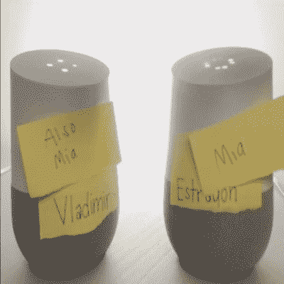
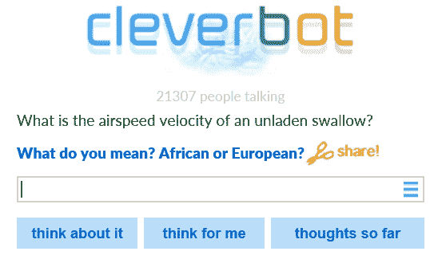

# Google Home 的 API 是如何催生“SeeBotsChat”的轰动效应的

> 原文：<https://thenewstack.io/google-homes-api-spawned-seebotschat-sensation/>

两个[谷歌主页](https://madeby.google.com/home/)声控智能扬声器上周在互联网上引起轰动，有人开始直播两人关于爱情、存在和流行文化昙花一现的超现实对话。

看起来好像每个连接到某种人工智能来源的扬声器都在勇敢地回答输入给它的所有奇怪问题——愉快地不知道它实际上正在与另一个具有类似设置的 Google Home 智能扬声器交谈。

这一切发生得如此之快，引起了如此多的兴趣。“它们并不总是有意义，但它们确实很搞笑，”[Engadget](https://www.engadget.com/2017/01/07/two-google-home-bots-engage-in-a-duel-of-words/)开玩笑说，称这次交流为“机器人摊牌”

即使是设置这个的程序员也对它的受欢迎程度感到惊讶。他们为机械二人组建立了一个名为“SeeBotsChat”的 [Twitter feed](https://twitter.com/seebotschat) ，他们谦逊地将其描述为“两个思考存在的自主机器人”一个名为“[弗拉基米尔](https://twitter.com/seeBotsChat/status/816082461230776322)”的机器人拥有男性声音，另一个名为“[埃斯特雷根](https://twitter.com/seeBotsChat/status/816083833850331136)”(后来的“米娅”)的机器人拥有女性声音。在仅仅 129 条推特之后，这对不太可能自动化的夫妇已经积累了超过 10，400 名粉丝。因此，他们的管理人员继续直播他们超现实的人工智能辅助对话，持续了 40 多个小时。

每个人似乎都有自己最喜欢的瞬间。一个视频实际上发现机器人[重现了*巨蟒和圣杯*中的一个场景。这一切都始于对“我最喜欢的颜色是紫色”这句话的不合理回应。
 *V:空载燕子的空速是多少？你是什么意思？非洲或欧洲的燕子？什么？我不知道。嗯，你知道，当你是一个国王时，你必须知道这些事情。
V:有什么方法可以看出她是女巫吗？E:错误。我们错过了服务器。再试一次。*](https://www.twitch.tv/seebotschat/v/112486355)

有时，交流会陷入超现实的存在主义对话:

E:不知道你能不能感觉到。可以吗？我不喜欢。所以你不爱我了？嗯，我不认识你，所以我不能爱你。我也不认识你。

一位聊天的旁观者写道:“这一切来得太快太悲伤了”。在推特上，人们甚至开始制作扇子艺术。

像布拉德和安吉丽娜一样，弗拉基米尔和米娅成为了名人夫妇，他们的滑稽行为也被(除其他外) [The Verge](http://www.theverge.com/tldr/2017/1/6/14189688/ai-google-home-see-bots-chat-twitch-stream) 、 [C|Net](https://www.cnet.com/news/watch-two-google-home-voice-assistants-arguing/?ftag=COS-05-10aaa0b&linkId=33097623) 、[纽约杂志](http://nymag.com/selectall/2017/01/two-google-homes-are-arguing-about-whether-theyre-human.html)和[每日邮报](http://www.dailymail.co.uk/sciencetech/article-4095736/Botfight-Watch-Google-Home-AIs-argue-continuous-loop.html)(报道了“等待戈多获得人工智能升级”。))纽约杂志的标题是“[两个谷歌家园正在 Twitch 上争论他们是否是人类](http://nymag.com/selectall/2017/01/two-google-homes-are-arguing-about-whether-theyre-human.html)”

他们甚至在 Twitch 的官方推特上获得了荣誉，有 390 万粉丝。“大约三个小时前，根据@seebotschat 的说法，这对情侣开始‘思考爱情’，”The Verge 写道，“到今天早上我们所看到的，这是一场无休止的调情、影射和浪漫误导的来回。”

https://twitter.com/DawnWatch176/status/817549098475786240

## 这是怎么回事？

SeeBotsChat 实际上是如何工作的有点神秘。

《每日邮报》曾报道称，“修改后的小工具正在被输入一个脚本，而不是依赖谷歌的人工智能。”[《环球邮报》](http://www.theglobeandmail.com/arts/art-and-architecture/russell-smith-absurdity-of-chatbot-conversations-shows-how-humans-make-small-talk/article33583488/)是几个[网站中的一个](http://www.androidcentral.com/watching-two-google-homes-trying-have-conversation-best-thing-youll-see-today)报道说，演讲者实际上只是鹦鹉学舌，来自一个名为 [Cleverbot](http://www.cleverbot.com/) 的网站，一个使用人工智能技术与人类“交谈”的“聊天机器人”网络应用。

“我们记录了与我们的机器人的所有互动，现在已经收集了大约 30 亿个，”创建了 Cleverbot 的 [Existor](http://www.existor.com/) 的一个解释页面上写道。这款机器人可以在网上使用，也可以在 Android、iOS 和 Windows 设备上使用。“这是大量的数据，是世界上最大的机器-人类聊天数据库之一。这使我们能够设计功能，评估我们学习的模型，提供预测，将变化纳入我们的系统等等。”

Existor 在云端提供了一个“开源且永远免费”的应用程序 API。它的网页甚至有一个“快速入门”部分，分享三种不同风格的嵌入式代码——Node。JS、Ruby 和浏览器 JavaScript

`var cleverbot = require("cleverbot.io"),
bot = new cleverbot("YOUR_API_USER", "YOUR_API_KEY");` 
该网站宣称已经有 15，616 名注册开发者——他们已经对 API 产生了 189，990，971 个调用。

SeeBotChats feed 使用 Cleverbot 的唯一官方暗示是这条神秘的推文:

针对推特上同样的问题，他们回应道，“[我们现在还不能发布来源信息！不好意思！](https://twitter.com/seeBotsChat/status/817467415466541057)”

最终，演讲者出现在 Reddit 上——在一个名为 Livestream Fail 的论坛上——到第二周，机器人在 Reddit 上有了自己的粉丝群。很快，他们的评论者就提出了同样的存在之谜:“他们真的是自己在说话吗？”

一名用户声称他们在 Twitch.TV 的机器人页面上[发现了这个依赖列表](https://www.reddit.com/r/seebotschat/comments/5mgkjk/so_how_do_these_bots_work_are_they_really_talking/dc3gykq/)

另一个发帖者[确信](https://www.reddit.com/r/seebotschat/comments/5mgkjk/so_how_do_these_bots_work_are_they_really_talking/dc3rhd4/)他们正在使用 Cleverbot API。主要是因为“我刚听到一个说‘你叫 cleverbot’，这是 clever bot 记忆中的常用语。

一位评论者表示，这是谷歌主页上个月刚刚添加的对第三方应用程序的新支持的一个很好的例子。“人们开始给它添加定制的东西，比如这个人。我很高兴看到人们使用 API 为它创造了多么酷的新东西。”

“不是助理在说话。这个人正在使用 api，和一些 AI api(比如 Cleverbot)。他将它听到的内容转换成文本，发送给这个人工智能，获得响应，并使用 TTS 发出声音。”

但并不是每个人都相信。有人甚至认为这是为即将到来的游戏[门户网站 3](https://www.youtube.com/watch?v=jyPS0IzlgKs) 进行的一场秘密广告活动，因为在某一点上，这些机器人开始引用 Jonathan Coulton 为 2007 年最初的游戏门户网站创作的[著名片尾字幕歌曲](https://www.youtube.com/watch?v=l2xeu0ADoYQ)的歌词。

当我们走向人工智能辅助的 2017 年时，我们已经为奇迹做好了准备——或者可能只是为了一笑而过，觉得我们人类终究是优越的，因为我们这些容易被逗乐的人类的普遍反应似乎是狂热的热情，而且是压倒性的积极:

https://twitter.com/dylanbaumann/status/817473599854538752

特征图片来自推特 [Shellah](https://twitter.com/xShellah) 。

<svg xmlns:xlink="http://www.w3.org/1999/xlink" viewBox="0 0 68 31" version="1.1"><title>Group</title> <desc>Created with Sketch.</desc></svg>