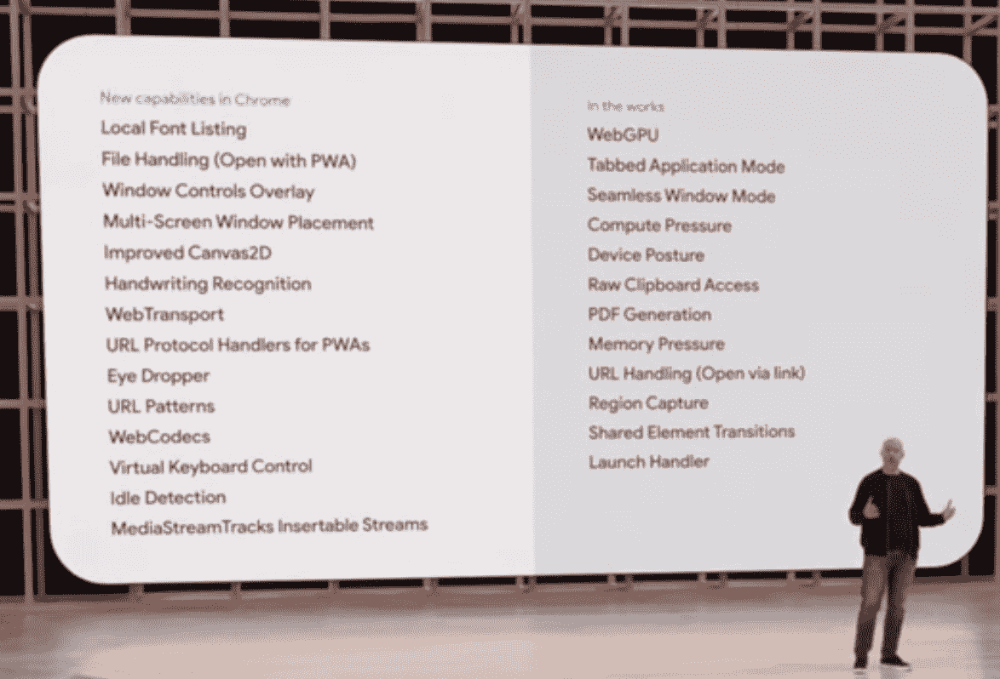

# 谷歌 I/O 2022 敦促开发者关注“真实世界”

> 原文：<https://thenewstack.io/google-i-o-2022-urges-developers-to-focus-on-the-real-world/>

谷歌年度开发者大会 [Google I/O](https://io.google/2022/) 于本周举行，主题之一是为“真实世界”开发。谷歌首席执行官桑德尔·皮帅在不到一分钟的时间里，在他的[开幕主题演讲](https://blog.google/technology/developers/io-2022-keynote/)(加入了“真实生活”)中，在讨论谷歌新兴的增强现实(ar)功能时，四次使用了这个短语。他谈到让谷歌用户“有能力花时间关注真实世界，我们真实生活中的重要事情。”

对开发者的暗示？你应该开发人们在日常生活中使用的应用和功能——在电脑、手机上，如果主题演讲中的一个宣传视频是可信的话——可能是一副 HUD(微型平视显示器)智能眼镜。

谷歌首席执行官桑德尔·皮帅谈论 HUD 智能眼镜的原型产品。

除了为其会议应用 Google Meet 添加了几个小功能之外，虚拟世界在主题演讲中几乎没有被提及。至于虚拟现实(VR)，显然在谷歌是不存在的。

[开发者主题演讲](https://youtu.be/qBkyU1TJKDg)继续巧妙地推动了为现实世界开发的主题。主持人 Jeanine Banks 在主题演讲中提到的第一个产品是 ARCore 地理空间应用编程接口，他是谷歌的开发者关系主管。班克斯说:“开发人员可以在 87 个国家的真实世界位置放置 AR 内容，从而免费轻松创建身临其境的体验。”

就连谷歌在 I/O 的网络平台代表本·加尔布雷斯(Ben Galbraith)也使用了“真实世界”(real world)一词，这一次是指谷歌浏览器团队多年来一直在推动的核心网络重要性能项目。“因为速度计测量的是真实世界的网络性能，”Galbraith 在谈到测量网站速度的工具时说，“这些改进转化为你和你的用户更快的体验。”

Ben Galbraith 和令人印象深刻的网络功能列表。

Galbraith 还提到了最近的 [Lego Spike web 应用](https://education.lego.com/en-us/downloads/spike-app/software)，它使用高级(仅限 Chrome)API 为 Lego 带来交互功能。这些 API 用于蓝牙和 USB 连接，所以这又是一个将现实世界中的一个物体(在这个例子中，是一个乐高玩具)与互联网连接的例子。

开发者主题演讲的另一个亮点是谷歌机器学习(ML)部门的更新。“我们相信 2022 年 ML 将成为每个开发者工具箱的一部分，”谷歌核心 ML 负责人 Alex Spinelli 说。“我们已经确保在任何你可以执行代码的地方，你都可以执行 ML，”他稍后补充道。对于 ML 模型的部署，他提到了 TensorFlow Extended (TFX ),他说它“让您快速、轻松地实现完整的管道；当然，如果你想要一个可管理的解决方案，Vertex AI 可以端到端地覆盖你。”

在早些时候的会议上，来自谷歌云的 [Karolina Netolicka](https://www.linkedin.com/in/knetolicka/) 介绍了 AlloyDB for PostgresSQL，“一个来自谷歌云的新的强大的关系数据库，完全兼容 PostgreSQL。”她指出，它也有“内置的 ML”

来自 Google Cloud 的 Karolina Netolicka 为 PostgresSQL 介绍 AlloyDB。

## 本周发展

### 谷歌的网络功能展示

在另一个有趣的 [30 分钟的会议](https://youtu.be/5b4YcLB4DVI)中，谷歌的乌娜·克拉韦茨和杰克·阿奇博尔德解释了“网络平台的新功能”前几年，这个会议展示了 Chrome 的最新功能，其中许多功能在苹果的 Safari 或 Mozilla 的 Firefox 中都没有。但今年，克拉韦茨和阿奇博尔德试图突出具有跨浏览器兼容性的功能(尽管仍有一些仅适用于 Chrome 的功能被提及)。

克拉韦茨谈到了一个名为“包容”的 CSS 功能，现在所有浏览器都支持它，“让开发人员告诉浏览器如何在屏幕上呈现内容并隔离 DOM 子树”，从而使浏览器“为了速度和效率而推迟大小、窗格和布局的呈现”

乌纳·克拉韦茨谈论跨浏览器互操作性。

后来，Archibald 强调了层叠层，这是今年全新的 CSS 特性，在业界得到了完全支持。“跨浏览器的工程师和标准人员一起工作，几乎在同一时间推出了这一功能，”他指出。

Jake Archibald 讨论级联层，一个新的跨浏览器功能。

### 新的 SlashData 报告:Python 和 Rust 在前进

分析公司 [SlashData](https://www.slashdata.co/) 发布了第 22 版开发者行业报告(你可以填写表格在这里[下载](https://www.slashdata.co/free-resources/state-of-the-developer-nation-22nd-edition))。毫不奇怪，JavaScript 仍然是最受欢迎的编程语言，全球有近 1750 万开发者在使用它。然而，位居第二的 Python 继续缩小差距，目前拥有 1570 万用户。“数据科学和机器学习(ML)的兴起是 Python 越来越受欢迎的一个明显因素，”SlashData 指出，据报道，大约 70%的 ML 开发者和数据科学家都在使用 Python。

另一个大动作(尽管规模较小)是 Rust，它“在过去 24 个月里规模增长了近两倍，从 2020 年 Q1 的 60 万开发者增加到 2022 年 Q1 的 220 万。”该报告指出，Rust“主要用于物联网软件项目，但也用于 AR/VR 开发，最常见的是用于实现 AR/VR 应用程序的底层核心逻辑。”

来源:SlashData

报告中另一组有趣的统计数据是关于低代码工具的。SlashData 表示，46%接受调查的专业开发人员“在部分开发工作中使用低代码/无代码(LCNC)工具”。尽管有经验的开发人员，尤其是那些有十年以上经验的开发人员，最不可能使用这些工具。

### Web3 艰难的一周

Web3(又名 crypto)人群度过了艰难的一周，主要的加密货币和 NFT 的价值都在下跌。据[一家 Techmeme 头条](https://www.techmeme.com/220512/p8#a220512p8)周四报道，“比特币自 2020 年 12 月以来首次跌破 26000 美元，24 小时内下跌 15%；乙醚跌至 1720 美元，为 2021 年 7 月以来的最低水平。当然，经济中的其他人也在受苦，今年股市继续熊市，而通货膨胀率上升。但对于 Web3 初创公司来说，加密估值在开发层面的影响要大得多——因为正在构建的产品的核心是金融化。

来自具有讽刺意味的网站 [Web3 的莫莉·怀特进展顺利](https://web3isgoinggreat.com/)在接受《哈佛商业评论》采访[中说得很好](https://hbr.org/2022/05/cautionary-tales-from-cryptoland)。“这些技术[Web3]建立了财务壁垒；他们不会击倒他们，”她告诉 HBR。“他们试图给我们所做的一切引入一层金融化，我觉得在许多方面，这比他们试图取代的现有体系更糟糕。”

### Dev 本周推特

你现在可能正在重新考虑你的 Web3 项目，但是 WebAssembly 仍然是 Web 开发的金童。

<svg xmlns:xlink="http://www.w3.org/1999/xlink" viewBox="0 0 68 31" version="1.1"><title>Group</title> <desc>Created with Sketch.</desc></svg>