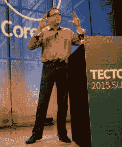

# Google 关注基于容器架构的必然未来

> 原文：<https://thenewstack.io/google-inevitable-future-container-based-architectures/>

本月早些时候，谷歌产品经理 Craig McLuckie 在纽约举行的 CoreOS [构造峰会](https://tectonic.com/summit/)的一次演讲中断言，基于容器的微服务不仅适用于网络规模的公司，也将是企业的最佳选择。

“直到你开始真正尝试运行大量的服务，你才会明显感受到容器带来的令人难以置信的生产力，”麦克卢奇说。

根据 McLuckie 的推理，这种基于容器的架构将很快成为企业不可避免的。如果这样的未来成为现实，将会给企业的 it 运营方式带来巨大的变化。支持这种新架构是谷歌创建[云本地计算基金会](https://cncf.io/) (CNCF)的动机，该基金会现在监管谷歌的开源 Kubernetes 容器管理应用。

Google 是容器的大用户，几乎所有的基础设施操作都依赖于容器。它每天投放大约 20 亿个集装箱。容器”为我们提供了一系列关于如何构建和运营数据中心的特征。这是我们运营模式的核心，”麦克卢奇说。迁移到容器架构给该公司带来了彻底的性能和效率改进。

他说，如今大多数企业都处于谷歌大约 10 年前的水平，那时候对谷歌工程师来说并不容易。他说，事实上，那些日子他们更愿意不说话。如果被问到，他们会紧张地抽搐，试图改变话题。

麦克卢奇说，随着谷歌继续跳跃式增长，他们“努力保持速度”。但所有这些惊愕导致谷歌工程师们认真思考该公司“难以置信的积极增长”的最有效架构。在给定的机器上工作最有效的方法是什么？如何对一台机器进行分区，使其发挥最大效率？

他们提出的方法 Google now 称之为“云原生计算”，或“B 型云计算”，以区别于云计算的最初尝试，在最初的尝试中，客户或内部业务部门基本上被提供划分为虚拟机的服务器空间。

麦克卢基承认，新方法提供的是计算，而不是计算机，这在当时是一个不和谐的概念。但是容器是有用的，因为它们解决了供应和部署的棘手问题。它们提供了一个封装的环境，可以在其中放置应用程序或应用程序的各个部分。

“这就解决了你的很多运营问题，”他说。应用程序本身甚至不需要在一个容器中。软件的不同部分可以彼此分离，每个部分都有自己的容器。

麦克卢奇说，这种装配线方法最强大的方面是“它允许你创建一个专业化的操作”。这将鼓励资源的重用，开发人员可以专攻堆栈的每个部分。他们不再需要担心应用程序运行的所有方面。

McLuckie 说，开发者的“责任止于集群开始的地方”。这种专业化反过来允许谷歌创建更复杂的系统。

当谷歌正在设计这种微服务架构时，脸书、Twitter 和其他网络规模的公司都在研究惊人相似的方法。McLuckie 说，他们“都共同发展了基于容器、动态调度的微服务架构的相同基本模式”，即使他们对不同的组件有不同的名称。

麦克卢奇认为，虽然这对于网络规模的公司有意义，但这种方法对于企业公司也越来越有意义。许多人正在建立物联网风格的传感器网络，这将产生海啸般的数据，并需要一套复杂的后端计算支持。

然而，容器只是解决方案的一部分。“Docker 会给你一个惊人的前五个小时，”McLuckie 说。之后，运营的重点会迅速切换到其他关注点。您还需要动态调度软件来了解应用程序的操作特征，并就在何处以及如何运行这些应用程序做出明智的决策，以实现最高的效率和弹性。

公司还需要一种控制和管理大量集装箱的方法。这就是为什么谷歌开发的 Kubernetes。Kubernetes”是我们对集群管理的看法。它简单、模块化、可扩展，”麦克卢奇说。“这是我们思考基础架构管理和部署应用程序的方式。”

Google 工程师不会将容器视为单独的对象，而是更大的应用程序的构建模块，每个容器作为一个整体保存应用程序的一个单独的组件。应用程序的不同部分可能有不同的资源需求，例如更多的处理或 I/O。因此将它们分开打包可以更有效地利用资源。它还使得升级组件变得更加容易，而无需将应用程序作为一个整体来关闭。在 Google 中，应用程序由大量的容器组装成一个单一的身份，称为 pod，可以通过一个单一的 IP 号码访问。

为了帮助世界其他地方适应类似的方法，谷歌开源了许多围绕这一架构开发的技术。该公司在资源隔离所需的控制组等新技术上所做的许多工作都是作为对 Linux 内核的开源修改而发布的。

“我们厌倦了解释为什么我们想要上游内核的改变。麦克卢奇说:“如果我们只是把这项技术作为开源来贡献，解释起来就容易多了。”。

谷歌发布 Kubernetes 部分是为了帮助组织建立自己的运营。CoreOS 本身提供了一个商业支持的 Kubernetes 版本，名为[architectural](https://thenewstack.io/coreos-debuts-tectonic-a-commercial-kubernetes-distro/)——这也是此次会议的原因。McLuckie 断言，Kubernetes 的魅力在于它可以轻松地在任何地方运行。它可以部署在 Amazon Web Services 或 OpenStack 实现上。

谷歌希望该软件将成为管理集装箱的事实上的标准，这就是为什么该公司提供 Kubernetes 作为 CNCF 的种子技术。

“目的是通过代码而不是规范建立一个标准，”麦克卢奇说。方法“不是创建大的头重脚轻的规范，并期望人们实现那些规范。其目的是找到解决实际问题的工作代码，并使用它建立一个语义标准，然后将该 API 提升为 API 标准，”McLuckie 说。

CoreOS 和 Docker 是新堆栈的赞助商。

专题图片:Craig McLuckie 在构造峰会上。由[本·希德尔](http://benhiderphotography.com/#!/HOME)拍摄。

<svg xmlns:xlink="http://www.w3.org/1999/xlink" viewBox="0 0 68 31" version="1.1"><title>Group</title> <desc>Created with Sketch.</desc></svg>