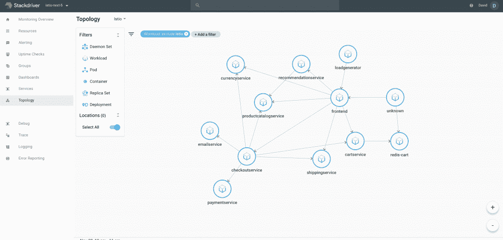

# Google 将 Istio 服务网格整合到 Kubernetes 服务中

> 原文：<https://thenewstack.io/google-integrates-istio-service-mesh-into-kubernetes-service/>

帮助为微服务和分布式应用提供流量管理、可观察性和安全性的开源服务网格 Istio ，本周又向前迈出了一步，因为谷歌宣布，它将于下个月以一键集成的形式来到[谷歌 Kubernetes 引擎](https://cloud.google.com/kubernetes-engine/) (GKE)。

该集成最初处于测试阶段，将通过在现有的 GKE 集群上分层服务网格来帮助 GKE 用户，并以 mTLS 的形式提供遥测、记录、负载平衡、路由甚至安全。该公司指出，所有这一切都是“通过简单地选中 GKE 管理控制台中的‘启用 Istio’框”来开启的

Istio [在今年早些时候刚刚达到生产就绪状态](https://thenewstack.io/istio-1-0-come-for-traffic-routing-stay-for-distributed-tracing/)，但谷歌在一篇宣布整合的博客文章中表示，服务网格正在被“几十个已经在生产中运行它的早期访问客户”使用，并且它预计这个数字将快速增长，因为超过 80%的最大客户已经在生产中使用 GKE 来运行他们的工作负载。

事实上，谷歌负责技术基础设施的高级副总裁 Urs hlzle 在去年 8 月 Istio 1.0 发布时的演讲中预测，在未来两年内，超过 90%的 Kubernetes 用户将运行 Istio。

根据谷歌云工程副总裁 [Eyal Manor](https://www.linkedin.com/in/emanor/) 的说法，Istio 是采用容器和微服务的企业发展的自然下一步。

“Kubernetes 席卷了全世界。Istio 是第二阶段，建立在它之上。一旦投入生产，Istio 会帮助您以安全、可见的方式实现自动化，”Manor 说。“Istio 是企业当前状态和企业未来状态之间桥梁，是云原生的。”

根据 Manor 的说法，Istio 的一个关键特性是它将业务逻辑的处理与操作逻辑分开。

“如今，当您想要在生产安全和通信、日志记录和可追溯性方面进行应用时，通常需要开发人员来完成一些工作。你的服务越多，你需要的工作就越多，”Manor 说。“使用 Istio，您可以在一个位置更改安全性、应用配额、管理身份等，而开发人员无需做任何事情。”

在声明中，Manor 引用了笛卡尔实验室、易贝和 AutoTrader UK 的早期用户，提供了笛卡尔实验室的一个轶事，说明 Istio 如何帮助管理在 Kubernetes 上构建分布式应用程序可能会增加的复杂性。

“Kubernetes 使他们能够根据需求进行扩展，但由于他们的应用程序有如此多的微服务和依赖项，因此很难发现性能问题。Manor 写道:“当一项服务过载时，可能需要花几个小时的时间来梳理日志，以找到问题所在。“部署 Istio 让他们变得清晰。一年多来，Istio 让他们看到任何给定服务的流量来自哪里，因此他们可以更快地解决问题。”

除了 GKE 集成，Manor 表示，这种集成只是第一步，用户可以期待 Istio 集成到其“广泛的”产品中，包括 GKE On-Prem，这是一种二进制兼容版本的 GKE，可以在自己的私人数据中心运行。至于项目本身的增长，Manor 解释说项目治理仍然很简单。

“从一开始，我们就接触了多个合作伙伴。才过了一年。IBM 是一个很好的合作伙伴，我们与他们有一个治理模型。VMware 正在做出贡献，并与其他多家公司一起成长，”Manor 说。“现在还为时过早，但我们希望与所有人合作。在这一点上，治理非常简单。这是谷歌和 IBM 的合作，并随着它的成熟而发展。在未来，这将是一个基础。现在，它是一个开源许可证。随着收养的增加，我们可以看看我们是否捐赠，但现在这只是语义上的。”

[https://www.youtube.com/embed/vJ9OaAqfxo4?feature=oembed](https://www.youtube.com/embed/vJ9OaAqfxo4?feature=oembed)

视频

<svg xmlns:xlink="http://www.w3.org/1999/xlink" viewBox="0 0 68 31" version="1.1"><title>Group</title> <desc>Created with Sketch.</desc></svg>