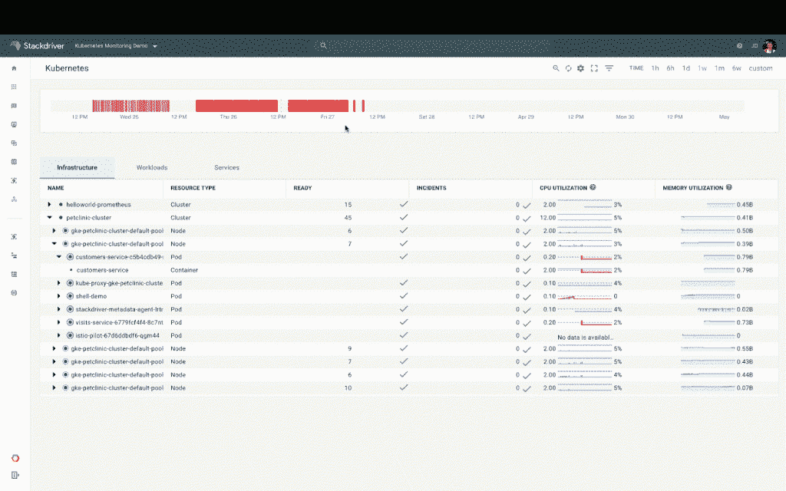

# Google 发布 gVisor，一个开源的沙盒容器运行时

> 原文：<https://thenewstack.io/google-launches-gvisor-an-open-source-sandboxed-container-runtime/>

继开源容器编排引擎取得巨大成功之后，谷歌推出了另一个开源云原生软件项目，保护容器免受其他容器的恶意入侵。

谷歌 Kubernetes 集团产品经理[阿帕娜·辛哈](https://twitter.com/apbhatnagar)说，与 Kubernetes 一样，谷歌希望谷歌内部开发的 gVisor 项目既能满足 Kubernetes 用户的需求，又能吸引外部开发人员来推进该项目。

辛哈说:“我们希望这个项目和其他项目之间会有显著的相互促进。”

## 在沙盒里

gVisor 软件为多租户环境中的容器提供容器隔离，在多租户环境中，来自多个用户的容器在同一个环境中操作。容器的多租户可能会有问题，因为它们共享相同的操作系统，使用一个容器的恶意攻击者可能会通过误用内核系统调用来窥探另一个所有者的容器。

迄今为止，阻止这种情况发生的最有效的方法是将容器放在虚拟机中，这很麻烦，并且会降低性能(尽管这一直是 [Kata Containers](https://thenewstack.io/kata-containers-secure-lightweight-virtual-machines-container-environments/) 的方法，它将虚拟机剥离到所需功能的最小集合)。像 seccomp 过滤器这样的内核特性也提供了隔离，但是它们需要维护预先批准的系统调用的白名单。

Sinha 说，gVisor 提供了与虚拟机相同的隔离级别，但在系统上占用的空间更小。基本上，gVisor 运行一个非常轻量级的 OS 内核，它可以在容器内以[非特权模式](https://thenewstack.io/quest-build-unprivileged-container/)运行超过 200 个 Linux 系统调用。内核是用 Go 编程语言编写的，因为它的内存和类型安全而被选中。

沙盒使用开放容器倡议(OCI)运行时 API，通过 runsc(Docker 的默认 runc 容器运行时版本)与 Docker 和 Kubernetes 完全兼容。

谷歌警告说，并非所有的 Linux 应用程序都可以在 gVisor 上运行，尽管容器中广泛使用的许多常见工作负载都可以在这种环境下运行，包括 Node.js、Java 8、MySQL、Jenkins、Apache、Redis 和 MongoDB。

谷歌在本周于哥本哈根举行的 Kubecon + CloudNativeCon 欧洲会议上宣布了 gVisor。在那里，该公司还推出了对其 [Stackdriver](https://cloud.google.com/stackdriver/) 云监控服务的更新，允许该软件监控 Kubernetes 的部署，无论它们是位于谷歌云平台上，内部还是其他云服务上。

Sinha 说，Stackdriver 为混合和多云部署提供了“单一平台”。“新产品统一了日志、指标和事件，以提供对 Kubernetes 结构整个层次结构的全面观察，包括容器、单元和集群，以及来自底层基础设施的信号。”

谷歌和 CNCF 是新堆栈的赞助商。

<svg xmlns:xlink="http://www.w3.org/1999/xlink" viewBox="0 0 68 31" version="1.1"><title>Group</title> <desc>Created with Sketch.</desc></svg>