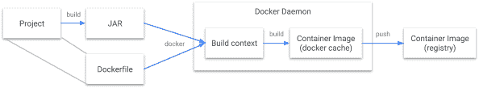

# 谷歌推出 Jib，Java 应用程序的自动化容器打包

> 原文：<https://thenewstack.io/google-launches-jib-automated-container-packaging-for-java-apps/>

谷歌发布了可以自动打包 Java 程序的软件，这样它就可以在原生云环境中运行。

据谷歌的两位工程师[阿普·古丹](https://github.com/loosebazooka)和[陈清扬](https://www.linkedin.com/in/qingyang-chen-63b6b361/)称，Jib 是一个开源的 Java“容器化器”，可以处理将你的应用程序打包成容器映像的所有步骤，他们共同撰写了一篇博文[宣布这项新技术](https://cloudplatform.googleblog.com/2018/07/introducing-jib-build-java-docker-images-better.html)。

二十多年前由 Sun Microsystems 创建的 Java 是作为一种“编写一次，在任何地方运行”的编程语言推出的，其中所有的代码都被打包在一个 JAR 文件中，并由 Java 虚拟机在任何平台上运行。然而，随着容器化的引入，对在任何地方运行代码的需求已经扩大。现在很少有商店只提供 Java，许多商店转向容器化来实现真正的应用程序可移植性，

这需要更多的工作。工程师指出，如果你想在容器中运行 Java 程序，你必须“写一个 Docker 文件，以 root 用户身份运行 Docker 守护进程，等待构建完成，最后将映像推送到远程注册表”。

容器化 Java 应用程序的标准方法。

从开发人员的角度来看，使用 Jib 打包 Java 应用程序的步骤。

有了 Jib，开发者不需要写 Docker 文件，甚至不需要安装 Docker。相反，Jib 是一个插件，可以与 [Apache Maven](https://maven.apache.org/) 或 [Gradle](https://gradle.org/) 开源自动构建软件集成。

这些工具用于创建容器映像，JAR 文件是用代码及其所有依赖项创建的(“胖 JAR”)。“由于 Jib 与您的 Java 版本紧密集成，它可以访问所有必要的信息来打包您的应用程序。工程师写道:“在后续的容器构建过程中，Java 构建中的任何变化都会被自动提取出来。

这种方法可以节省时间，尤其是在需要进行更新时。Jib 读取用于构建的配置文件，在不同的层(依赖项、资源、类)中构建应用程序，因此可以仅使用更新的组件快速地重建应用程序。

本周，谷歌并不是唯一一家向企业 Java 开发者宣传容器化的公司。在一篇博文中，Red Hat 开发者体验总监 [Rafael Benevides](https://twitter.com/rafabene?lang=en) 认为，由 Google 首先开发的 Kubernetes 容器编排引擎可以被认为占据了与 Java 应用服务器在过去十年中类似的角色。但是它们也有额外的好处。“迁移到容器、Kubernetes 和微服务的最大好处之一是，你不必为你的应用选择单一的应用服务器、框架、架构风格甚至语言，”他说。

[谷歌](https://cloud.google.com/kubernetes-engine)和[红帽](https://www.openshift.com/)是新堆栈的赞助商。

通过 Pixabay 展示艺术。

<svg xmlns:xlink="http://www.w3.org/1999/xlink" viewBox="0 0 68 31" version="1.1"><title>Group</title> <desc>Created with Sketch.</desc></svg>