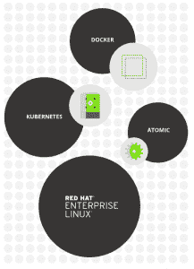

# 谷歌云平台现在支持红帽 OpenShift

> 原文：<https://thenewstack.io/google-now-supports-red-hat-openshift/>

希望促使客户将他们的容器部署从测试转移到生产，谷歌和红帽[已经集成了](https://googlecloudplatform.blogspot.com/2016/01/google-and-red-hat-integrate-openshift-dedicated.html?m=1)红帽 [OpenShift](https://www.openshift.com/) 平台服务软件与[谷歌云平台](https://cloud.google.com/) (GCP)服务的集成。

这篇博客文章称，这项交易“将 Red Hat 的企业级容器应用平台与谷歌围绕容器的[运营专长](https://research.google.com/pubs/pub43438.html)结合在一起。”

“你将使用 Kubernetes 和 OpenShift 获得对容器的改进支持，以及获得旨在帮助你更好地利用数据的强大 GCP 服务，”公告写道，描述了两家公司的客户如何在他们将容器从实验阶段转移到管理生产工作负载时请求更多支持。

最终目标是让公司更容易采用容器，将平台管理从开发人员的工作负荷中移除，让他们专注于编写代码。

谷歌自 2014 年以来一直托管 Red Hat Enterprise Linux，Red Hat 是 Kubernetes 的早期采用者之一，但这次宣布将合作关系提升到了一个新的水平，导致了更紧密的集成。

根据最近 [InfoWorld 的一篇文章](http://www.infoworld.com/article/3025334/cloud-computing/googles-new-managed-containers-are-brought-to-you-by-red-hat.html)，谷歌一直在稳步开发基于容器技术的[开源混合云环境，但缺乏私有云组件。这种安排给了他们那块拼图。Red Hat 的 OpenShift Dedicated 是一个内部运行的 OpenShift 版本，一个月前刚刚推出。](http://www.infoworld.com/article/3016021/hybrid-cloud/road-to-cloud-native-may-start-and-end-at-google.html)

这是一笔双赢的交易。根据[寄存器](http://www.theregister.co.uk/2016/01/21/google_red_hat_openshift/)；红帽“获得了一个强大的新合作伙伴来传播代码，谷歌将获得更多进入它所追求的企业开发者市场的机会。”

此外，到目前为止，Red Hat PaaS 需要使用 Amazon Web Services (AWS)，这是唯一一个足够大的公共云来支持它。现在，它也可以部署在谷歌上。这不仅对谷歌与 AWS 的竞争很重要，对信任红帽并正在寻找云托管选项的公司也很重要。

有一个问题仍然存在:Docker 在其中扮演什么角色？

虽然在这个公告中没有提到 Docker，但 Red Hat 网页上描述 OpenShift 的图形显示了一系列带有 Docker、Atomic、Kubernetes 的气泡，以及一个大型 Red Hat Enterprise Linux 气泡。“Docker，”它说，“为打包和创建基于 Linux 的轻量级容器提供了抽象… Kubernetes 提供了集群管理，并在多个主机上编排 Docker 容器。”

鉴于上周谷歌工程博客上的讨论解释了为什么[不支持 Docker 为 Kubernetes 设计的容器网络模型](http://blog.kubernetes.io/2016/01/why-Kubernetes-doesnt-use-libnetwork.html) (CNM)，这不禁让人怀疑 Red Hat 是否有一个谷歌工程师更喜欢 Docker 的解决方案。或者下一个公告可能会包括 CoreOS 的容器网络接口( [CNI](https://github.com/appc/cni/blob/master/SPEC.md) )模型，谷歌已经选择了它而不是 CNM。

无论答案是什么，这项服务仍处于测试阶段，他们正在寻找测试人员。想试试吗？报名[这里](https://www.openshift.com/dedicated/google-cloud-platform.html)。

*TNS 撰稿人 Scott M. Fulton III 对本文有贡献。*

Docker 和 Red Hat 是新堆栈的赞助商。

来自 [Ryan McGuire](http://www.laughandpee.com/) 的特征图像，获得 [CC0](http://www.gratisography.com/terms.html) 许可。

<svg xmlns:xlink="http://www.w3.org/1999/xlink" viewBox="0 0 68 31" version="1.1"><title>Group</title> <desc>Created with Sketch.</desc></svg>