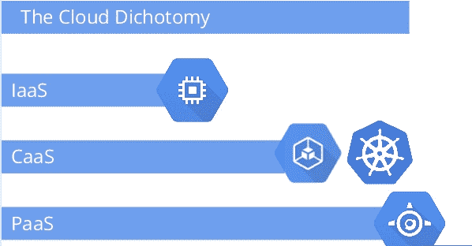

# 谷歌提供“容器即服务”来定义 Kubernetes 在云经济中的地位

> 原文：<https://thenewstack.io/google-offers-container-as-a-service-to-define-kubernetes-place-in-the-cloud-economy/>

在昨天的 Defrag 会议上，谷歌的 Brendan Burns 将容器即服务(CaaS)作为容器平台的术语。在他看来，像 Google Kubernetes 和 Google Container Engine 这样的 CaaS 环境介于 IaaS 和 PaaS 环境之间。这是一个新术语，但他为它的适用性提供了一个非常清晰的论据。

蒂娜·安德鲁斯

Tina Andrews 是印度班加罗尔的一名 IT 爱好者。

以下是他演讲的完整录音和幻灯片，以及他如何证明使用 CaaS 作为描述云平台新层的术语的合理性。特别是，请注意他是如何强调面向对象设计作为理解容器概念的一种方式的。在他看来，云经济类似于编程语言。IaaS 有一种类似于汇编语言的编程语言。他注意到 IaaS 是面向机器的。它是非常字面的。相比之下，大多数人都使用面向对象语言，坐在中间。面向对象语言具有机器上不存在的概念。它们有模式和接口，但不限制你要构建什么。面向对象语言封装并使其易于构建。我们已经远离了机器，但并不太远。CaaS 作为一种连接到机器的方式属于这种中间地带，但也提供了利用概念的能力，这些概念将影响我们对分布式架构上的应用程序开发的看法。

T5【布伦丹·伯恩斯】谷歌:Kubernetes 概述 

### 显示注释

*   Google Kubernetes 是由 Google 开发的一个开源实现，其灵感来自于驱动 Google 基础设施的技术以及所有 Google 应用程序的运行方式。
*   Kubernetes 有一个豆荚的概念。每个 pod 都有许多容器，它们作为一个原子单元一起工作，必须在同一台机器下配对，并且可以共享卷。这确保了组件的可重用性。
*   Containers 虚拟化了处理器和内核，并允许应用程序在一个虚拟机上使用相同的底层内核，在一个密封的部署单元中进行一定程度的抽象和自省。

*   Docker 用优雅的工具普及了容器，使人们能够构建现有的技能并将其转移到容器中。
*   集群是同构机器的逻辑理想化计算的过渡，可被视为具有资源池的逻辑基础，可用于提高利用率。
*   对于总是希望开发高可维护性和可伸缩性的应用程序的开发人员来说，他们在开发和应用程序设计的利用率方面得分很高。
*   容器使您能够进入模块化应用程序设计，在这种设计中，数据库是独立的，并且允许您在不扩展机器的情况下扩展应用程序。
*   正在发展的三种容器模式是边车，它们本质上扩展和增强了您的应用程序。适配器，它规范了抽象概念，并在抽象概念之间架起了桥梁。大使模式是代表代理服务的最后一种模式。
*   这三个都是强大的可重用组件，将加速分布式设计。
*   适配器本质上规范了监控信息，并允许您在该信息的基础上构建一个抽象服务。
*   强大的可重用模块化组件将加速分布式系统的设计和开发。
*   封装确保容器是活动的和健康的。Kubernetes 和容器之间有某种健康检查合同，规定了它的生存。
*   BigTable 是识别和分离关注点以构建更强大和可重用的系统的能力。

<svg xmlns:xlink="http://www.w3.org/1999/xlink" viewBox="0 0 68 31" version="1.1"><title>Group</title> <desc>Created with Sketch.</desc></svg>