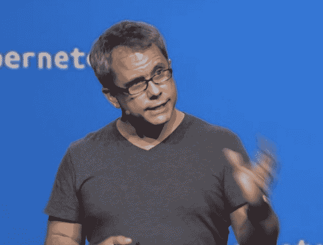
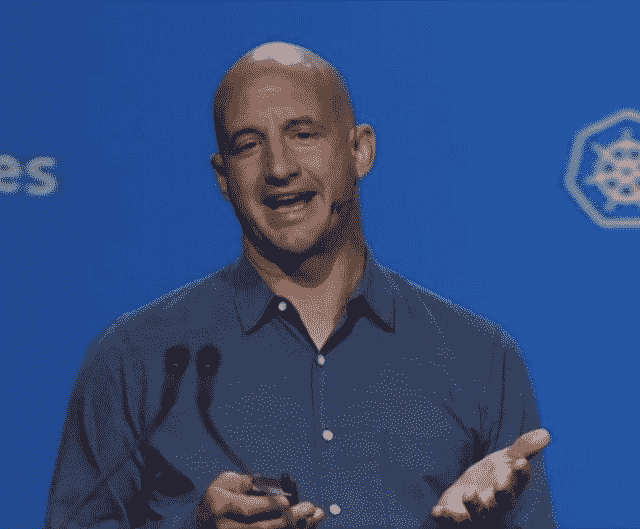

# 谷歌正式推出 Kubernetes 1.0，承诺“给你进化”

> 原文：<https://thenewstack.io/google-officially-launches-kubernetes-1-0-promises-to-give-you-evolution/>

从开发者的角度来看，这是一个已经达到的里程碑:谷歌上周向 GitHub 推送了其 Kubernetes 编排系统的 1.0 版本代码。但这是一个值得特别关注的里程碑，在周二俄勒冈州波特兰市 O ' Reilly OSCON 会议的主题演讲中，谷歌停下来为其主要营销信息奠定了基础，因为它开始掌控当今数据中心最重要的进化讨论。

谷歌云管理总监格雷格·德米奇利

“如果你的开发人员花时间考虑单个机器，你就在太低级的抽象上操作。谷歌云平台产品管理总监格雷格·德米奇利(Greg DeMichillie)说:“你希望在应用程序层面上运营，让系统来处理应用程序的调度。这意味着您的开发人员可以更快地行动，您可以更快地发货，您可以更快地迭代，您的业务增长更快。速度改善一切。”

对于一个已经深入到包括三星、易贝和红帽在内的一些世界主要企业的基础设施中的产品来说，将 Kubernetes 称为“工作测试版”这么长时间似乎令人惊讶。但是，它需要在那里，那么深，那么长时间，以前所未有的规模工作，才能让 Kubernetes 走得这么远。

今天的声明对新功能没有任何惊喜，因为谷歌实际上是在向唱诗班布道:OSCON 的观众由许多直接参与 Kubernetes 项目的人组成。DeMichillie 挑选了其中一些人，包括来自 Mesosphere 和 CoreOS 的人，并对 Docker 将容器带入公众思维给予了大量的信任。

“我认为，就连我们也对贡献者加入、支持和主演 GitHub 项目的速度感到吃惊，”他说，“但我们收到推送请求和贡献的速度也是如此。我们每周有大约 200 个拉取请求，我们有超过 400 个贡献者在为项目贡献真正的代码。”

## 我们现在可以宣布这个东西诞生了

DeMichillie 评论说，为了让 Kubernetes 感到“完成了”，Google 的工程师认为它需要对无状态和有状态 web 应用程序托管进行优化。它需要给予开发人员大规模测试应用程序的能力，并且它需要以持续集成/持续部署的速度可操作。

正如谷歌负责基础设施的副总裁 Eric Brewer 所指出的，实现这种持续的速度，同时规划一些空闲时间来进行创新，是许多组织今天面临的一个问题……Brewer 没有计算他自己的问题。

谷歌基础设施副总裁埃里克·布鲁尔

“这是最基本的，现在你必须有可用性，”布鲁尔说。“问题是可用性和创新不能很好地结合在一起。如果我们想要高可用性，并且没有做任何更改，那就很容易了。当然，问题是我们想尽快做出很多改变。

“所以我有点觉得，Kubernetes 的实际作用不是给你容器，”他继续说，“而是给你进化。在可用性方面，进化是最难的部分。”

布鲁尔讨论的心态转变也是一种实质性的文化转变，这在组织中总是最难实现的一种转变。在管理和 DevOps 层面，他重复了——但在某种程度上也完善了——在 [x86](https://en.wikipedia.org/wiki/X86) 硬件平台层面管理服务器不是真正的管理，因为没有人能看到服务器真正在做什么。

他继续说，服务水平是管理员应该追求的粒度。服务应该有自己的名称和命名空间，并且应该在物理和虚拟机之外的级别上标识自己。他认为(再一次)服务和微服务应该被赋予容器，它们有自己真正唯一的 IP 地址，不只是在一个网络中，而是跨越一个非常大的域，不排除互联网作为那个域的可能性(如果使用 IPv6 的话)。

布鲁尔指出，在这样的系统中，虚拟机之间出现的常见冲突(例如，对相同端口的访问权的争夺)根本不会发生，因为专用 IP 地址将保证专用端口始终可用。拒绝此类端口可能不是某些附加安全软件的功能，而是构造容器的过程的功能。不希望一个端口对一个进程开放？关闭进程容器并保持关闭。

## “穿上你的战衣”

当然，他指出，Kubernetes 现在没有这些功能。为了开发出这一级别的功能，必须鼓励系统最专注的超大规模用户之间的公开讨论。布鲁尔在这里提到了云计算原生计算基金会的创建，很明显谷歌将管理该基金会，而 Linux 基金会将监管该基金会。

布鲁尔认为，只有通过这样一个论坛，参与者才能为他描绘的整个容器生态系统迫切需要的功能制定出细节:例如，[参数化](https://en.wikipedia.org/wiki/Parametrization)。

“你需要在容器间共享，”谷歌副总裁说。“我们共享名称空间，共享文件系统。如果它是容器的层次结构，在 Linux 容器的意义上，我们也可以共享它。但我们肯定想要一些细粒度的、快速的共享…从长远来看，如果你现在有办法做到这一点(坦白地说，我认为这有点做作，使用环境变量)，你需要有办法说，“这是一个可重用的构建块，因此它需要有一些参数化。我希望能够在不同的环境中以稍微不同的方式部署容器。

“我们现在可以做到这一点，”他继续说道。“我认为它不应该在这里。这绝对是我希望看到我们在未来一年发展的。”

在周二的一篇博客文章中，中间层高级研究分析师德里克·哈里斯表达了他的团队对 Kubernetes 成就的赞赏。

“中间层是库伯内特的忠实粉丝，”哈里斯写道。“我们从第一天起就支持这项技术，今年早些时候，我们与谷歌合作开发了 Kubernetes 的企业级版本，该版本运行在我们的数据中心操作系统[DCOS]上。我们在 Kubernetes 上的所有工作都已经被纳入了 Kubernetes 开源 repo。我们还有 Kubernetes 项目委员和一个致力于这项技术的团队。”

谷歌周二下午与格雷格·德米奇利(Greg DeMichillie)的主题演讲之前，可能是有意播放了一小段会议气氛音乐。扬声器里播放的是独立流行乐队“The Mynabirds”的一首歌，名为“将军”。“我们在家里烧钱，我们的书和骨头分解得太快了，”主唱劳拉·伯亨吟诵道。“他们不断把我们所有的现金投入到下一场大屠杀中，我告诉你，我厌倦了。我们交了多久的会费？

[https://www.youtube.com/embed/oYFqiEk5PLc?feature=oembed](https://www.youtube.com/embed/oYFqiEk5PLc?feature=oembed)

视频

“你想修复它”这首歌继续预言，“还是 f__？我们会修好它的，因为它已经坏了。”

CoreOS、Docker 和 Red Hat 是新堆栈的赞助商。

特征图片:“[八哥——将军](https://www.youtube.com/watch?v=oYFqiEk5PLc)”

<svg xmlns:xlink="http://www.w3.org/1999/xlink" viewBox="0 0 68 31" version="1.1"><title>Group</title> <desc>Created with Sketch.</desc></svg>