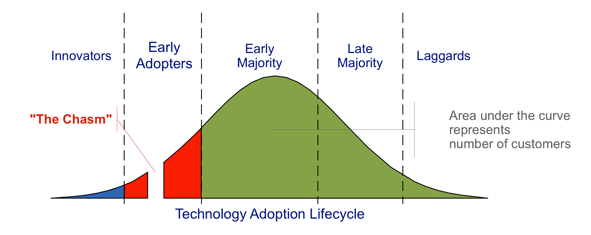

# 谷歌上的 DevOps '精英'和其他人

> 原文：<https://thenewstack.io/google-on-the-devops-elite-and-everyone-else/>

在两次 DevOps 采用浪潮之后，已经完全采用了 [DevOps](/category/devops/) 最佳实践的公司正在实现比同行更好的软件交付和运营性能指标。大多数其他公司都陷入了业绩停滞。这是谷歌最近发布的“[加速 DevOps 2021](https://cloud.google.com/devops/state-of-devops/) 状态”报告的半空解读方式。

谷歌的研究人员使用了一种叫做聚类分析的统计技术，对该调查的 1200 名受访者进行了细分。今年，26%的人被列为“精英”，高于 2019 年的 20%和 2018 年的 7%。

中型精英组织无疑是高绩效的。它按需交付软件，一天多次将代码部署到生产环境或发布给用户。

也许这种能力没有被充分利用，但是从提交到在生产中实际运行代码也可能不到一个小时。这与 2019 年相比有所改善，当时中位精英 DevOps 执行者需要一天的准备时间来进行更改。

此外，15%或更少的更改会失败，这意味着需要修补程序、回滚、补丁或其他类型的补救措施。最后，在发现事故、中断或严重的安全漏洞后，中型精英组织只需不到一个小时即可恢复服务。

这对于“精英”来说是个好消息，但是对于研究中属于“高”和“中”类别的 68%的主流组织来说呢？仅从受访者的中位数来看，这些群体自 2019 年以来出现了倒退。以前，即使是非精英也至少每周部署一次，但现在已经下降到每周和每月之间。什么变了？

让我们回到“高”组的聚类分析。2018 年，48%的组织符合类似的特征。这一比例在 2019 年降至 23%，今年升至 40%。

正如我们已经告诉你的，这与性能的实际改善并不一致。相反，它关系到同行和行业的期望。到 2018 年，大多数研究参与者已经采用了 DevOps 文化，但程度有限。

Accelerate 报告的 [2019 版本](https://thenewstack.io/dora-2019-devops-efforts-improving-but-not-done/)，以及“[2019 devo PS 报告状态](https://puppet.com/resources/whitepaper/state-of-devops-report)”透露了一些丑陋的真相。许多为新的 CI/CD 软件构建软件交付过程的公司发现，随着对其过程的新发现的可见性，他们的软件交付和性能度量比以前认为的更差。

此外，开发人员和安全团队之间的紧张关系变得更加突出。正如我们[之前写的](https://thenewstack.io/integrating-security-into-build-processes-signals-devsecops-tipping-point/)，一旦 DevSecOps 问题被解决，组织就获得了一条清晰的成功之路。

我们回顾了最近为 [Sonatype](https://www.sonatype.com/?utm_content=inline-mention) 的[软件供应链状态](https://www.sonatype.com/resources/state-of-the-software-supply-chain-2021)报告所做的调查，清楚地表明有一群精英公司确实部署软件更快，平均来说比最差的表现者有更好的结果。但是，特别是在解决安全问题的速度方面，公司在采用许多前沿实践后还没有看到显著的结果差异。

可以把聚类分析看作是识别杰弗里·摩尔经典技术采用曲线中的部分。我们在 2019 年“跨越了鸿沟”,一大部分“精英”群体现在是早期采用者。该报告的“高”聚类映射为早期多数，“中”聚类映射为后期多数，“低”聚类映射为落后者。

很难知道报告中包含的结果是否代表早期多数和晚期多数之间有意义的差异；他们加起来继续占研究的三分之二(2019 年为 67%，今天为 68%)。然而，该研究的[模型](https://www.devops-research.com/models.html)明确考虑了公司文化、云、安全和 [SRE 实践](https://thenewstack.io/category/devops/)等因素。

看起来在可靠性方面有很大的不同。例如，成功实现可靠性目标的精英员工拥有将可观察性融入整体系统健康的解决方案的可能性是普通组织的四倍多。

将自己与精英阶层进行对比听起来很棒，而且会产生很酷的统计数据。根据这份报告，表现优秀的人从事故中恢复的速度是表现不佳的人的 6570 倍，但这是一个荒谬的、几乎毫无价值的数字，这份报告中没有适当背景的许多其他结果也是如此。这意味着平均而言，精英恢复服务可以在一小时内从一个重大安全漏洞中恢复。相比之下，7%表现不佳的公司平均一年花三个季度(6570 小时)。

你真的认为这需要那么长时间吗？在这之间的所有结果呢？我们认为，在今后的分析中，应将“低”组视为异常值而不予考虑。

正常的技术采用曲线是均匀分布的，但现在似乎不是这样。会不会出现新的数字鸿沟？会不会有四分之一的公司高绩效，把所有人都甩在后面？让我们知道你的想法。

来源:Craig Chelius 改编自杰弗里·摩尔的书[跨越鸿沟](https://en.wikipedia.org/wiki/Crossing_the_Chasm "w:Crossing the Chasm")中描述的技术采用生命周期。

<svg xmlns:xlink="http://www.w3.org/1999/xlink" viewBox="0 0 68 31" version="1.1"><title>Group</title> <desc>Created with Sketch.</desc></svg>