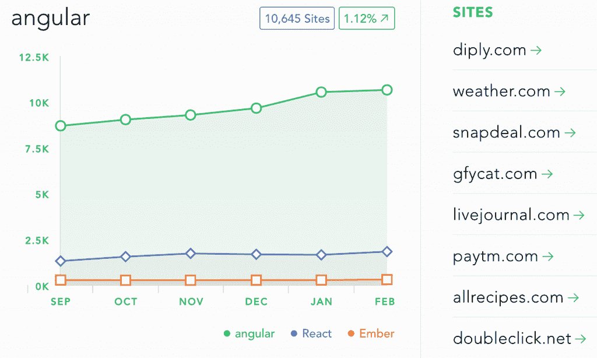

# 谷歌准备最终发布 Angular 2

> 原文：<https://thenewstack.io/google-preps-angular-2-final-release/>

当谷歌在 2014 年末首次宣布他们流行的 [Angular.js](https://angular.io/) JavaScript 框架将会有重大语法变化时，开发者社区[表达了一些担忧](https://jaxenter.com/angular-2-0-announcement-backfires-112127.html)。“去你的，棱角分明”是一篇被广泛分享的，实际上很有思想的[博客文章](https://medium.com/@jeffwhelpley/screw-you-angular-62b3889fd678#.sms9f9gqk)的标题。Reddit 上另一个受欢迎的帖子告诫开发者，“如果你认真对待开发，你需要停止抱怨 Angular 2.0。”

但这种强烈的感觉似乎部分反映了人们对棱角分明的强烈依恋。与 Ember 和 React 等其他框架相比，Angular 仍然更受欢迎，根据 LibScore 的数据，Angular 在顶级网站中的使用率在过去六个月中持续攀升。

据谷歌 AngularJS 工程总监布拉德·格林(Brad Green)称，现在谷歌几乎准备发布更快更小的 Angular 2 版本。

谷歌一直承诺测试版将比棱角分明的 1.x 系列更快、更小。“快一点的将在大约两周内着陆，”格林说，“小很多的将在大约一个半月内着陆。”

“我们在 5 月份有一个大型会议，我们当然希望在那之前完成，”格林补充道，可能指的是 5 月 18 日至 20 日的谷歌 I/O 或 5 月 4 日至 6 日的 ng 会议。

虽然最终版本原定于 2015 年底发布，但“这是人们期待的大事……大多数人会认为测试期结束了。”为了帮助社区跟进，本周谷歌还将发布一个测试结束跟踪器——“一组里程碑，这样人们就可以看到我们进行了多长时间。”

> “在 Angular 2 中，我们有一些非常清晰的习惯用法和 API 来做 web 开发人员过去经常做的事情”——Brad Green，Google。

格林说，在测试期的剩余时间里，仍然会有许多较小的改进——本地化的内容、动画、命令行界面和“对路由器上的 API 的一点点改进”。当然，也会有一些大的改进。

“Angular 1 是一个框架，你可以把它放入一个网页，然后开始运行，”Green 说。“对于 Angular 2，我们实际上是从‘能力平台’的角度来攻击它。我们仍在做框架，但我们正在提高处理不同语言的能力。我们的计划是推出能与从 Java 到 Python 等多种服务器端技术兼容的版本。”

微软已经展示了如何将 Angular 融入 ASP.NET，谷歌也在与 Drupal 团队合作。“我们有一个空闲频道。我们每天都在和他们一起工作，”格林说。1，418 名开发人员为 Angular 1 做出了贡献，有 213 名贡献者为 Angular 2 工作——包括谷歌 Angular 团队的 20 名全职人员，加上另外 10 名承包商和“大量其他贡献者”

这是一项巨大努力的一部分，旨在为 Angular 的下一个主要版本的平稳着陆做准备，这也包括与谷歌内外使用 Angular 2 的团队密切合作。

使用角度，由 Libscore 测量。

Angular 2 的 UI 架构师团队负责人肯尼·耶茨[在 Twitter](https://twitter.com/digitalnurdz/status/700336361690128385) 上发帖称，他“不断看到有公司就 Angular 2 与他联系，在一次采访中，Reddit 的 Angular 论坛的主持人甚至表示，他已经是一个团队的一部分，该团队正在使用它进行一个 150 万美元的项目。

## 旧的棱角分明

与此同时，谷歌的 Angular lead 表示，他们还将继续支持 Angular 1 至少一年。“我们已经说过，我们将支持 Angular 1，直到大多数人转向 Angular 2，”Green 说。目前，根据 30 天内的独立访问量，有 130 万开发人员在使用 Angular 1，相比之下，只有 30 万人使用 Angular 2，所以“我们还有很长的路要走……

“我们今年的很多努力都是帮助人们学习，如果有意义的话迁移他们的应用程序，或者开始在 Angular 2 上制作新的应用程序，”格林说，他指的是[谷歌开发者专家计划](https://developers.google.com/experts/)，顶级贡献者在那里接受培训，偶尔甚至会被带到谷歌参观。

“我们有一个特殊的空闲频道——他们自己做很多讨论，但他们可以 ping 我们。所以我们真的尽力给他们所有他们需要带到社区的信息，我们和他们一起解决问题，”格林说。

为了尽可能平稳地过渡，开发团队还在收集来自“一堆大团队”的反馈，这些团队目前正在使用 Angular 2，包括谷歌内部和外部。

谷歌光纤已经将 Angular 2 用于其在线账户管理页面，谷歌也开始将 Angular 2 用于其内部 CRM 解决方案 Greentea，这是一种类似 Salesforce 的应用程序，用于管理他们数十亿美元的广告业务的联系人和会议以及其他工作流任务。超过 100 名开发人员在开发这个应用 Angular 团队在他们旁边工作。

谷歌 AdWords——另一项价值 10 亿美元的业务——也将很快转向 Angular 2。“谷歌开发团队似乎真正喜欢的事情是，如何编写一个组件，如何与浏览器交互，这更加清晰，”格林说，“而在 Angular 1 中，我们有点让你自己的感受力来决定。

“在 Angular 2 中，我们有一些非常清晰的习惯用法和 API 来做 web 开发人员过去经常做的事情。我们有了一个新的依赖注入，使得“延迟加载”变得非常容易。你不希望用户不得不等待下载，”格林说。

## 角度 2 和 Weather.com

谷歌也在密切关注天气频道的体验，该频道正在为自己的网站[weather.com](http://www.weather.com)使用 Angular。他们的第一个 Angular 2 页面将于下个月上线，尽管他们早在 2012 年就开始探索 Angular，并在 2014 年底全面切换到 Angular 1.3。“肯定会有一个上升期，”该网站的软件工程副总裁温迪·弗雷泽说。“我们实际上正在评估我们的下一步计划。我们是追求角 2 还是‘滚自己的’？”

她的团队的经验正通过各种渠道反馈给谷歌的 Angular 团队。weather.com 团队已经访问了山景城，会见了谷歌的 Angular 工程师，天气频道 Angular 实施的前端开发负责人杰夫·卢(Jeff Lu)说，“我们在谷歌上进行了面对面的交流，交换了电子邮件，并在 GitHub 上留下了评论。”。

事实上，至少在一个案例中，Google 修改了框架来解决他们的一个特定用例。“当我们引导时，当它们完全相同时，没有办法说‘我想引导三个组件中的第二个’!我给他们发了一封电子邮件，问我们如何才能有一个唯一的标识符，以便我们可以引导特定的组件，他们暂时为我们提供了一个解决方案，直到下一个版本正式发布为止，”Lu 说。

弗雷泽对谷歌棱角分明的团队的响应能力表示赞赏。“你可以看出，他们有一个路线图，说明他们试图通过应用程序达到的目标，而且他们在不断发展。他们听取了我们的使用案例，并采纳了我们的反馈，将其融入到他们的路线图中。他们不只是假设他们知道。他们实际上是在旋转和改变。”

那么她对其他探索 Angular 2 的团队有什么建议呢？Google 在 Angular 1 中增加了新的 ngUpgrade 模块，允许 Angular 1 应用程序混合使用新的 Angular 2 语法。

弗雷泽说:“ngUpgrade 肯定是过渡期间的一座好桥梁，但你应该在很短的时间内利用这座桥梁，大约三到六个月。”对于他们来说，由于新的语法和结构，他们只是从头开始编写一切，而不是改编 Angular 1 代码。

## 更快的最终版本

但是根据布拉德·格林的说法，伴随着重大变化而来的是重大改进。“在渲染方面，根据您的使用情况，速度会提高 5 到 10 倍。我们将在最终版本中让它变得更快。我们将从拥有一个你加载的库转变为实际生成你所需要的代码。他说:“图书馆的一部分会消失，速度会快得多。”。

他们的长期目标更加雄心勃勃。“我们希望努力让棱角变得经得起未来考验。由于我们有 Angular 的新版本，如果我们能给出一个升级脚本就好了，所以在每个版本中，它都不会有压力。”但是如果有新的浏览器功能或者旧的功能被废弃了会怎么样呢？“可能会有一个附带的角度升级脚本…使这成为一种免费的升级环境。”

格林记得一位棱角分明的开发人员曾说过“就像圣诞节快到了，他迫不及待地想让这一切发生。”他笑了笑，然后补充道，“还有其他人压力更大一些。取决于你在团队中是谁…

“我们都非常兴奋，”格林说。

<svg xmlns:xlink="http://www.w3.org/1999/xlink" viewBox="0 0 68 31" version="1.1"><title>Group</title> <desc>Created with Sketch.</desc></svg>