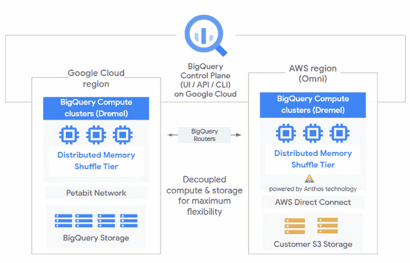

# Google 将 BigQuery 扩展为一个多云数据仓库查询工具

> 原文：<https://thenewstack.io/google-stretches-bigquery-into-a-multicloud-data-warehouse-query-tool/>

云服务提供商[谷歌云](https://cloud.google.com/)已经扩展了其 [BigQuery](https://cloud.google.com/bigquery) 数据分析服务，以便它可以查询来自其他云提供商的数据仓库服务，即亚马逊网络服务和(在不久的将来)微软 Azure，该公司在本周举行的[谷歌云 Next’20](https://cloud.withgoogle.com/next/sf)虚拟会议上宣布。

“我们相信多云是未来，”谷歌云总经理兼数据分析工程副总裁德班詹·萨哈在新闻发布会上说。该公司认识到，其大多数客户的数据分布在多个云服务提供商之间。他说，这是有问题的，因为“当数据分散在多个云中时，人们很难运行他们的分析”。

这项名为 BigQuery Omni 的服务将提供跨多个云使用标准 SQL 查询的能力。

BigQuery 架构[将计算和存储](https://cloud.google.com/blog/products/data-analytics/bigquery-turns-10)解耦，允许该公司的 [Dremel](https://research.google.com/pubs/pub36632.html) 查询引擎通过 Google [Anthos](https://cloud.google.com/anthos/gke) 服务来查询其他云服务中的数据，从而消除了将整个数据集迁移到单个主机的需要。谷歌维护着一个运行在多个 AWS 区域的多租户服务来执行这项工作——因此不需要数据出口。对于查询执行，数据被临时从数据存储转移到 Anthos 驱动的 BigQuery 集群。支持的格式包括 Avro、CSV、JSON、ORC 和 Parquet。结果返回到用户的 BigQuery UI，并可以导出回数据存储。

“例如，您可以使用 BigQuery Omni 来查询存储在 Google Cloud 中的 Google Analytics 360 Ads 数据，还可以查询存储在 AWS S3 中的电子商务平台和应用程序的日志数据。然后，使用 [Looker](https://looker.com/google-cloud) ，你可以建立一个仪表板，让你可以可视化你的观众行为和购买以及你的广告支出，”谷歌博客帖子解释道。

目前，谷歌正在测试 BigQuery Omni private alpha，最初与 AWS S3 和 Azure Data Lake 合作。要试用[，请填写这张表格](https://docs.google.com/forms/d/e/1FAIpQLSff3MG6wKeqL3TDzwwb5nCmYwwBsRmGdscplHL237l7z7ItAw/viewform)，要了解更多信息，请查看下个月即将举行的 Google Cloud Next’20:on air 会议:“[多云世界中的分析](https://cloud.withgoogle.com/next/sf/sessions?session=DA105)”

亚马逊网络服务是新堆栈的赞助商。

来自 Pixabay 的 HowardWilks 的特写图片。

目前，新堆栈不允许直接在该网站上发表评论。我们邀请所有希望讨论某个故事的读者通过推特[或脸书](https://twitter.com/thenewstack)[访问我们。我们也欢迎您通过电子邮件发送新闻提示和反馈:](https://www.facebook.com/thenewstack/)[feedback @ thenewstack . io](mailto:feedback@thenewstack.io)。

<svg xmlns:xlink="http://www.w3.org/1999/xlink" viewBox="0 0 68 31" version="1.1"><title>Group</title> <desc>Created with Sketch.</desc></svg>