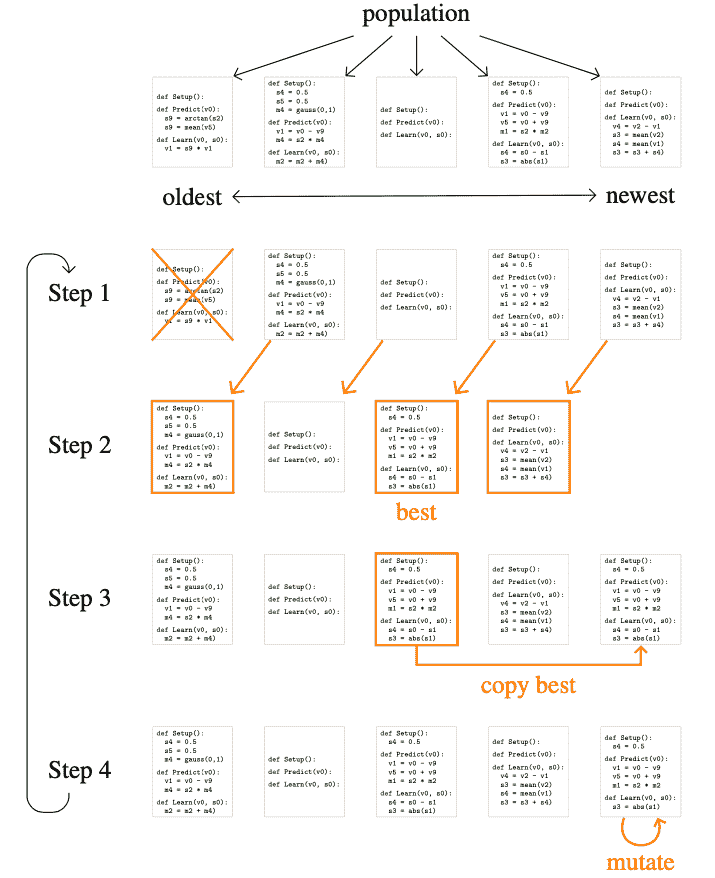

# 谷歌的 AutoML-Zero 使用基础数学进化机器学习算法

> 原文：<https://thenewstack.io/googles-automl-zero-evolves-machine-learning-algorithms-using-basic-math/>

如今，算法似乎无处不在，在推荐引擎(T0)或帮助医生(T2)检测罕见的遗传疾病(T3)背后发挥着神奇的作用。但是，尽管机器学习工具逐渐变得[更容易被非专家](https://thenewstack.io/fuzzy-io-aims-democratize-artificial-intelligence-developers/)使用，设计机器学习算法本身通常需要一些专家知识——即使这样，也不能保证人工智能模型会正确执行，因为有时它们的内部工作方式甚至对初学者来说也是一个谜。

因此，难怪最近自动机器学习(AutoML)领域引起了人们的兴趣，允许非专家快速将机器学习应用于现实世界的问题，而不必先掌握其更神秘的方面。这里有一个更令人兴奋的想法:如果机器学习算法可以被编程为自动进化出更好的版本会怎么样？

机器进化算法的概念可能意味着更具创造性的解决方案——超越人类思维构思能力的解决方案——除了规避人类偏见可能给它们带来的限制。谷歌的研究人员最近似乎已经通过 [AutoML-Zero](https://github.com/google-research/google-research/tree/master/automl_zero) 实现了这一创新，这是一种新型的[自动机器学习](https://thenewstack.io/category/machine-learning/)，它从进化生物学中获得了线索。该团队的[预印论文](https://arxiv.org/abs/2003.03384)没有使用人类定义的规则和复杂的方程，而是描述了他们的系统如何使用简单的高中水平数学和[进化算法](https://towardsdatascience.com/introduction-to-evolutionary-algorithms-a8594b484ac)，使其能够创建可以被选择并适应手头任务的算法，就像只有物种中“最适合”的成员才能在自然选择过程中生存一样。

正如[谷歌](https://www.google.com/)的软件工程师和论文的主要作者 Esteban Real 向我们解释的那样:“AutoML 的领域旨在自动发现机器学习算法。我们的目标是双重的:我们想看看我们是否能找到我们在手工发现中遗漏的东西，我们想把它应用到没有足够的人类专家的领域。AutoML-Zero 是 AutoML 的一种特定方法，专注于从零开始发现算法，尽可能减少人为偏见。”

## 一代代的算法

基于之前由[谷歌](https://thenewstack.io/get-started-with-google-cloud-automl-vision-for-image-classification/)和其他研究人员完成的 AutoML 工作，Real 和他的同事陈亮、大卫·索和郭可乐开发了一种有趣的方法，该方法使用组件函数作为更复杂算法的基本构建模块，并使用一种称为[正则化进化](https://colab.research.google.com/github/google-research/google-research/blob/master/evolution/regularized_evolution_algorithm/regularized_evolution.ipynb)的搜索方法的更新版本。

类似于达尔文主义，从一群“父”算法中选出的表现最好的算法将被复制以产生新一代的“子”算法，这些算法将被进一步“变异”并筛选出对特定任务最优化的算法。虽然该团队的工作将先前的研究向前推进了一步，但他们的工作是第一次从头开始进化一个完整的程序(尽管需要注意的是，一旦从框架中取出，进化的算法就停止了进化)。此外，为了简化人工进化过程，该团队将大型数据集分成较小的块，然后通过分布式处理用于评估子算法。

为了进一步解释这一点，Real 将他们构建人工神经网络的方法比作使用功能类似砖块和砂浆的更基本的组件，而不是使用相当于预制房间的传统算法。

Real 说:“传统上，架构搜索通过结合大型复杂的人类设计的组件来构建算法，如批量规范层、漏失和卷积(这些就像构成神经网络最终‘房子’的‘卧室、厨房和浴室’)。“AutoML-Zero 的目标是用不需要太多人为设计的简单组件(‘砖块和砂浆’)来做这件事。因此，AutoML-Zero 有一个更难解决的任务，但也有更多发现新事物的潜力。本质上，AutoML-Zero 从基本组件构建算法；这很像是用砖和砂浆而不是预制房来盖房子。”

令人惊讶的是，当任其自生自灭时，即使没有人类偏见的干扰，系统最终也会进化出经典算法，如[反向传播](http://neuralnetworksanddeeplearning.com/chap2.html)和[线性回归](https://machinelearningmastery.com/linear-regression-for-machine-learning/)。然而，就目前而言，AutoML-Zero 只能进化出 10 到 20 行长的算法，而现代机器学习算法需要更长的程序。但是随着进一步的工作来提高框架的搜索效率，Real 推测，在没有人类影响的地方，AutoML 将会大放异彩。

“这项工作展示了加速发现新的机器学习算法的潜力。这可能对机器学习发挥作用的许多领域有潜在的帮助，特别是对于人类专业知识也缺乏的新应用。”

在团队的[论文](https://arxiv.org/pdf/2003.03384.pdf)中了解更多，在 [GitHub](https://github.com/google-research/google-research/tree/master/automl_zero) 上查看 AutoML-Zero 的代码。

图片:Johannes Plenio 通过 Unsplash 拍摄的照片；谷歌

<svg xmlns:xlink="http://www.w3.org/1999/xlink" viewBox="0 0 68 31" version="1.1"><title>Group</title> <desc>Created with Sketch.</desc></svg>