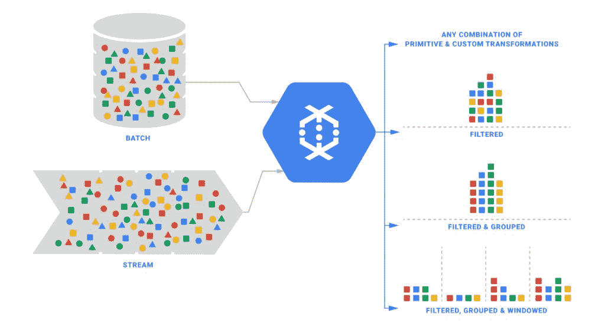

# 谷歌呼吁停止整理数据，接受它的无限到来

> 原文：<https://thenewstack.io/googles-call-to-stop-grooming-data-and-accept-its-infinite-arrival/>

周三，谷歌新闻的莫名其妙的缺乏似乎持续了几分钟，之后，该公司发布了其在 T2 的基于谷歌云的数据仓库组合的大部分内容。此版本包括 Cloud Dataflow，这是一种独特的数据工作流管理系统，可让数据库管理员更直接地控制其基于云的环境，更接近他们对内部数据仓库的期望。

与大多数基于云的数据库系统不同，Cloud Dataflow 专为与第三方集成而设计，包括商业 Hadoop 提供商 Cloudera 和 Salesforce。正如谷歌工程师解释的那样，这是因为大规模的大数据部署往往彼此不同，有时甚至截然不同。单一的基于云的工具集可能无法充分适应所有可能的工作流。因此，谷歌的方法是提供一个平台，多个组件可以共存，客户可以决定让这些组件协同工作的工作流程。

考虑通过绘制图表来创建数据仓库的能力，您就明白了。

## 埃里克·施密特，数据库工程师

谷歌云工程师 Eric Schmidt 在最近的 Hadoop 峰会上表示:“根据你在哪里运行这些工作，一般来说，在宏观层面上，弹性不是你今天的朋友。”(是的，埃里克·施密特是他的名字；不，他不是那个埃里克·施密特。但是对于一个雇佣这么多人的公司来说，裁员是必然会发生的。)

“时间和生命永远不会停止，尤其是在流媒体模式下，”施密特说。“数据不断涌现，不断涌现。尽管我们都是优秀的开发人员，并且我们认为我们可以创建坚如磐石的序列化/反序列化机制来处理模式中的差异，但现实是您的系统中将会发生一些变化。”

施密特解释说，当一个典型的数据仓库是为供应商所说的“弹性”而设计时，这意味着他们的目标是拥有处理峰值工作负载的能力。这与其说是一个弹性管道，不如说是一个大管道，对于大多数企业来说，过度供应的成本太高。

此外，正如施密特和他的同事们所证明的那样，过度供应可能是低效的，即使在峰值容量时也是如此。

在刚刚发布的由施密特和其他十位谷歌同事共同撰写的白皮书中，提交给本月晚些时候在夏威夷举行的大规模数据库会议，谷歌正式提出了数据流模型。这是一个您可能想不到的情况:当一个组织将一个数据库管理系统发布到云中时，它通常代表一个客户。研究人员给出的例子涉及一家视频服务提供商，该提供商希望对其日常使用情况进行简单分析，并对其客户进行一些深入了解，并且不希望分析的质量随着数据库的扩大或缩小而变化。当开发人员构建应用程序来访问这些数据时，这样的客户希望有一定程度的稳定的可编程性。

施密特写道:

我们认为，在现代数据处理中，必须从根本上转变方法来处理这些发展的需求。作为一个领域，我们必须停止试图将无界的数据集整理成最终变得完整的有限的信息池，而是在这样的假设下生活和呼吸，即我们永远不会知道我们是否或何时看到了我们的所有数据，只知道新数据将会到达，旧数据可能会被收回，并且使这个问题易于处理的唯一方法是通过原则性的抽象，允许从业者沿着感兴趣的轴选择适当的折衷:正确性、延迟和成本。

数据库可能会扩大，有时其可访问性可能会降低。但是从开发者的角度来看，谁在乎呢？数据库的可编程性各不相同。

## 数据库永远不会“完整”

施密特和他的同事认为，现有的数据库分析系统期望构成最终分析模型的输入数据在某一点上是“完整的”。对于围绕运行系统的统计数据，“完整性”永远不会发生。该小组指出数据库设计中的这一遗漏是一个主要缺点。

“我们认为，当当今庞大、高度无序的数据集的现实与消费者要求的语义和及时性发生冲突时，这种方法存在根本缺陷，”该团队写道。“我们还认为，任何方法，如果要在今天存在的如此多样的用例集(更不用说那些徘徊在地平线上的用例)中具有广泛的实用价值，就必须提供简单而强大的工具来平衡正确性、延迟的数量，并且成本适合手头的特定用例。最后，我们认为是时候超越执行引擎支配系统语义的流行思维模式了；正确设计和构建的批处理、微批处理和流系统都可以提供同等水平的正确性，这三种系统在当今的无界数据处理中都有广泛的应用。”

他们继续提出，如果一个工作流系统能够充分创造自动化的灵活性——随着使用规模的增加或减少，使工作流适应不同的方案——那么从最终客户的角度来看，系统的稳定性将被认为是恒定的。从这一点上来说，客户可以根据剩下的几个变量来判断服务提供商:延迟和资源成本。

白皮书的其余部分继续概述了一个相当复杂的系统(我们希望实际的 Google 服务能够显著简化该系统),用于定义不同工作流的运行条件，以及触发这些工作流变化的条件。这是一种数学方式来表示这样一种理想状态，即在大规模但仅在特定时间内，数据库系统本身不应该在所有可想象的条件下保持不变。

在 Hadoop 峰会期间，Schmidt 将这种简化描述为“一个简单的速度旋钮”。云数据流现在提供了一组用于构建并行数据处理管道的 SDK。它还添加了一个托管服务，用于优化这些管道上的工作流。

换句话说，研究团队在他们的白皮书中展示的所有复杂性都是基于通过客户使用 Dataflow SDK 创建管道而确定的变量。

“这可能是围绕大数据创新的第 14 年，”施密特一度表示。“我们也在大力投资云计算。与此同时，我们将继续在[谷歌云平台]之上拥抱所有类型的开源工作流。您想将 Hadoop 工作负载带到 GCP 吗？太好了。我们将继续优化我们的基础架构…以运行基于 Hadoop 的工作负载。与此同时，我们还花费大量创新时间来构建完全托管的服务。这就是优化的切入点。”

专题图片: [José Eduardo Deboni](https://www.flickr.com/photos/deboni/) 的《[飞法马体](https://www.flickr.com/photos/deboni/2887680476/in/photolist-5pb7Nq-w2zyt-6mhSKe-p1Edh-5xsozW-ogqZvQ-39sWik-4Nm3FJ-oQWSES-59U2ho-58CNnY-4CSTFx-oDt1cS-59Ea67-e4wskm-bCSrRv-5r2fAc-55P2hs-4WeS43-qe2jpR-4WaCC4-oG4JeK-fp342M-5ChYxJ-hEJk97-57ZcNw-oamWhn-51FbWg-aZ2YbM-a34fVc-59wAvs-4XXKVY-irMg5M-5aeDJz-8RTAtD-52nPvi-4WeSA5-dREGWD-5pW4V2-bBmxAy-52s4uY-57ZcNy-e2B7Y6-e7KwX5-8RWFE5-4XF2W6-dMJvs3-4CTiq9-og8EYg-8C6JNt)》由 [CC 授权 2.0](https://creativecommons.org/licenses/by/2.0/) 。

<svg xmlns:xlink="http://www.w3.org/1999/xlink" viewBox="0 0 68 31" version="1.1"><title>Group</title> <desc>Created with Sketch.</desc></svg>