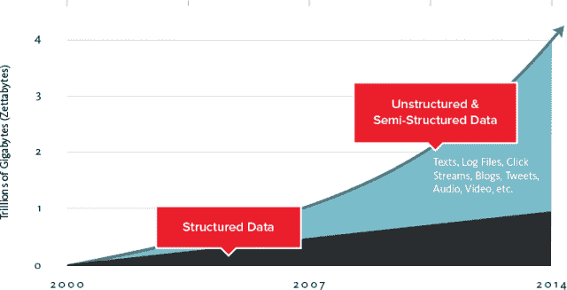

# 谷歌的云大表和数据服务生态系统

> 原文：<https://thenewstack.io/googles-cloud-bigtable-and-the-data-services-ecosystem/>

Google Cloud Bigtable 是一个 NoSQL 数据库，本周发布，目前处于测试阶段。该服务是一个批处理系统，通过开源的 [Apache HBase API](http://hbase.apache.org/apidocs/) 与客户端进行交互，该 API 本身基于最初的 [Bigtable](https://research.google.com/archive/bigtable.html) 技术。Bigtable 是运行 Google Analytics 和其他 Google 服务的数据库。

对谷歌来说，这一举措表明，它越来越重视迎合企业级以及对管理数据方式的总体需求，这些数据现在主要来自数据日志、点击流和其他非结构化数据形式的机器。Bigtable 也符合谷歌发布技术的模式，这种模式已经在公司内部使用了多年。

2004 年，谷歌发布了一篇关于 MapReduce 的研究论文，它已经在内部使用了多年。那篇论文成为 Apache Hadoop 的基础，这种[分布式数据处理技术](https://hadoop.apache.org/)反过来又成为新一代提供商的基础，如 [MapR](https://www.mapr.com/) 、 [Cloudera](https://www.cloudera.com/) 和 [Hortonworks](http://hortonworks.com/) 。

[Apache Drill](http://drill.apache.org/) 是一款面向 Hadoop 和 NoSQL 的开源、低延迟 SQL 查询引擎。它基于 Google Dremel，使用嵌套数据的柱状存储表示，并将其与类似 SQL 的功能相结合。

谷歌博格是该公司作为研究论文发布的最新技术。Borg 是 Google Kubernetes 的基础，这是 Google 管理容器化应用的开源项目。Borg 也是 Twitter、Airbnb 和其他公司使用的数据中心操作系统 Apache Mesos 的基础。Mesos 是[中间层数据中心操作系统](https://mesosphere.com/)背后的核心产品。

像 Google Kubernetes 一样，Cloud Bigtable 也是为企业和不断增长的平台需求而设计的，这些平台允许公司进行扩展。

“我们为高度可扩展的企业客户推出了托管数据库服务，”谷歌云平台产品管理总监汤姆·克肖(Tom Kershaw)说。“它适用于需要围绕读/写操作进行大量处理和分析的 1pb 或更大的作业。可以将它看作是一个面向拥有大型数据集的客户的全面管理的高规模数据库。”

每个云 Bigtable 集群由三个节点组成。每个节点每秒提供多达 10，000 个查询和 10 兆比特每秒(Mbps)的吞吐量。每个集群至少有三个节点，每个节点每小时的成本为 0.65 美元。SSD 存储为 0.17 GB/月，HDD 存储(尚未上市)将为 0.026 GB/月。

公司必须管理的机器数据量是前所未有的。这些新兴数据(日志文件、销售点终端数据、交易数据等)大多是非结构化的，因此无法在传统的关系数据库中处理，即使数据量不是问题。

其他 NoSQL 提供商，如 Couchbase，也在解决管理非结构化数据带来的问题。他们引用了 IDC 研究公司的研究，该公司估计，2013 年全球数字数据的总大小为 4.4 泽字节，即 4.4 万亿吉字节，到 2020 年将增长十倍，达到 44 泽字节。

公司不想投资那些只是偶尔被推到极限的平台，他们希望以灵活的方式增加容量。constellation research 首席分析师兼副总裁霍尔格·穆勒(Holger Mueller)在回复电子邮件提问时写道，云 Bigtable 开启了以前由于性能和成本原因难以实现的新用例。

Mueller 的评论指出了一个趋势，即我们看到越来越多的云服务被用来构建向外扩展的数据库服务。亚马逊网络服务于去年 11 月推出了 Aurora，并且还有一项名为亚马逊 EMR 的新服务，旨在通过提供托管的 Hadoop 框架来简化大数据处理。

根据运营总监 James Conklin 的说法，CCRi 正在与谷歌 Bigtable 合作，以促进使用 GeoMesa 存储和查询“时空”数据。他说，CCRi 开发 GeoMesa 是为了将其威胁预测分析解决方案之一移植到谷歌平台上。他说，GeoMesa 是开源的，因为它显然对其他人有价值。

康克林是新平台的粉丝。“从技术上讲，云 Bigtable[拥有]非凡的能力，”他在回复电子邮件提问时写道。“最初关于 Bigtable 的论文启发了几个现在广泛使用的数据库产品，如 HBase、Cassandra 和 Accumulo。虽然功能强大，但这些系统很复杂。云 Bigtable 系统管理许多与优化和调优分布式数据库相关的底层细节，这反过来简化了我们用来存储和访问数据的代码。”

康克林表示，云 Bigtable 的一个好处是消除了创建、管理和优化这种复杂平台的时间和精力。“也许云 Bigtable 最重要的技术和业务案例是，随着数据的增长，您可以轻松地扩展系统。CCRi 经历了构建和维护云的痛苦，因此我可以证明，这些好处不仅是真实的，而且是宝贵的。”

当今可用的数据技术是由一些世界上最杰出的工程师构建的。它们是一个有限的人才库，通常不为成千上万家将向数据驱动型企业转型的公司所用。如果没有这方面的人才，大多数公司会转向数据服务提供商。这种方法也有黑暗的一面。这意味着他们现在受制于这些公司的服务条款、定价模式以及服务在适应客户和市场需求时发生的所有变化。

开源对于数据服务生态系统至关重要，但在很大程度上，客户将依赖于构建在开源平台上的商业服务。从投资角度来看，构建服务本身是没有意义的。这些服务做得很好。

通过 Flickr 知识共享的特色图片[。](https://www.flickr.com/photos/gsfc/3927825968/in/photolist-6Z68Po-eqyRHC-kGWCQY-6EyAaV-br1nSQ-76Y6zH-3BMCAx-7G4ZBL-fmHtAC-dWcWed-aAF8HC-6ECKGW-o54gg6-9ZRJ6b-9ZRJaE-aACphp-r4iBJG-rkMc1A-rkQGdv-rkQzi8-rixDgq-r2w9YH-772Wym-bSf8VF-3BRYQG-aRqYCx-eLfntm-5ZuauN-9CAtNf-Kzbc9-r2w2tc-aBchPi-rkQBXB-r4icK9-r6aWsL-mHXYrK-rChTnT-5rgDd7-rA7LLo-5rgD85-qSmw4U-r2hbKh-rAc2Sr-bicZGc-qFoUq5-rCi4nn-rj5a9x-rCiL3v-rCijzY-7FdVKS)

<svg xmlns:xlink="http://www.w3.org/1999/xlink" viewBox="0 0 68 31" version="1.1"><title>Group</title> <desc>Created with Sketch.</desc></svg>