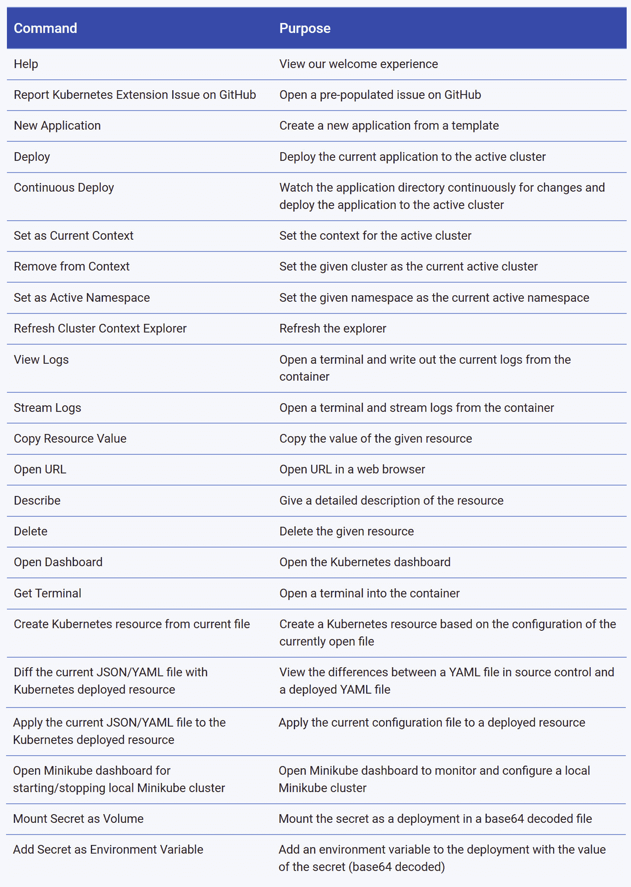

# 谷歌的云代码插件将 YAML 从 Kubernetes 中移除

> 原文：<https://thenewstack.io/googles-cloud-code-plug-ins-take-the-yaml-out-of-kubernetes/>

随着 Kubernetes 变得越来越受欢迎，人们也认识到开发人员的体验并不理想，需要开发人员获得大量的运营专业知识才能变得高效。谷歌产品和设计副总裁 Pali Bhat 告诉新的堆栈，云代码是谷歌计划的一部分，[与云构建和云运行](https://thenewstack.io/how-google-cloud-run-combines-serverless-and-on-demand-kubernetes/)一起，使 Kubernetes 更容易为开发者所用。

“有很多开发团队从来没有考虑过传统意义上的服务器，现在有了 Kubernetes，他们开始考虑这个问题。过去的情况是，开发人员开发他们的应用程序，然后将它扔到墙外，系统管理员团队会尝试部署它。那是坏的，”巴特解释道。“我们用 Kubernetes 解决了这个问题——只是现在开发者突然不得不考虑 Kubernetes。云代码的起源来自与客户的对话，他们告诉我们‘我有所有这些业务应用程序开发团队，我希望他们专注于业务逻辑，但不幸的是，他们现在不得不弄清楚如何使用容器和进行云原生开发。"

Bhat 建议说，Kubernetes 提供了可编程的基础设施，但这并不是开发者真正想要的。“开发团队根本不想考虑基础设施。”

“如果我们可以使用云代码和云运行之类的东西来简化过程，简化云原生应用的开发，那么开发人员就可以回到只考虑自己的代码和应用，但他们仍然可以获得好处:灵活性、抽象性、更好地利用他们的服务器和可扩展性，”他说。

## 应用程序代码，不是 YAML

云代码旨在与云构建、云运行和 Knative 一起工作，Bhat 建议将其视为“Kubernetes 和 Istio 之上的伟大开发人员体验”。Google 显然希望公司使用从 CI/CD 和使用 Cloud Build 的自动部署到 Cloud Run 的自动伸缩和服务的整个链，但是您可以使用云代码在任何 Kubernetes 集群上部署和调试。

“它不仅可以构建本地集群，还可以从 IDE 中自动构建远程集群。他们可以设置断点，可以进行全面的调试，并且可以在现有的开发环境中完成所有这些工作，这是您的开发人员和 appdev 团队所熟悉的。这看起来像完全本地应用程序开发，但它是针对一个动态集群。使用 Skaffold、Jib 和 kubectl 等工具，我们可以近乎实时地对其进行监控，因此您可以查看集群并获得关于整个体验的实时反馈。它在您的 IDE 中为您提供了端到端的开发生命周期。”

云代码包括一组[样本](https://github.com/GoogleCloudPlatform/cloud-code-samples)，这些样本被预设为发布到谷歌 Kubernetes 引擎(GKE)和云运行，但管理员和开发经理可以定制这些样本，以部署到他们自己的 Kubernetes 环境中(该环境使用了[谷歌的 Kustomize 项目](https://kubernetes.io/blog/2018/05/29/introducing-kustomize-template-free-configuration-customization-for-kubernetes/))。“我们让你连线你的目标集群，它可以是任何 Kubernetes，”Bhat 证实。

开发人员仍然可以在他们的 IDE 中查看和定制 YAML 文件，如果需要的话，一个有用的选项可以让您区分源代码控制中的 YAML 文件和部署在集群上的 YAML。可扩展的 YAML 林挺给出任何语法错误的即时反馈，同样可以为您的策略定制。

最初，该插件支持 Visual Studio 代码和 IntelliJ，并支持 Java、Python 和 Ruby，但谷歌正在考虑客户正在使用的其他开发环境，以及更多的语言；。NET 核心支持已经在开发中，但还没有发布，NodeJS 和 Go 也即将推出。这是一个支持开发人员已经在使用的工具的务实决定。

这两种 ide 的特性列表略有不同。借助云代码，IntelliJ 可以与 Google 云存储和应用程序引擎进行更好的集成，而 Visual Studio 代码插件允许开发人员浏览 Kubernetes 资源，将秘密放在卷和环境变量中，监控和配置本地 Minikube 集群，或者在 GKE、EKS 和 AKS 创建集群，而无需离开 IDE。

Bhat 说，未来云代码还将与其他 Kubernetes 和 DevOps 工具集成。“随着时间的推移，我们将扩大这一产品组合，并为您的定制 CI/CD 渠道构建定制能力。没有两个组织拥有完全相同的 CI/CD 流程；每个客户都有自己定制和调整的东西，因为应用程序开发是定义产品和服务的核心部分。我们的目标是使我们的工具链能够跨越云代码和云构建，以适应这种体验。”

IntelliJ 中的云代码使用 Stackdriver 在 GKE 上进行基于快照的生产调试，计划是从 Stackdriver 中带回更多信息，以便开发人员在编写代码时可以在他们的开发环境中看到这些信息。Bhat 说:“我们想做的是最终开始获得运营指标，并将它们带回你的 IDE 中。

这种信息对于像 [Visual Studio Code 的 CodeLens](https://code.visualstudio.com/blogs/2017/02/12/code-lens-roundup) 这样的东西特别有用，它给你上下文信息；在生产中查看一段代码的响应时间可以更容易地改进代码库。Bhat 希望该工具能为客户提供这样的开发效率。

“他们转向云计算的原因是，他们希望变得更加敏捷，而支持这种敏捷的方式就是去掉所有无聊的部分，并实现这些部分的自动化，让开发人员专注于构建令人惊叹的应用。”

[T3](https://cdn.thenewstack.io/media/2019/04/13a014a7-google-plugin-01.jpg)T5

<svg xmlns:xlink="http://www.w3.org/1999/xlink" viewBox="0 0 68 31" version="1.1"><title>Group</title> <desc>Created with Sketch.</desc></svg>