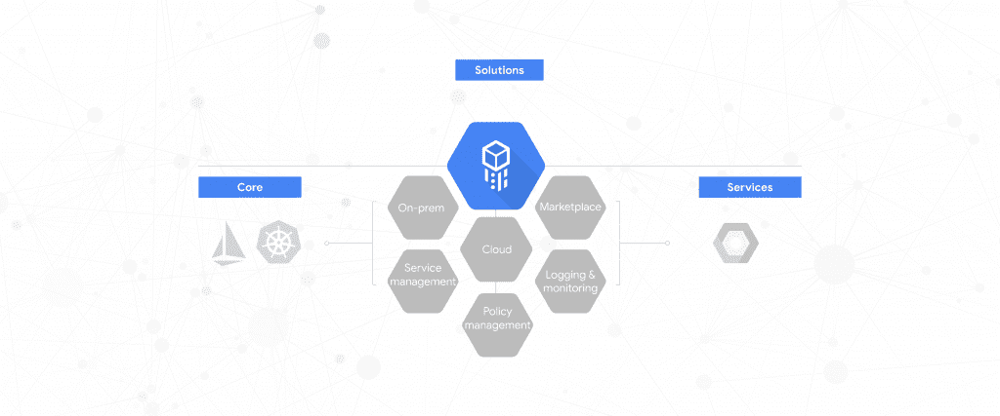

# Google 的云服务平台将托管的 Kubernetes 引入混合云

> 原文：<https://thenewstack.io/googles-cloud-services-platform-brings-managed-kubernetes-to-hybrid-cloud/>

在这一点上，云的优势可能被视为一个预料之中的结论，但仍然有许多原因导致企业没有进行过渡，无论是对本地硬件的投资、行业法规，还是进行迁移所需的时间和技能。根据 IDC 的研究，87%的公司表示，对于许多公司来说，混合云仍然是享受云优势的方式，同时还能满足企业或行业的特定需求。

对于这些公司来说，谷歌已经推出了其云服务平台的测试版，该平台于去年在谷歌云 Next 上首次由 T2 宣布。谷歌云副总裁 [Eyal Manor](https://www.linkedin.com/in/emanor) 在一篇关于测试版的博客文章中写道，CSP 是“一种基于软件的混合产品，利用 Kubernetes 和 Istio 的力量将谷歌云服务带入您的本地基础设施，以满足您的需求”。

根据谷歌文档，CSP 建立在谷歌托管的 Kubernetes 产品之上，[谷歌 Kubernetes 引擎](https://cloud.google.com/kubernetes-engine/) (GKE)，并包括 [GKE 本地](https://cloud.google.com/gke-on-prem/)，这是一种“为您的本地集群提供远程生命周期管理的托管 Kubernetes 服务”，允许您“使用跨所有环境的一致平台，编写一次并部署到云或本地”。

该公司还推出了 [CSP 配置管理](https://cloud.google.com/csp-config-management/)，这是一种 CSP 用户创建大规模应用安全策略和合规性规则的集中方法的方式。使用此工具创建的策略可以“设置和实施基于角色的访问控制、资源配额，并创建名称空间；据该公司称，“全部来自一个单一的真实来源”。它可以跨多个集群部署，包括本地集群和云中集群。

CSP 打算为企业提供单一平台体验，在混合环境中运行 Kubernetes，在云方面使用其托管的 Google Kubernetes 引擎(GKE ),在内部方面使用目前仍处于 alpha 阶段的 GKE 本地。除此之外，CSP 还包括所有其他谷歌产品，这些产品将 Kubernetes 从命令行体验增强为具有各种安全、管理和可见性层的体验——但现在是针对混合云。

在与新堆栈的一次采访中，[CSP 的谷歌工程总监 Chen Goldberg](https://www.linkedin.com/in/goldbergchen) 解释说，新的产品是为了将这些云的好处带到本地环境中，而不是让企业将他们的系统带到云上。

“没有人质疑云的好处。我们的客户对云给他们带来的好处感到兴奋，但大多数工作负载仍在本地运行。CSP 是第一个真正允许客户利用云的基于软件的平台。它确实将云带到了本地，但同时也为我们的云环境提供了一致性，”Goldberg 说。“我们的客户希望在任何地方运行工作负载。我们从客户那里得知，混合动力的挑战不仅在于可移植性，还在于集成、人员和技能。用不同的工具对人们进行培训需要多长时间？两种环境中一致性的重要性促使我们选择了 CSP。”

Key Bank 就是这样一家利用新产品将 Kubernetes 带到本地的公司。根据 KeyBank 首席技术官 Keith Silvestri 的说法，CSP 是显而易见的选择。

“谷歌创建了 Kubernetes 和 Istio，因此它们是显而易见的合作伙伴，因为我们希望将容器化的应用程序引入我们的数据中心，”Silvestri 在谷歌邮报上说。“简而言之，云服务平台为我们提供了我们需要的安全性、我们想要的可移植性以及我们的开发人员渴望的生产力。”

戈德堡附和了这一观点，指出“这是我们与 GKE 在过去 4 年和在谷歌内部 15 年发展的同样的专业知识。”

CSP 还提供各种集成，包括 Google Cloud[stack driver Monitoring](https://cloud.google.com/monitoring/)、 [Istio](https://istio.io/) 服务网格和[Google Cloud Platform market place](https://cloud.google.com/kubernetes-applications/)，后者“让您可以访问各种企业就绪、开源和商业的 [Kubernetes 应用程序](https://cloud.google.com/kubernetes-applications/)，这些应用程序具有预构建的部署模板、简单的许可和统一的计费。”对于有兴趣使用 Google CSP 的公司来说，可以通过 [beta 注册表格](https://docs.google.com/forms/d/e/1FAIpQLSfUGNBHV66NcSfquLJ4F1jdtDLpYpq2laPRO8srz-FKtQFz8Q/viewform)接受申请，尽管目前还没有关于等待时间的信息。

[https://www.youtube.com/embed/vJ9OaAqfxo4?start=2422&feature=oembed](https://www.youtube.com/embed/vJ9OaAqfxo4?start=2422&feature=oembed)

视频

通过 Pixabay 的特征图像。

<svg xmlns:xlink="http://www.w3.org/1999/xlink" viewBox="0 0 68 31" version="1.1"><title>Group</title> <desc>Created with Sketch.</desc></svg>