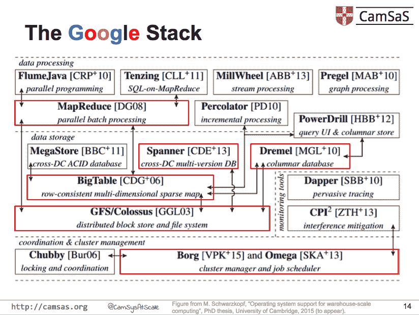

# 谷歌的数据架构以及如何大规模运作

> 原文：<https://thenewstack.io/googles-data-architecture-and-what-it-takes-to-work-at-scale/>

马尔特·施华蔻——目前正在剑桥大学完成“仓库规模计算的操作系统支持”的博士学位——发布了一系列幻灯片，描述了他对大规模分布式数据架构的一些研究。

施华蔻和他在[剑桥系统公司](http://www.cl.cam.ac.uk/netos/camsas/)的团队旨在为大规模数据中心构建下一代软件系统。因此，对于他来说，了解一些当前的数据巨头目前如何配置他们的完整堆栈，以便为下一波需要以类似规模工作的业务增长构建软件至关重要。一路走来，他参与了许多开源项目，包括 [DIOS](http://www.cl.cam.ac.uk/~ms705/research/dios/) (一种用于仓库规模数据中心的分布式操作系统，使用基于分布式对象的 API[苍穹](http://www.cl.cam.ac.uk/~ms705/research/firmament)(一个可配置的集群调度器，希望在流网络上应用优化分析)；[火枪手](http://www.cl.cam.ac.uk/research/srg/netos/musketeer/)(大数据分析的工作流经理)；以及 [QJump](http://www.cl.cam.ac.uk/netos/qjump) (一种减少网络干扰并提供延迟消息传递的网络架构)。

施华蔻的幻灯片基于他在谷歌书库的广泛参考书目。

他的研究发现，仓库规模的计算(定义为 10，000 多台机器)需要不同的软件堆栈，所有这些都旨在帮助提高众核机器的利用率，并允许对大型数据集进行快速、增量的流处理和近似分析(就像 BlinkDB 提供的那样)。(众核是一个术语，意在表示比多核更高的数量级。)

施华蔻的研究阐明了许多最大的数据驱动型公司，如微软、Twitter 和雅虎，与谷歌和脸书共有的三个主要特征:

*   “前端服务系统和快速后端。
*   批量数据处理系统。
*   多层结构化/非结构化存储层次结构。
*   协调系统和集群调度程序。"

在他的演讲中，“[怎样才能让谷歌大规模运作？](https://docs.google.com/presentation/d/1OvJStE8aohGeI3y5BcYX8bBHwoHYCPu99A3KTTZElr0/edit)“施华蔻讨论了在谷歌输入栏提交搜索请求和返回广告和搜索结果页面之间的 139 微秒背后的架构。

施华蔻说，所有发生的事情都发生在每个数据机上定制的 Linux 内核和分布式系统的透明层之间的容器中。

他指出了 16 种不同的软件技术，这些技术协同工作，返回用户期望从谷歌获得的实时、有背景的个性化搜索结果。

【T2

其中包括:

*   **GFS/Colossus:** 一个大块数据存储系统。
*   **大表:**一个三维键值存储，将行和列键与时间戳结合在一起。
*   **Spanner:** 使用数据中心内的 GPS 和原子钟在全球范围内实现事务一致性的软件。
*   **MapReduce:** 一个并行编程框架。
*   **Dremel:** 面向列的数据存储，对于快速的交互式查询非常有用。
*   **Borg/Omega:**Kubernetes 之父，大型分布式数据中心架构的集群管理器和调度器。

目前还不清楚施华蔻可能在哪里展示了这项工作:他的个人主页和 Twitter feed 没有表明这些幻灯片是结合任何特定的演讲发布的，只是在 8 月 17 日的一条推文中提供了一个链接。虽然是高层次的，但演示幻灯片足够清晰，可以提供使分布式架构大规模工作所需的基础架构图的有用见解，并且提到了足够多的链接和资源，任何在该领域工作的人都有大量有趣的兔子洞可以在深夜研究或午餐后拖延中漫游。

<svg xmlns:xlink="http://www.w3.org/1999/xlink" viewBox="0 0 68 31" version="1.1"><title>Group</title> <desc>Created with Sketch.</desc></svg>