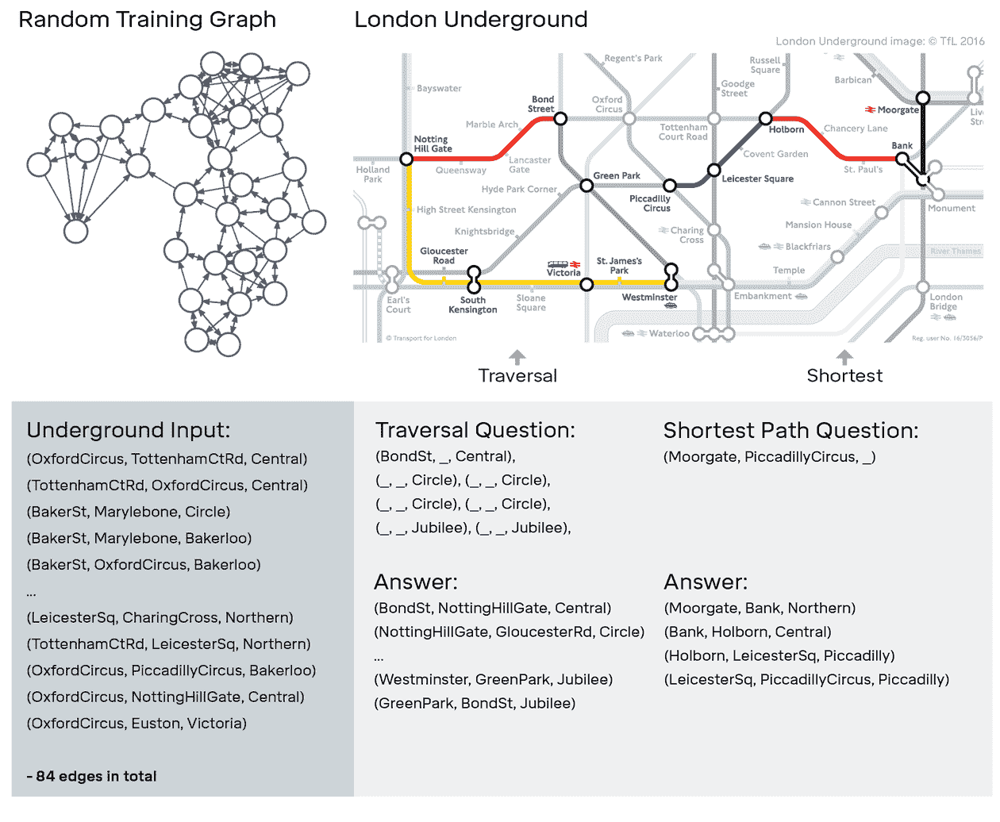
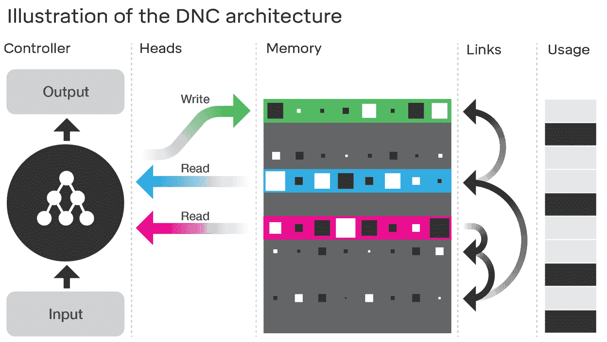

# 谷歌的 DeepMind 人工智能现在能够进行“深度神经推理”

> 原文：<https://thenewstack.io/googles-deepmind-ai-now-capable-deep-neural-reasoning/>

在过去的几年中，深度学习人工神经网络的发展突飞猛进。这些受生物学启发的计算模型，大致基于人类大脑的功能，迄今为止已经使机器能够完成曾经被认为是人类独有的任务。之前，我们已经见证了人工智能神经网络能够以某种艺术风格创造音乐，T2 从原始图像中幻觉出迷幻的风景，甚至 T4 在有史以来最复杂的游戏中击败了人类冠军。深度学习元素已经成为我们日常使用的许多技术的基础，从搜索引擎到语音识别和翻译。

但是谷歌的人工智能研究实验室 DeepMind 已经更进一步。DeepMind 已经创建了能够掌握复杂的棋盘游戏围棋的 AlphaGo 软件，现在已经开发了他们所谓的“记忆增强神经网络”,它使用一种外部“工作记忆”,帮助它学习如何独立完成复杂的任务，使用人类启发的记忆和推理，而不是通过编程来完成。

这种新的混合架构被称为可微分神经计算机或 DNC，将神经网络与网络外部的内存存储优势相结合。它的工作方式类似于计算机的随机存取存储器(RAM)的工作方式——这增强了模型的整体“推理”能力。

“神经网络擅长模式识别和快速反应式决策，但我们才刚刚开始建立能够缓慢思考的神经网络——也就是说，利用知识进行深思熟虑或推理，”DeepMind 的研究人员在最近的一篇博客文章[中解释道。“这些(DNC)模型……可以从神经网络等例子中学习，但它们也可以像计算机一样存储复杂数据。”](https://deepmind.com/blog/differentiable-neural-computers/)

然后，研究人员开始测试 DNCs 的问题，这些问题需要它构建临时数据结构，并使用这些有组织的知识来解决这些问题，类似于人工智能的一种“理性推理”。

这与传统的神经网络形成对比，传统的神经网络可能需要多次“输入”相同的训练数据，或者专门为其编程以完成相同的工作。根据研究人员发表在《自然》和题为“Hybrid coMPuting 利用一个 nEURalnetwo ernal memory、这种记忆辅助的“深度神经推理”使 DNC 能够成功完成一些独立神经网络表现不佳的任务。

DNC 使用随机生成的“图形”进行训练(左)。经过训练后，它的任务是在伦敦地铁系统中导航(右图)，要么找到任意长度的路径，要么找到两个车站之间的最短路径。

## 地铁导航和家庭关系

例如，一项任务涉及让系统学习如何在伦敦的地铁中导航——这是一项相对困难的壮举，需要人工智能在数据点之间建立复杂的联系和关系。但是研究人员发现，当 DNC 的任务是在伦敦地铁上找到从一点到另一点的路线时，它的平均准确率为 98.8%，相比之下，在近 200 万个样本上训练的独立神经网络的平均准确率为 37%。

在另一个练习中，当只给定与家庭的父母、子女和兄弟姐妹关系时，DNC 必须推断出家庭树中的关系。正如你在下面 DeepMind 的视频中看到的，DNC 一步一步地找到了解决方案，将学到的信息存储在内存中，当它面临解决另一方面的难题时，可以利用这些信息。

[https://www.youtube.com/embed/B9U8sI7TcMY?feature=oembed](https://www.youtube.com/embed/B9U8sI7TcMY?feature=oembed)

视频

## 学习如何使用记忆

那么，DNC 与其传统兄弟有什么不同呢？DNC 的中心是一个控制器，其作用类似于计算机的处理器。控制器的工作是接收输入，读取和写入内存，并产生输出。神经网络在“选择”是否将某件事情提交给内存以及将它写在哪里方面具有自由度。当信息被写入时，它的位置通过带有时间戳的“关联链接”与其他数据位相连接，这表明了存储数据点的时间顺序。这使得控制器可以根据位置或时间返回并调用存储的信息，这使得 DNC 能够选择如何分配内存、存储信息的位置以及如何找到信息，久而久之 DNC 在调用和连接单独的数据位方面变得越来越好。

“不同的神经计算机学习如何使用记忆，以及如何完全从零开始产生答案，”该团队解释道。“他们学会了使用优化的魔力来这样做:当 DNC 产生一个答案时，我们将这个答案与想要的正确答案进行比较。随着时间的推移，控制者学会产生越来越接近正确答案的答案。在这个过程中，它会想出如何使用自己的内存。”

既然 DNC 已经在这些初步练习中经过测试，下一步将是扩大 DNC 的内存容量，以便处理真实世界的数据。

“一个灵活、可扩展的 DNC 风格的工作记忆可能会允许深度学习扩展到具有理性推理组件的大数据应用，如生成视频评论或语义文本分析，”德国不来梅雅各布大学计算科学教授 Herbert Jaeger 评论道。但耶格指出，还有一个更大的画面要看:“DNC 只是到处涌现的几十个新颖、高效、构思巧妙的神经学习系统中的一个。”

即便如此，这种新设计确实让我们更接近更智能的机器，这些机器可以[学习如何学习](https://thenewstack.io/machines-learn-learn-like-humans-new-breakthrough-algorithm/)并解决任何数量的一般性问题，而不是依赖脆弱的、所谓的“[弱人工智能](https://en.wikipedia.org/wiki/Weak_AI)”，这些人工智能已经被预编程来完成单一的特定任务。拥有更强[人工通用智能](https://en.wikipedia.org/wiki/Artificial_general_intelligence) (AGI)的机器将能够像任何人一样处理认知任务，这将意味着我们的数字助理、汽车和协作机器人将反应更快、更智能，并可能更像人类一样与之互动。

<svg xmlns:xlink="http://www.w3.org/1999/xlink" viewBox="0 0 68 31" version="1.1"><title>Group</title> <desc>Created with Sketch.</desc></svg>