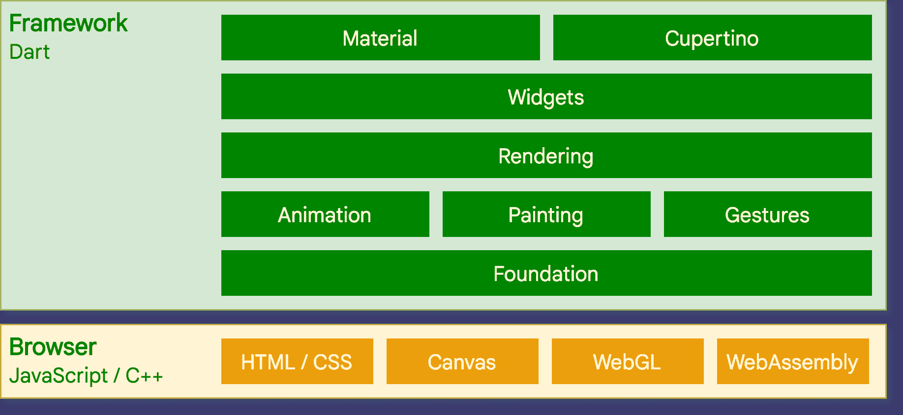
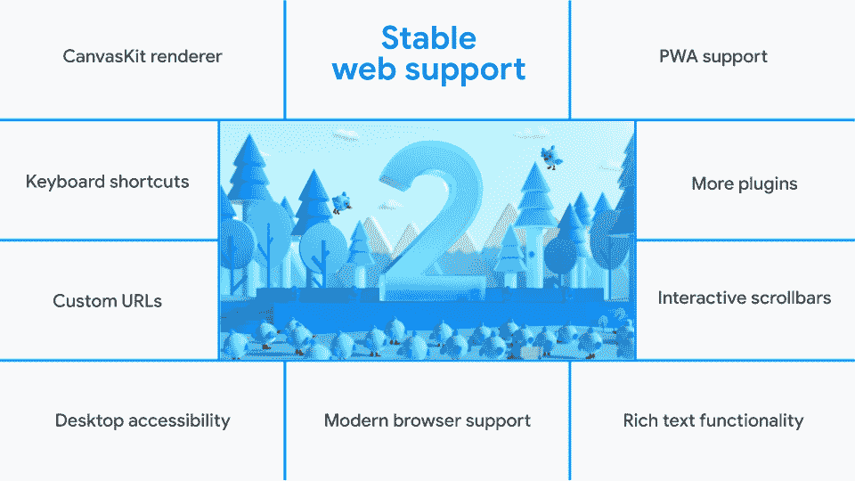

# 谷歌的 Flutter 增强了网络支持，那么它与 React Native Now 相比如何呢？

> 原文：<https://thenewstack.io/googles-flutter-beefs-up-web-support-so-how-does-it-compare-to-react-native-now/>

本月早些时候，谷歌[发布了 Flutter 2](https://developers.googleblog.com/2021/03/announcing-flutter-2.html) ，这是其最新版本的 UI 工具包，用于[构建](https://flutter.dev/)“从单一代码库为移动、网络和桌面原生编译应用程序。”Flutter 允许开发者为五种操作系统——iOS、Android、Windows、macOS 和 Linux——创建原生应用，以及为 Chrome、Firefox、Safari 和 Edge 等现代浏览器创建 web 应用。

也许 Flutter 2 公告中最大的新闻是，它对 web 的支持现在被标记为“稳定”(在此之前，它是“测试版”)。最初于 2015 年推出的 Flutter 主要被视为 Android 和 iOS 的移动软件开发包(SDK)。到目前为止，框架的 web 部分即使不是一个次要的特性，也肯定是一个实验性的特性。

 [理查德·麦克马努斯

Richard 是 New Stack 的高级编辑，每周撰写一篇关于 web 和应用程序开发趋势的专栏文章。此前，他在 2003 年创立了读写网，并将其打造为全球最具影响力的科技新闻和分析网站之一。](https://twitter.com/ricmac) 

增强的 web 支持使 Flutter 更接近其他跨平台开发平台的功能，如 [React Native](https://reactnative.dev/) 和 [Ionic](https://ionicframework.com/) 。因此，这对谷歌来说是重要的一步，尤其是考虑到它在网络应用市场上与 Chrome 相关的优势。Flutter 需要展示它可以覆盖所有基础，包括网络。

Flutter 是用一种叫做 Dart 的编程语言编写的，可以编译成 JavaScript。这是 Flutter 不断增长的网络野心的关键，因为当然 JavaScript 统治着这个时代的一切。题外话:[早在 2010 年](https://gist.github.com/paulmillr/1208618)谷歌就在谈论创造一种叫做 Dash 的新语言，它被定位为 JavaScript 的替代品。实际上，Dart 是在 2011 年推出的，但直到 2015 年，谷歌才全力以赴将 Dart 编译成 JavaScript。即使是谷歌的力量也无法消灭现代网络中的 JavaScript。

Dart 的问题是没有多少开发人员使用它——当然与 JavaScript 相比。因此，这使得 Flutter 与 React Native 相比处于劣势，React Native 是脸书在 2015 年推出的，旨在补充其流行的 React JavaScript 库。

根据 Flutter 的[文档](https://flutter.dev/web)，增加网络支持“涉及在标准浏览器 API 之上实现 Flutter 的核心绘图层，此外还要将 Dart 编译成 JavaScript，而不是用于移动应用的 ARM 机器码。”

## 交叉开发者

从本质上来说，通过 Flutter 2，谷歌表示，它对希望构建生产就绪型应用程序的 web 开发人员开放。然而，来自网络开发者的最初反馈是复杂的。

Flutter 最大的特性之一是热重载，[也就是](https://www.quora.com/Whats-hot-loading-in-Webpack-and-how-does-it-work)“一种在运行的应用程序中更新代码而无需重启或重置应用程序状态的方法。”不丢失状态有助于更快的开发，因此它为开发人员节省了时间。然而，Flutter 所谓的“有状态热重装”目前在网络上还不被支持。相反，它为网络应用程序提供了一个“热重启”功能，但它不会记住你的状态。

问题是，完整的热重新加载体验是竞争框架提供的一个特性，正如一位 Reddit 用户提到的:

*“我知道热重装是 dart VM 的一个特性，很难在 web 上模拟。但是如果你看看 React 和 Vue，它们确实提供了一定程度的热重装。例如，编辑应用程序的样式而不丢失其状态是可能的。”*

也有人抱怨 Flutter 2 中的其他 web 工具——比如 widget inspector——以及大量代码。

所有这些担忧都提出了一个关于 Flutter 网络支持的有效问题:去掉 beta 标签是否为时过早？

## 颤动与自然反应

当[宣布](https://medium.com/flutter/flutter-web-support-hits-the-stable-milestone-d6b84e83b425)稳定的网络支持时，谷歌指出，Flutter 最适合渐进式网络应用(PWAs)、单页应用(spa)，以及将现有的移动应用带到网络上。

在伴随发布的 [Flutter Engage 虚拟活动](https://www.youtube.com/watch?v=HAstl_NkXl0)中，谷歌产品经理 [Mariam Hasnany](https://www.linkedin.com/in/mariam-hasnany/) 表示“虽然你可以在网络上做很多事情，但 Flutter 最初的稳定版本最适合构建网络应用，而不是静态内容网站。”

归根结底，Flutter 是一个用户界面框架，专门研究动态设计元素，因此它最适合需要丰富的交互式 UI 的 web 应用程序。Flutter 网站[是这样说的](https://flutter.dev/web):

*“…博客文章等文本丰富、基于流的静态内容受益于以文档为中心的模型，而不是像 Flutter 这样的 UI 框架可以提供的以应用为中心的服务。”*

与 web 上的 Flutter 相关的一点是，它不支持 SEO，这使得它不适合构建大型内容网站。 [Eric Seidel](https://www.linkedin.com/in/ericseidel/) ，Flutter 的工程总监[说](https://twitter.com/_eseidel/status/1371176961616191489)“我们有计划增加(SEO)支持，但还需要一段时间。”

虽然 Flutter 不推荐用于构建文本丰富的 web 应用程序，但 React Native 被许多开发人员视为一个可行的选择。React 专家塞巴斯蒂安·洛伯(Sébastien Lorber)也是脸书的一名承包商，他在 Twitter 上说“我仍然在很多用例上押注 React-Native。”他补充说，“对于以内容为中心的网站”，他会选择 React Native 但洛伯也对 Flutter 2 印象深刻，并选择它“用于可以提前下载 10mb 的 UI 密集型网络应用”

## 结论

尽管在 Reddit 和 Twitter 上讨论了初期问题，但 Flutter 2 是谷歌在其跨平台框架中为网络支持迈出的一大步。这也是必要的一步，因为谷歌开发人员的大部分精力都是由其占主导地位的网络浏览器 Chrome 提供的功能驱动的。将跨平台开发中的 web 支持拱手让给脸书并不明智。

你可以感觉到 PWAs 将会是 Flutter 未来的一个焦点，至少在 web 支持方面，因为这个框架不适合文本丰富的 web 应用。根据定义，pwa 是具有类似本地应用的交互功能的网络应用；谷歌最近一直在推动这项技术向前发展。

同样值得关注的是 Flutter 和 React Native 之间正在进行的竞争——当然，两者都是开源的，但它们也得到了两个网络巨头的支持。脸书的 React 生态系统目前在网络开发者中占据上风，这要归功于它在过去十年中的 [JavaScript 创新](https://thenewstack.io/instagram-lite-is-no-longer-a-progressive-web-app-now-a-native-app-built-with-bloks/)。但是谷歌有 Chrome，并且在 T4 设定网络标准方面有影响力。两者都在觊觎更多的跨平台开发者。

<svg xmlns:xlink="http://www.w3.org/1999/xlink" viewBox="0 0 68 31" version="1.1"><title>Group</title> <desc>Created with Sketch.</desc></svg>