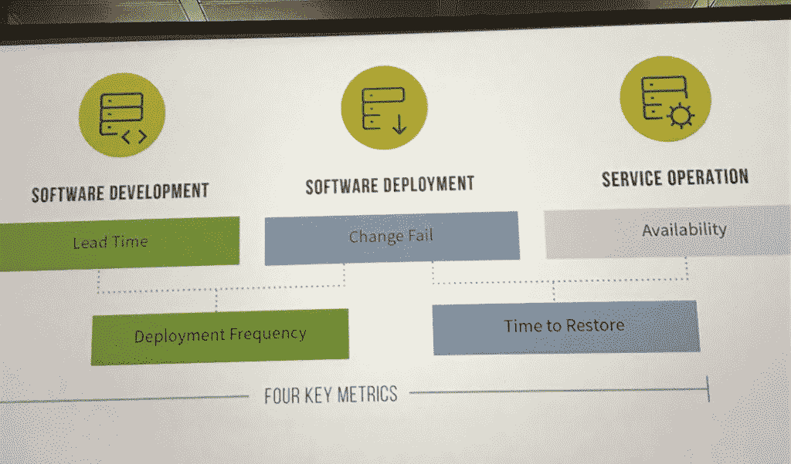

# Google 的精英 DevOps 性能公式

> 原文：<https://thenewstack.io/googles-formula-for-elite-devops-performance/>

每个组织都想成功，但是谁来决定哪些是成功的呢？对于 Google 来说，如何衡量 DevOps 团队的成功有一个清晰的定义。在去年的 [CloudNative London](https://infosec-conferences.com/events-in-2019/cloudnative-london/) 大会上，谷歌云平台倡导者和《[持续交付](https://www.amazon.com/Continuous-Delivery-Deployment-Automation-Addison-Wesley/dp/0321601912)、 [Jez Humble](https://twitter.com/jezhumble) 的合著者解释了谷歌的四个关键指标——通常被称为 DevOps 研究和评估或 [DORA 指标](https://www.devops-research.com/research.html)——以及如何成为这些为数不多的、值得骄傲的精英团队之一。

让我们先来澄清一下 Google 是如何定义 DevOps 的，即“旨在提高软件交付速度、提高服务可靠性以及在软件利益相关者之间建立共享所有权的组织和文化运动。”这个定义进一步深入到了 DevOps 团队应该如何“提高软件交付能力的速度、稳定性、可用性和安全性”

Humble 表示，许多团队认为他们可以安装 Kubernetes 并开始部署应用程序，但很少有组织拥有推动真正成功的技术和管理能力。那么，那几个表现最好的人做得对吗？

## 一个成功的 DevOps 团队的 4 个 DORA 指标

对于谷歌来说，它归结为三个团队——软件开发、软件部署和服务运营——他们关心四个指标加上一个不能直接衡量的指标，即可用性，但在这个过程中不能妥协。DevOps DORA 的四个关键指标是:

*   变革的准备时间
*   部署频率
*   恢复服务的时间
*   变更失败率

成功的开发运维团队理解这些目标的共享所有权。

Humble 进一步将 DevOps 高绩效者定义为在吞吐量、稳定性和可用性方面做得更好的人。这些精英表演者:

*   每天释放多次。
*   从变更到投入生产的准备时间不到一天。
*   恢复服务的时间不到一小时(表现差的需要一周或一个月)。
*   变更失败率为 0 到 15%。

这些精英员工能够实现公司目标，因为他们在以下指标上表现出色:

*   收益性
*   生产力
*   市场占有率
*   客户数量
*   产品或服务的质量
*   工作效率
*   客户满意度
*   提供的产品或服务的数量
*   实现组织和使命目标

所有这些都使人们相信软件交付和运营(SDO)的性能预测了整个组织的性能。汉布尔还表示，你的 SDO 表现和你的文化表现之间存在进一步的关联。“他们预测文化。你的文化在多大程度上是使命导向的，而不是病态的、控制导向的。

所有这些精英表演者共同营造了一种学习的氛围，高度参与的回顾，以及对信任、发言权和自主权的鼓励。

但这也不仅仅是人的问题。在 DevOps，技术和文化一样重要。

### 没有云计算可以有 DevOps 吗？

谷歌 2019 年开发状况报告发现，80%的受访者主要在某种云平台上进行托管。Humble 解释说，谷歌将[国家科学技术研究所对云计算的定义](https://nvlpubs.nist.gov/nistpubs/Legacy/SP/nistspecialpublication800-145.pdf)应用于 SDO 性能。这概括了云计算的五个基本特征:

1.  **按需自助服务:**云提供商无需人工干预即可提供计算资源。
2.  **广泛的网络访问:**通过电话、笔记本电脑和平板电脑进行异构访问，而不仅仅是工作站。
3.  **资源池:**多租户，可以通过国家、州或数据中心进行抽象。
4.  **快速弹性:**功能可以轻松伸缩。
5.  **测量服务:**云系统自动控制、优化和报告关键资源使用情况。

在谷歌的调查中，只有 29%的受访者符合所有五项要求。不出所料，这些与 DevOps 性能相当。事实上，精英表现者遇到所有这些基本云特征的可能性是低水平表现者的 24 倍。

去年的报告意识到，今年的报告验证了他们是在公共云、私有云还是混合云上工作并不重要，专注于基于云的执行的团队应该在速度、稳定性和可用性方面取得成功。

Humble 表示，企业通常运行着成千上万的服务，这些服务由异构技术组成，但也有许多其他公司将超过 70%的 IT 预算用于“维持运营和增加容量”然后，当他们必须支持 CI/CD 时，他们需要在易贝上购买不受支持的硬件，或者他们“正在运行一些任务关键型的东西，没有人有代码来完成这些任务”

## 你在培养精英文化吗？

精英团队清楚地了解谁做什么，并尽可能自动化。

Humble 说，在 DevOps 的四个关键指标中，最难衡量的是交付周期。这看起来回答了这样的问题:你的组织需要多长时间来部署一个只涉及一行代码的变更？你能在可重复、可靠的基础上做到这一点吗？

他接着强调了显著影响交付时间的不同领域，最强大的软件开发和运营团队似乎都有答案:

1.  **垃圾收集:**我应该为这个虚拟负载平衡器或数据库实例向谁收费？如果我删除此服务，会发生什么情况？现在还有人用吗？平台应该确保每个虚拟资源都分配给一个应用程序或平台本身。
2.  **做出改变:**如果一个应用程序有漏洞，我该如何修复和部署它？如果我需要更新这个依赖服务，源代码在哪里？Humble 表示，只需点击一个按钮，就可以重新部署任何应用程序。
3.  **多租户:**我们如何为开发人员提供自助式部署或配置？Humble 承认，让 AWS 和 Kubernetes 成为多租户很困难，但这是任何企业平台即服务(PaaS)的基本要求。
4.  **管理复杂性:**确保栈是最新的。我们如何在 15 年内雇佣懂得如何操作的人？亨布尔说要限制选择。例如，所有应用都必须构建在预定义的批准运行时堆栈上，PaaS 运营商可以按需修补和重新部署。

或许最重要的是，当您的堆栈中存在漏洞时，您需要多长时间来修补、构建和重新部署所有受影响的应用程序？Humble 提到了这种快速修补的需要，以应对当 [Equifax 因 Apache Struts 框架中的一个缺陷而发生的头条新闻泄露](/equifax-data-breach-shows-perils-not-patching-timely-manner/)时所发生的情况。

### 精英开发团队背后的架构

在他的主题演讲中，Humble 概述了架构成果，这些成果允许团队在没有安全风险的情况下实现高性能开发运维所需的灵活性。康威定律在这里出现并不奇怪。

问自己这些问题:

1.  我的团队可以在没有团队之外的人的许可或者依赖于其他团队的情况下对系统的设计进行大规模的修改吗？
2.  我的团队可以在不需要与团队外的人进行细粒度的沟通和协调的情况下完成工作吗？
3.  我的团队可以独立于产品或服务所依赖的其他服务，按需部署和发布其产品或服务吗？
4.  我团队可以在不需要集成测试环境的情况下按需进行大部分测试吗？
5.  我的团队能否在正常工作时间内以可忽略的停机时间执行部署？

Humble 建议需要一个平台即服务。他说，自助式多租户平台即服务可以最大限度地减少攻击服务区域。

对于 Humble 而言，PaaS 的主要原则是职责分离，即:

1.  平台团队负责 PaaS。
2.  使应用程序部分尽可能小。
3.  利用自助式 API 进行部署。

他称之为“功能即服务模式”，理想情况下，应用堆栈也是平台的一部分，因此您可以轻松地修补它们。这些都有助于保持合规性。

当您过渡到 PaaS 时，Humble 建议您从考虑结果开始，并考虑整个软件开发生命周期的合同。PaaS 将帮助您缩短交付周期和恢复时间。

他建议为你的网站和应用提供一个 jam stack(JavaScript、API 和标记)。然后，任何涉及业务逻辑或状态变化的事情都会通过 API 与之对话的函数发生。全都在你的 PaaS 上面。

Humble 列出了 PaaS 的优势，包括:

*   极其便宜且高度可扩展
*   最小化攻击表面积
*   内容和功能之间关注点的分离，
*   超级易于配置和部署
*   分离演示和服务
*   更容易开发/测试

### 高绩效团队背后的心理安全

最后，Humble 谈到了团队如何实现结果，而不是个人，这就是为什么团队和组织文化是这些精英 DevOps 执行者成败的关键。

那么，建立高绩效团队并使他们能够快速稳定地交付成果的秘诀是什么呢？心理安全。

促进心理安全的组织——团队成员在彼此面前感到冒险和脆弱是安全的——在可靠性、结构、清晰性、意义和对组织的影响方面有更大的能力。

以上所有因素结合在一起强烈地影响了文化和 SDO 的绩效，这有助于组织的绩效。此外，它还有助于减少倦怠、部署痛苦和返工。

<svg xmlns:xlink="http://www.w3.org/1999/xlink" viewBox="0 0 68 31" version="1.1"><title>Group</title> <desc>Created with Sketch.</desc></svg>