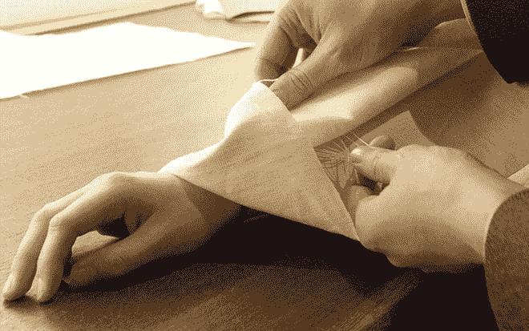

# 谷歌的提花项目:将织物变成触摸屏的导电线

> 原文：<https://thenewstack.io/googles-project-jacquard-conductive-threads-that-turn-fabrics-into-touch-screens/>

未来的小玩意可能不是拿在手里的东西——相反，它可能是你戴着的东西。

今天充满小工具的环境可能很快就会成为历史，因为似乎越来越多的人开始将技术嵌入到我们的日常用品中，以使技术不那么显眼，成为更无缝体验的一部分。我们已经看到了这个概念厨房是如何实现的，现在谷歌的 T2 项目 Jacquard 最近在谷歌的 I/O 大会上亮相，正在试验“智能纺织品”——一种有“导电线”编织的衣服，这样它们就可以像触摸屏一样工作。查看这些互动线程的运行情况:

[https://www.youtube.com/embed/qObSFfdfe7I?feature=oembed](https://www.youtube.com/embed/qObSFfdfe7I?feature=oembed)

视频

由谷歌[高级技术与进步(ATAP)](https://plus.google.com/+GoogleATAP/about) 团队领导的项目 Jacquard 的名字是对[提花织机](https://en.wikipedia.org/wiki/Jacquard_weaving)的一个肯定，它使得图案服装的工业化生产成为可能。

这些细小的导电线被编织到织物中，使衣服的某些区域能够被轻击和抚摸，以便与智能手机和平板电脑等设备进行交互。这种纱线——可以制成任何颜色和几乎任何厚度——是通过用导电的薄金属聚合物替代和编织织物股来制造的，以产生一种坚固的纤维。项目创始人 Ivan Poupyrev 解释道:

> 纺织品的结构与我们每天在移动设备和平板电脑上使用的触摸屏的结构相同。这意味着，如果你用导电线代替纺织品中的一些线，你应该能够编织一种能够识别各种简单触摸手势的纺织品。

Poupyrev 在会议上展示了一件智能服装的威力——一件装有触摸感应贴片和藏在其中一个口袋里的蓝牙控制器的亚麻夹克——它可以完成多种任务，比如导航智能手机，滚动浏览照片或打开应用程序。

## 与现有供应链整合，使技术“环境化”

该团队的目标是制造“智能”线，可以集成和升级用于现有的工业机器，而不是从零开始。Poupyrev [指出](http://www.fastcodesign.com/3046864/meet-project-jacquard-googles-plan-to-turn-all-your-clothes-into-a-touchscreen)虽然智能服装并不新鲜，但由于制造的限制，它还不常见:

> 服装业每年生产 190 亿件服装。相比之下，去年智能手机的产量为 1.28 亿部。因此，当我们谈论交互式纺织品时，我们需要在服装制造的规模上考虑它，使用现有的供应链和现有的工业织机。

因此，Project Jacquard 的目标是使用现有的系统，而不是重新发明轮子。最重要的是，这种面料将经过严格的测试，以经受住工业生产的危险。

该项目旨在让技术更加“环境化”，将互动和输入能力融入我们周围的织物和物品(比如沙发、枕头、窗帘)。此外，该团队希望让传统设计师更容易接触到智能纺织品，他们可能没有任何集成这种技术的经验，让他们更容易与软件开发商合作。首席研究员南-龚伟说:“重点是让它更隐蔽，而不是显而易见。” 我们正试图将所有组件缩小到一个按钮的大小，最终这将是一个非常小的东西，我们可以将它们嵌入到制造过程中。”

它可能会彻底改变时尚产业，把我们穿的“笨”衣服变成各种各样的空白、可编程的画布，让我们可以做令人惊讶的事情。可能会有具有医疗应用的智能服装，比如监测我们的生命体征；允许我们无线交流的衣服；或者让我们控制我们的智能家居。这些衣服可以与虚拟现实平台交互，或者为用户提供触觉反馈。当然，总有不好的一面；消费者的隐私权可能会被侵犯，就像现在我们的其他产品一样。然而，[Poupyrev:说](http://www.techradar.com/us/news/wearables/inside-project-jacquard-how-google-is-threading-together-its-plan-for-smarter-clothes-1295970/2)这些原型智能服装的多功能性是关键

> 每件夹克都会有特别之处。但对这件事来说，非常重要的一点是，我们正在思考平台，我们希望人们为这件衣服编写自己的应用程序。这是一件普通的夹克，一件定做的夹克。它不是“可穿戴的”这不是什么特别的事情。所以一旦我们开放它，人们可以写他们自己想要的应用程序。[用户]可以安装应用程序，所以，这不是一次性的，它只做一件事。它变得更加有趣，因为你可以在日常生活中修改衣服的功能。

为此，该团队现在正致力于“ ”为这些织物开发定制连接器、电子元件、通信协议以及简单应用和云服务的生态系统。 而这些智能服装可能比你想象的来得更快；谷歌[与李维斯](http://www.techradar.com/us/news/wearables/how-levi-s-and-google-plan-to-change-the-wearable-clothing-game-1295822)合作，在 2016 年推出首批智能服装产品。在[项目 Jacquard](https://www.google.com/atap/project-jacquard/) 阅读更多信息。

图片:谷歌项目提花。

<svg xmlns:xlink="http://www.w3.org/1999/xlink" viewBox="0 0 68 31" version="1.1"><title>Group</title> <desc>Created with Sketch.</desc></svg>