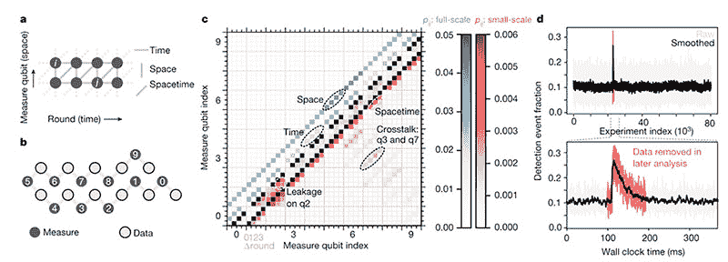

# 谷歌的量子计算机可以指数级抑制错误

> 原文：<https://thenewstack.io/googles-quantum-computer-can-exponentially-suppress-errors/>

无论是应对[气候危机](https://thenewstack.io/well-its-a-start-can-tech-stop-the-climate-emergency/)，建设[无法破解的互联网](https://thenewstack.io/scientists-adapt-1930s-radio-tech-help-build-unhackable-quantum-internet/)还是[开发新颖的机器学习算法](https://thenewstack.io/the-ultimate-guide-to-machine-learning-frameworks/)，世界正面临着越来越复杂的问题，所有这些都需要越来越强的计算能力。

强大的量子计算机可能会满足对更高计算能力的需求，但目前最先进的量子计算机仍然相对容易出错，因为量子位或量子位对外部环境扰动(如温度波动或错误的电磁场)具有内在的敏感性。

尽管如此，这并没有阻止像 IBM、亚马逊、霍尼韦尔和 ColdQuanta 这样的科技公司制造量子计算机或提供量子计算服务。

科技巨头[谷歌](https://thenewstack.io/quantum-computers-are-here-but-what-to-do-with-them/)是另一家加入大规模商业化量子计算竞赛的公司，他们最近建造了一台名为 Sycamore 的 54 量子位机器。

正是 Sycamore 量子处理器让谷歌宣布它实现了被称为[量子优势](https://ai.googleblog.com/2019/10/quantum-supremacy-using-programmable.html)的突破，这意味着它能够在短短几分钟内解决一个极其困难的计算问题，这个问题可能需要世界上最快的“经典”超级计算机数千年才能解决。

现在，谷歌的研究人员已经证明，在他们的量子机器上以指数方式抑制错误也是可能的。这是一个重要的发现，将帮助其他专家开发更多容错的量子计算机，这些计算机也可以自动检测和纠正错误。

目前最先进的量子计算机通常具有接近 10³的错误率(即。千分之一)。然而，为了让量子计算机发挥其全部潜力，错误率需要降低到至少 10^(-15)，这被广泛认为对大多数应用是可行的。

## 指数误差校正

在发表于[自然](https://www.nature.com/articles/s41586-021-03588-y)的一篇论文中，谷歌团队概述了他们如何开发一些执行[量子纠错](https://oxfordre.com/physics/view/10.1093/acrefore/9780190871994.001.0001/acrefore-9780190871994-e-35) (QEC)的新技术。就像经典计算机可能会在一串二进制代码中添加一个[奇偶校验或“检查”位](https://www.computerhope.com/jargon/p/paritybi.htm)作为一种简单的纠错形式一样，量子计算机需要一些方法来保护脆弱的量子信息免受错误或量子噪声的影响，量子噪声可能会因量子位受到机器外部环境的无意影响而产生。

这就是量子纠错的用武之地，但是量子计算机要复杂一些。这是因为数据不像在传统机器上那样被编码成二进制的 1 和 0；取而代之的是，量子位以两种状态编码信息，使得量子计算机中的纠错变得更加棘手。

为了解决这个问题，谷歌的研究人员使用了所谓的[稳定器代码](https://en.wikipedia.org/wiki/Stabilizer_code)。就像传统计算系统中的错误检查奇偶校验位一样，稳定器代码有助于补偿量子系统中的高错误率。

在这种情况下，谷歌的研究人员使用了两种稳定器代码:一种称为“重复代码”，另一种称为“表面代码”。这些代码有助于在许多量子位之间分配量子信息，并指定额外的量子位来跟踪奇偶校验，并在出现错误时进行纠正。

由于量子位容易受到退相干的影响，因此需要更多额外的物理量子位来进行纠错，将这些纠错量子位组合在一起作为一个实体将形成称为“[逻辑量子位](https://thequantumdaily.com/2019/10/01/introduction-to-qubits-part-1/)的簇，这有助于为整个系统提供稳定性和容错能力。

“许多量子纠错架构建立在稳定器代码上，其中逻辑量子位以多个物理量子位的联合状态进行编码，我们称之为‘数据量子位’，”该团队解释道。

被称为‘测量量子位’的附加物理量子位与数据量子位交织在一起，并被用于周期性地测量所选数据量子位组合的奇偶性。这些投射稳定器测量将数据量子位状态的不希望的扰动转化为离散误差，我们通过寻找宇称的变化来跟踪这些误差。然后可以对奇偶校验值流进行解码，以确定最有可能发生的物理错误。”

a)错误检测事件图。b)重复码中“测量量子位”的排序。c)检测事件之间的测量相关性。D) Top:重复代码运行期间观察到的高能量事件。下图:放大高能事件。在计算逻辑错误概率时，设备范围的错误和数据会迅速增加并呈指数衰减。

为了进行实验，系统中的量子位被排列成一维链，这样每个量子位最多有两个相邻的量子位。重复代码通过让数据量子位交替充当数据量子位和检查其邻居中的任何错误的测量量子位来控制链中的量子位。

有趣的是，研究小组发现，当逻辑量子位簇的大小(范围从 5 到 21 个物理量子位)增加时，逻辑错误率呈指数级下降。与仅由五个物理量子位组成的逻辑量子位相比，21 个量子位的集群的错误率减少了 100 倍。

“随着物理量子位数量的增加，编码逻辑量子位状态的错误可以得到指数抑制，前提是物理错误率低于某个阈值，并且在计算过程中保持稳定，”该团队说。

因为可能发生不同类型的量子错误——类空间错误、类时间错误或类时空错误——该团队还实施了另一种称为“表面代码”的稳定器代码来检查错误。这种代码将量子位排列成数据量子位的二维棋盘结构，并测量量子位，以更好地监控可能出现的任何额外的逻辑错误。

更重要的是，该团队发现他们的方法保持了逻辑错误抑制率的稳定性，即使在测试 50 轮后也是如此。这是该团队的关键发现，因为这可能为未来开发更具容错性的大规模量子计算机指明了方向。

然而，该团队指出，他们的模型存在局限性，最明显的是，未来量子计算机要实际运行，量子位的错误率需要降低至少 10 倍，而逻辑量子位的大小必须扩展到大约 1000 个数据量子位。正如该团队指出的，这将是未来量子计算的一个重要门槛。

然而，目前他们无法测试这一提议，因为即使是 Sycamore 最先进的量子处理器也只有 54 量子位，尽管该公司表示，它的目标是到 2029 年建立一个商业级的 100 万量子位处理器。

<svg xmlns:xlink="http://www.w3.org/1999/xlink" viewBox="0 0 68 31" version="1.1"><title>Group</title> <desc>Created with Sketch.</desc></svg>