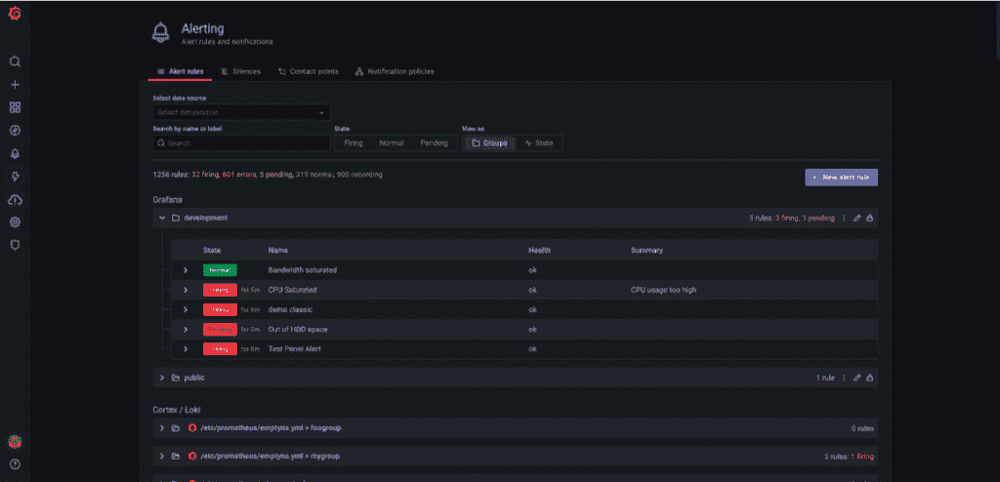
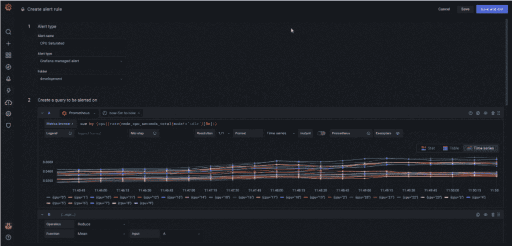
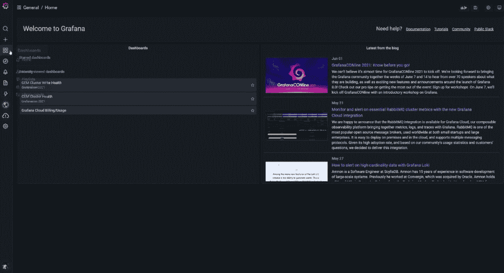
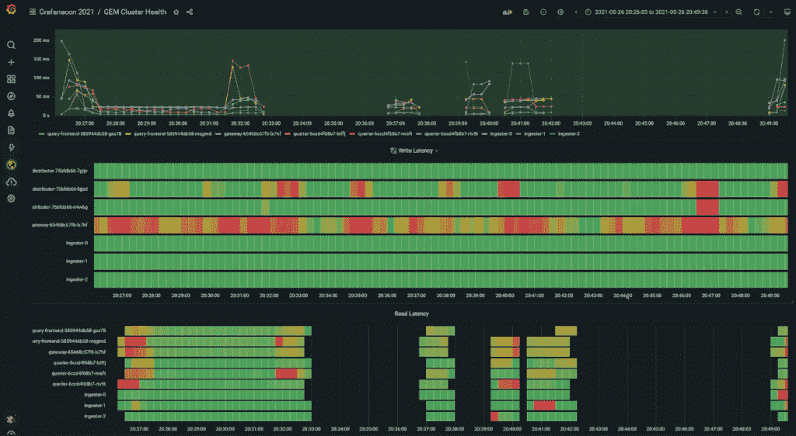

# Grafana 8.0 重新思考警报和可视化

> 原文：<https://thenewstack.io/grafana-8-0-rethinks-alerts-and-visualizations/>

Grafana Labs 的 Grafana 8.0 版本具有许多新功能，包括在单个界面中结合不同类型的警报和更广泛的可视化选项。

Grafana Labs 的 alerts rethink 涉及如何将来自 Grafana 的 Grafana 警报以及来自 [Prometheus](https://prometheus.io/) 和其他可观察性选项组合在一个用户界面(UI)中，从而将可以在控制台中同时查看的不同警报类型联系起来。

在 Grafana 8.0 发布之前，用户必须在两个不同的警报系统之间进行选择，包括“一个易于使用的 Grafana 内置的图形驱动警报系统，或一个强大的 Prometheus 配置驱动系统”，[Grafana Labs](https://uk.linkedin.com/in/tomwilkie)的产品副总裁 Tom Wilkie 告诉新堆栈。

Wilkie 说:“通过 Grafana 8.0，我们将两个系统统一到一个用户界面中，结合了 Prometheus 多维警报的强大功能和 Grafana UI 的简单性。

Grafana 8.0 还为 Grafana 的云、企业和开源堆栈整合了不同的 Grafana 和 Prometheus 警报。这允许用户为 Grafana 兼容的 Cortex 警报和 Loki 警报以及 Prometheus 兼容的数据源配置和编辑警报规则。

Grafana Labs 还介绍了警报现在如何与仪表板分离，增加了对多维警报、大规模管理通知的策略和 API 的支持。

Wilkie 解释说，用户过去还必须为应用程序中的每个服务或组件运行多个警报规则副本。有了 Grafana 8.0，由单一“多维”警报规则组成的统一警报现在可以用于所有组件，“为每个组件发出单独的通知，”他说。“这为 Grafana 中最受欢迎的功能之一提供了另一种解决方案:在仪表板警报中使用模板变量。”

此外，Grafana 与 Prometheus 的统一也扩展到 Grafana 现在如何将 Prometheus Alertmanager 直接嵌入 Grafana 界面，Wilkie 说。他说，这种能力允许“对警报通知进行复杂的静音、分组、路由和重复数据删除，从而减少”寻呼机疲劳，并确保警报到达正确的团队。

此外，Grafana 还将其“大帐篷”理念引入了新的警报系统，使用户能够针对 Grafana 的大规模支持数据源目录发出普罗米修斯警报，Wilkie 说。

Grafana 8.0 也超越了[时间序列数据库](https://en.wikipedia.org/wiki/Time_series_database)来源的可观察性。此前，Grafana 的数据可视化功能缺乏对可视化非时序数据以及物联网和工业文本和布尔状态传感器数据的内置支持。Grafana 实验室的联合创始人和 Grafana 开源项目的项目负责人[托克尔·德加德](https://se.linkedin.com/in/torkel-odegaard)说，用户必须找到不同质量和行为的外部插件来解决这些用例。

Grafana 8.0 提供了新的设计和配色方案选择。

degaard 说，新的支持包括四种新的可视化，旨在解决以前的限制。例如，新的条形图和饼图可视化选项使可视化分类和非时间序列数据变得“简单而美丽”，degaard 说。新的状态时间线可视化可以显示离散状态随时间的变化，或者使用配置的阈值将时间序列数据转换为离散状态。其他新的可视化包括状态历史和直方图。

“所有这些可视化现在都被捆绑在一起，并使用新的可视化架构，所有可视化的显示设置和选项 UI 现在都是相同的，这使得用户可以更轻松地构建仪表板，”degaard 说。

<svg xmlns:xlink="http://www.w3.org/1999/xlink" viewBox="0 0 68 31" version="1.1"><title>Group</title> <desc>Created with Sketch.</desc></svg>