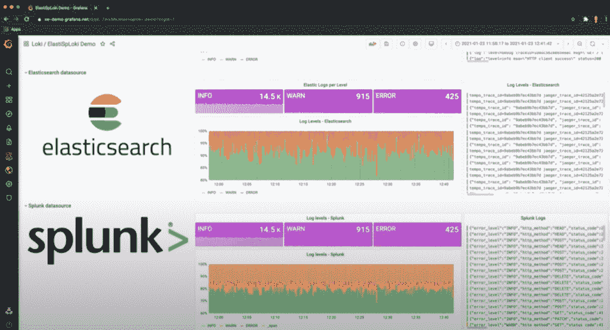
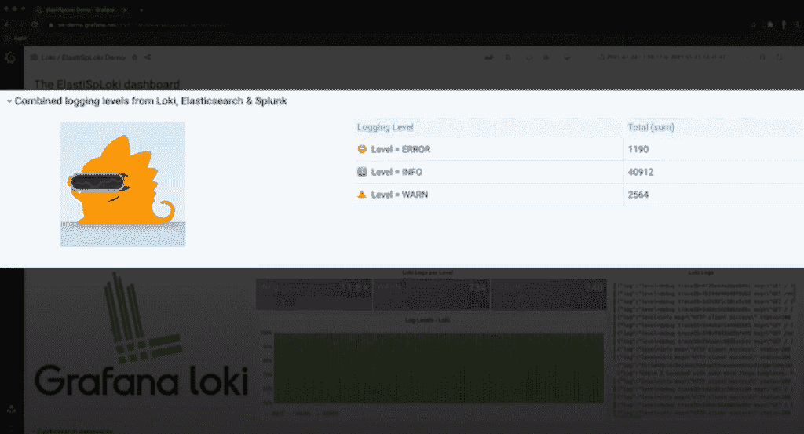

# Grafana 将 Elasticsearch 添加到它的“大帐篷”数据源中

> 原文：<https://thenewstack.io/grafana-adds-elasticsearch-to-its-big-tent-of-data-sources/>

Grafana 的 Elasticsearch 新插件进一步增加了云原生可观测性工具不断增长的数据源名册，Grafana 实验室将其描述为支持平台的“大帐篷”。

在 Elasticsearch 插件可用之前，许多 Grafana 用户已经“黑出了他们自己的解决方案”，与 [Elasticsearch](https://www.elastic.co/) 可扩展搜索和分析引擎合作，[Grafana Labs](https://www.linkedin.com/in/radutt)的首席执行官兼联合创始人 Raj Dutt 告诉新堆栈。“在 Grafana 和弹性开源社区的帮助下，新插件将使这一过程更加简单，”他说。

Grafana 是一个多平台开源分析和交互式可视化 web 应用程序，广泛用于许多云本地计算部署。

这种伙伴关系的其他好处包括更多的功能，如聚合、更广泛的查询语言支持，以及对节省空间的结构(如汇总和其他功能)的支持。

Dutt 说:“Elasticsearch 是最受欢迎的数据平台之一，我们的用户目前在其 Grafana 部署中可视化，因此与他们合作开发一个原生插件是确保我们的客户拥有结合这两种工具的流畅、积极体验的最佳方式。”

将 Elasticsearch 添加到不断增长的 Grafana 插件列表中也允许组织采用来自服务提供商的几种不同的可观察性工具。

“这对他们来说真的很容易——我们有近百种不同的插件，从免费到付费(企业插件)，”Dutt 说。

在 Grafana 描述为“大帐篷”的情况下，Dutt 说 Grafana 实验室的主要理念是让用户“完全控制他们的可观察性策略，扩展到他们喜欢使用的特定工具，”Dutt 说。

“我们在 Grafana Labs 的作用是让他们能够将他们聚集在一起，了解他们所有的数据，无论数据在哪里，”Dutt 说。

除了合作开发 Elasticsearch，Dutt 指出，现在 Grafana Labs 已经与许多其他组织合作，包括亚马逊网络服务、甲骨文、Azure 和谷歌。Dutt 说，开发众多插件背后的想法是“让它们更进一步，以便它们可以更有效地呈现和交互来自这些来源的数据”。

他说，例如，现在用户可以将 Elasticsearch、Splunk 和 Loki“整合到一个仪表板中，甚至可以在它们之间运行计算，而无需移动底层数据”。

[Tom Wilkie](https://uk.linkedin.com/in/tomwilkie) ，Grafana Labs 的产品副总裁， [Prometheus](https://prometheus.io/) 的维护者， [Loki](https://grafana.com/oss/loki/) 和 [Cortex](https://grafana.com/oss/cortex/) 的共同创建者，他指出，除了 Elasticsearch 之外，Grafana 现在还可以可视化来自 Prometheus、Loki 和“近 100 个其他数据源”的数据。

威尔基说:“这对格拉夫纳来说是非常独特的。“我们的‘大帐篷’方法是关于不偏袒——我们平等对待所有数据源，并投资于 Elasticsearch 以及 Loki、Splunk、Google Stackdriver 日志等。”

从许多方面来看，Elasticsearch 都是 Grafana 的前身项目，Grafana 于 2013 年从该项目中分离出来。正如 Dutt 在一篇博客文章中指出的那样，Grafana Labs 的联合创始人 tor kel dega ard 创建了 Grafana 作为 Kibana 3 的一个分支，它是 Elasticsearch 平台的前端。

杜特写道，德加德的意图是创造一个“以时间序列和图表为中心的仪表板工具”。

“虽然 Elastic 决定 Kibana 的任务是只可视化来自 Elasticsearch 的数据，但 Grafana 将支持多种数据源的可视化。从那时起，数据来源的列表已经扩展到包括从 Graphite 和 Prometheus 到 GitLab 和 Splunk 的所有内容——是的，还有 Elasticsearch，”Dutt 说。

<svg xmlns:xlink="http://www.w3.org/1999/xlink" viewBox="0 0 68 31" version="1.1"><title>Group</title> <desc>Created with Sketch.</desc></svg>