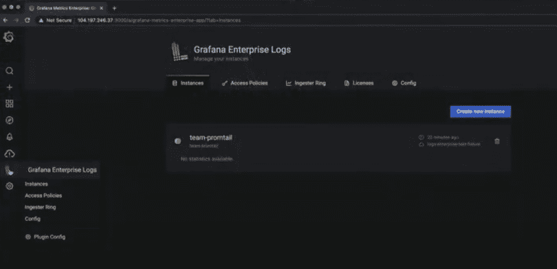
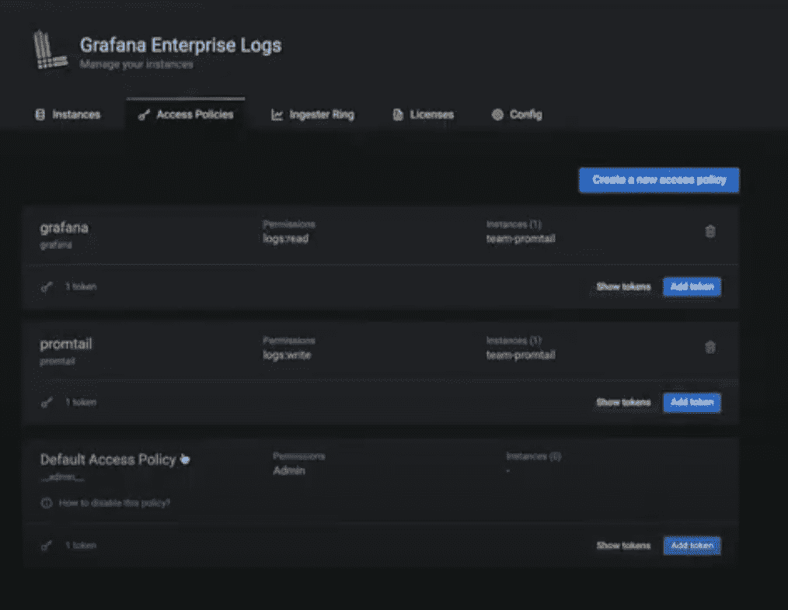

# Grafana 将日志记录添加到其企业可观察性堆栈中

> 原文：<https://thenewstack.io/grafana-adds-logging-to-its-enterprise-observability-stack/>

Grafana Labs 为 [Grafana Enterprise](https://grafana.com/products/enterprise/) 系统监控平台添加了日志索引、存储和管理控制，以寻求为其企业用户构建完整的云原生可观察性堆栈。

基于 Grafana 维护的 [Loki](https://github.com/grafana/loki) (用于日志记录)和 [Cortex](https://grafana.com/oss/cortex/) (用于 Prometheus 上的指标查询)开源平台，该概念还旨在帮助满足 Grafana 企业堆栈内的日志记录功能需求，同时补充指标和其他 Grafana 企业功能。

“我们看到的是，采用 Grafana Enterprise 的组织非常喜欢我们的方法，并且越来越多地表达了在度量和日志存储的相邻领域采用我们的解决方案的愿望，” [Grafana Labs](https://grafana.com/) 的产品副总裁 [Tom Wilkie](https://uk.linkedin.com/in/tomwilkie) 告诉新堆栈，他也是 [Prometheus](https://prometheus.io/) 的维护者以及 [Loki](https://grafana.com/oss/loki/) 和 [Cortex](https://grafana.com/oss/cortex/) 的共同创建者。“Grafana Enterprise Metrics 和 Grafana Enterprise Logs 是我们在这方面的产品，它们建立在 Cortex 和 Loki 项目的基础上，使技术更易于使用、操作更简单，并适合大型组织的需求。”

在日志功能发布之前，Grafana 开发团队观察到用户如何从传统技术(如 Graphite 和 OpenTSDB 或自定义内部解决方案)转向企业级 Prometheus 解决方案，“可以处理大型现代组织的规模、可靠性和安全性要求，”Wilkie 说。Wilkie 说:“特别是，GEM 提供了内置的石墨兼容性以及其原生的 Prometheus 架构，可以帮助用户逐步和增量地从石墨迁移。

对于日志聚合，Wilkie 观察到与 Grafana Labs 合作的大多数组织使用 Splunk 或 Elastic。“Splunk 或 Elastic 是非常强大和有能力的产品，但我们发现组织正在为他们的开发人员日志寻找一个更加云本机、可扩展和集成的‘可观察性优先’解决方案，”Wilkie 说。“我们又发现，他们想集中基层收养格拉法纳·洛基。有趣的是，这往往会增强他们现有的日志聚合解决方案，这些解决方案仍然用于更复杂的分析和 BI 用例。”

Grafana Labs 表示，Grafana 企业堆栈捆绑包现在包括:

*   **Grafana Enterprise Logs，**基于 Grafana Loki，适用于大型组织，增加了管理、安全和可扩展性功能。
*   **Grafana Enterprise，**用于大型组织的可观察性自我管理和与商业数据源的集成，如 [Splunk](https://www.splunk.com/) ，以及附加的安全特性。
*   **Grafana Enterprise Metrics，**基于[Cloud Native Computing Foundation](https://cncf.io/?utm_content=inline-mention)的 Cortex 项目，增加了管理、安全性和可扩展性功能。

“现有的 Grafana 用户已经转换到 Grafana Enterprise 有一段时间了，特别是当他们需要连接到他们现有的企业数据源时，如 Splunk、Datadog、New Relic 等。，”威尔基说。“他们发现 Grafana 是将来自这些不同系统的数据整合到一个地方的最佳方式，并建立了一个无偏见的‘大帐篷’可观测性平台——这些都没有改变。”

本着 Grafana 以研究为导向和开源开发文化的精神，Wilkie 还表示，Grafana Enterprise 功能的持续扩展并不是一个“要么全有，要么全无”的命题。

“我们仍然看到许多组织采用一些堆栈，而不是其他堆栈。这是 Grafana 实验室方法的一个关键租户:我们的产品允许最终用户拥有他们的可观察性策略，”Wilkie 说。“几乎所有与我们交谈过的组织都在围绕一个集中的可观测性‘服务’团队构建一个战略，将 Grafana 和 Prometheus 等技术的基层采用集中到一个地方。Grafana Enterprise 和 Grafana Enterprise Metrics 为他们提供了一个易于管理、可无限扩展、100%兼容普罗米修斯的解决方案。”

<svg xmlns:xlink="http://www.w3.org/1999/xlink" viewBox="0 0 68 31" version="1.1"><title>Group</title> <desc>Created with Sketch.</desc></svg>