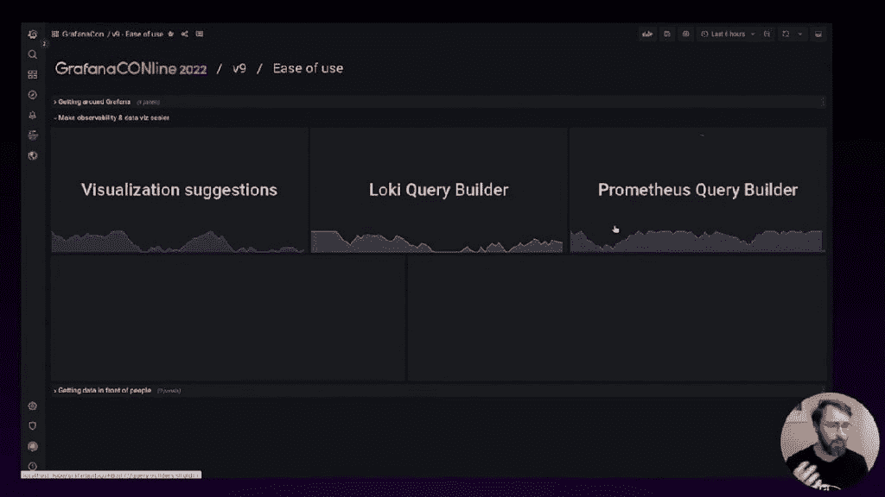

# 9 年后的格拉夫纳:现在怎么办？

> 原文：<https://thenewstack.io/grafana-after-9-years-what-now/>

Grafana 作为一个业余爱好项目已经有九年多的时间了，如今它已经成为一个广受欢迎的监控和可观察性平台，因其在光滑闪亮的界面上进行监控、度量和数据可视化而为人所知和喜爱。在撰写本文时，Grafana 的用户群继续呈指数级增长，现在已经有超过 1000 万的用户和近 100 万个实例，分别有 9700 个和近 50000 个 GitHub forks 和 stars(但 GitHub stars 并不意味着太多)。除了[普罗米修斯](https://prometheus.io/)(它非常适合 Grafana 面板，Grafana 是目前为止最大的贡献者)，Grafana 是目前使用最多的观察工具。

虽然从纯技术的角度来看不那么有趣，但自从 Grafana Labs 的联合创始人[Torkel de gaard](https://se.linkedin.com/in/torkel-odegaard)于 2013 年首次启动 Grafana 项目以来，Grafana 的员工人数已经膨胀到 750 多人。Grafana Labs 在 2022 年的 C 轮投资中获得了 2.2 亿美元的资金，并在 D 轮投资中获得了 2.4 亿美元的资金，而宏观层面上对科技和软件公司的估值在 2022 年大幅下降。因此，为了技术，让我们希望 Grafana 将这些资金投资于工程和使其软件更好，而不是以不平衡的方式增加营销人员。有趣的是，Grafana 报告其收入也在激增(它没有披露财务细节)，而在其 1000 万且不断增长的用户群中，只有大约 100 个付费账户占其收入的 95%以上。

还有呢。

软件领域的主导地位不一定有很长的寿命(网景公司和 [)微软公司管理不善和固有缺陷的 ie 浏览器在浏览器大战中的份额损失](https://www.computerworld.com/article/3663442/death-of-internet-explorer-good-riddance-to-bad-rubbish.html) 只是一个例子。这就引出了一个问题，Grafana Labs 作为一家公司，现在必须和应该做些什么来保持其作为可观察性和数据可视化首选方案的地位。根据最近举行的 GrafanaCONline 年度用户会议上的讲话和我对 Grafana 的实验，我看看 Grafana 实验室正在做什么和可以做什么来使它更容易访问和改进它的易用性，以及本文中提供的新功能。在这种背景下，看看 Grafana Labs 是否能保持其仍在快速增长的人气的滚雪球效应的势头将是有趣的。

## 更容易和更多

Grafana 似乎继续在过去几年中做得最好的事情上加倍努力:即在每个版本中连续提供一致的改进，而不是提供一个大爆炸版本，并为企业版提供不平衡的功能。然而，更多的功能是为了改善 Grafana 仪表盘的整体体验，以及 Grafana [Loki](https://grafana.com/oss/loki/) 、 [Tempo](https://grafana.com/docs/tempo/latest/) 和现在的[米伊美](https://grafana.com/blog/2022/03/30/announcing-grafana-mimir/)组件的使用。

正如德加德在《格拉夫纳在线》期间所承认的那样， “格拉夫纳并不总是那么容易。”他还补充说，使“易用性的改进”和使可观察性和数据管理总体上更容易是 Grafana 实验室目前的一项关键任务。“这是 Grafana Labs 的一项重大任务，总的来说，重点是让更多人更容易、更方便地观察和可视化数据，”dega ard 说。有一种方法可以让你更容易找到格拉法纳附近的路

## 无障碍改进

Grafana 9.0Grafana 9.0 中用户可以体验到的 Grafana 最近的可访问性改进包括可视化建议。该特性有助于解决特定查询的“获得正确的可视化和设置”问题。找到正确的设置对用户来说是一个挑战，主要是因为 Grafana 如何支持如此大量的数据源和用例。

德加德说，当用户必须找到与某个数据集一起工作的特定可视化，或者需要支持输入特定可视化所需的设置时，“这个功能不是那么微不足道”。 以前，用户在输入错误的可视化设置后会收到一条一般性错误消息。通过可视化建议，用户可以得到帮助，并支持选择和输入正确的设置。”

易访问性的其他改进包括导航栏“看起来与旧的非常相似，但改进了键盘支持和易访问性，” 德加德说。 有了它，用户能够展开导航栏，更轻松地浏览不同的部分。新的搜索引擎和搜索用户界面的更新都是新的改进。

“新搜索令人兴奋的是，这个新的搜索引擎不仅允许我们向您显示仪表板，而且我们可以显示和搜索仪表板内的面板，您可以快速导航到仪表板内的面板，”dega ard 说。

## 还有很多事要做

然而，还有许多工作要做。尽管 Grafana 对可视化进行了改进，但 Grafana 仍然可以使用更多的自动化和更少的命令行工作，而不是将其变成一个低代码平台。Google Sheets 集成只是一个例子。对于数据可视化的数据源，Google Sheets 不是默认的 Grafana 数据源。这意味着此时有必要 访问 Docker 和 Docker CLI，并安装在 Grafana Cloud 上可视化 Google Sheets 数据所需的插件。这需要一点手动命令行配置，如本演示所示的 [。](https://www.youtube.com/watch?v=GnWZsHjM5To&ab_channel=Thetips4you) (但是，需要注意的是，Grafana Labs 提供了基于非 CLI 的 Grafana Cloud 安装，允许直接安装 Google Sheets[。)](https://grafana.com/grafana/plugins/grafana-googlesheets-datasource/?tab=installation)

缺乏一种简单的点击方式来将像 Google Sheets 这样受欢迎的数据文件上传到 Grafana 仪表板上进行可视化就是一个例子。希望其他数据库文件类型将变得更容易访问，而不必配置 Docker 容器和执行其他手动过程。为此，数据可视化和可观察性的新玩家正在出现，他们提供了更多的点击式功能和低代码易用性。例如， [Directus](https://directus.io/) 被创建来作为一个开源数据平台，为开发人员自动包装任何带有实时 GraphQL+REST API 的 SQL 数据库，以及作为非技术用户的无代码数据协作应用程序。

结论是 Grafana Labs 继续改进其在 wa ys 中的开源产品，这些产品已经为用户带来了切实的好处，尽管如上所述，仍有许多需要改进的地方——也就是说，如果 Grafana Labs 计划继续寻求使其仪表板更易于访问的方法，甚至可能走上低代码的道路。然而，可以说，那些寻找 Grafana 为所谓的公民开发者提供低代码框架的人，或者寻找创建简单数据可视化或其他基本项目的外行人，可能没有抓住要点。也有其他提供者正在逐步提供数据可视化的低代码替代方案，比如上面提到的 Directus。

与此同时，Grafana Labs 现有的无数功能只会越来越好，越来越强大。说到底，一些用户在安装和运行 Grafana 仪表板时遇到困难的比率确实非常低，因为 Grafana 的强大功能使其在可观察性领域非常出名。

<svg xmlns:xlink="http://www.w3.org/1999/xlink" viewBox="0 0 68 31" version="1.1"><title>Group</title> <desc>Created with Sketch.</desc></svg>