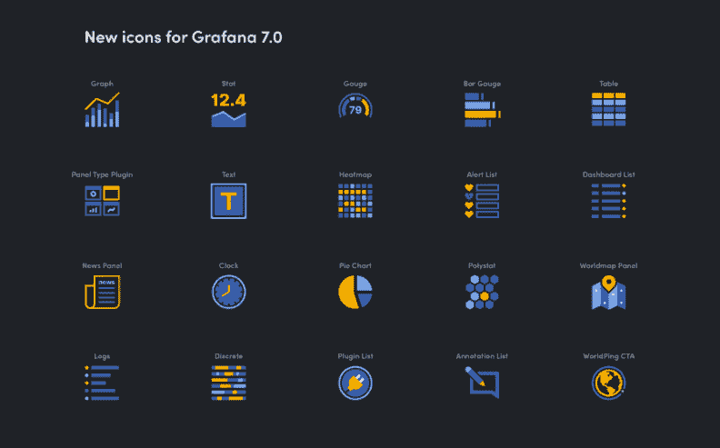

# Grafana 和 InfluxDB 建立了更强的联系

> 原文：<https://thenewstack.io/grafana-and-influxdb-build-a-stronger-connection/>

绘制 InfluxDB 和 Grafana 用户的维恩图总是显示出很大的重叠。

[Grafana](https://grafana.com/) 提供了一个仪表板，用于记录、度量和可追溯性的可观察性，这一直受到具有前瞻性思维的 DevOps 人员的青睐。由于 Grafana 是开源的，它一直被用作查询和访问来自各种数据源的信息的手段。

来自 [InfluxData](https://www.influxdata.com/) 的时序数据库 InfluxDB，在早期是支持 Grafana 的流行数据库选择。

现在，两家供应商都试图通过帮助简化连接最近发布的 [Grafana](https://grafana.com/) 和 [InfluxDB](https://www.influxdata.com/) 的过程来弥合各自平台之间的重叠。

“我们有一个庞大的重叠用户群体，”InfluxData 产品副总裁蒂姆·霍尔(Tim Hall)告诉新的 Stack。“我们真的很想支持 Grafana 推出这个新版本的 Grafana 7.1，因为这是我们的联合社区成员一直渴望的可用性和易用性方面的重大进步。”

对于使用 Grafana 运行 InfluxDB 1.x 开源版本、希望采用 [InfluxDB Cloud 2.0](https://thenewstack.io/getting-started-demo-monitoring-with-a-time-series-database-on-influxdb-cloud-2-0/) 但保持 [Grafana 7.0](https://grafana.com/docs/grafana/latest/guides/whats-new-in-v7-0/) 参数和仪表板不变的用户来说，这种转变变得更加容易。因为通过将数据定向到 InfluxDB Cloud 2.0 产品，可以继续使用现有的 Grafana 仪表盘和设置。

“这个过程实际上应该只是指向仪表盘，点击并运行，”霍尔说。

以前，缺少的是完成这一过程的“入口”,以便 DevOps 团队选择从 InfluxDB 1.x 的自我管理版本和 Grafana 的早期版本的安装切换到 Grafana 7.1 和 InfluxDB Cloud 2.0。

“他们以前不得不经历一些困难——他们必须找到一个测试版插件来完成这个过程，下载它，等等。，”霍尔说。“现在这一切都过去了，它不再是一个独立的实例，因为用户可以决定他们使用的查询语言，它将适用于我们的任何产品版本。”

在过去几年中，InfluxData 和 Grafana 一直在扩展各自的产品，同时在许多情况下，扩大了重叠的使用场景。InfluxData 在去年下半年开始提供 InfluxDB Cloud 2.0 作为无服务器时间序列平台即服务(PaaS)。该版本为 DevOps 团队提供了一种“现收现付”模式，有助于在使用该平台时促进容量规划，同时继续利用 InfluxData 广受欢迎的 Chronograf 仪表板和 Telegraf 插件进行时间序列数据分析、跟踪和监控。InfluxData 最近还推出了用于时序数据库的 Flux 编程语言。

Grafana 7.0 提供的新功能包括 UX 和可视化增强，插件平台的改进，包括新的 React 组件库和更全面的日志数据不足时的跟踪功能。一个非常受欢迎的转换功能允许将非时序数据自动放入表中，而无需额外的步骤或修改。

InfluxData 是新堆栈的赞助商。

通过 Pixabay 的特征图像。

目前，新堆栈不允许直接在该网站上发表评论。我们邀请所有希望讨论一个故事的读者通过 [Twitter](https://twitter.com/thenewstack) 或[脸书](https://www.facebook.com/thenewstack/)访问我们。我们也欢迎您通过电子邮件发送新闻提示和反馈: [feedback@thenewstack.io](mailto:feedback@thenewstack.io) 。

<svg xmlns:xlink="http://www.w3.org/1999/xlink" viewBox="0 0 68 31" version="1.1"><title>Group</title> <desc>Created with Sketch.</desc></svg>