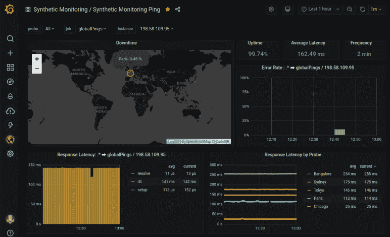
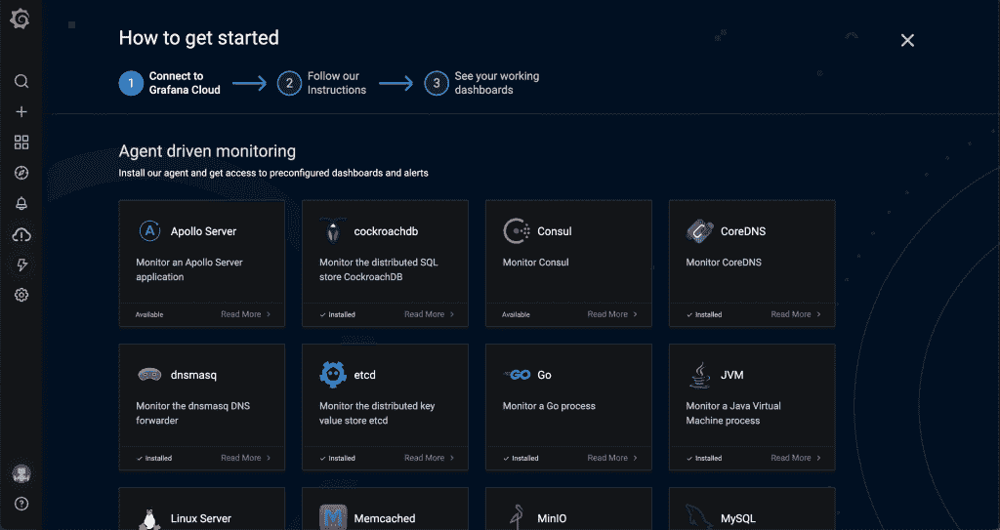

# Grafana 扩展了云管理的可观测性的免费访问

> 原文：<https://thenewstack.io/grafana-extends-free-access-for-cloud-managed-observability/>

希望扩大其已经流行的可观测性平台的覆盖范围，Grafana 实验室现在提供免费访问其 Grafana 云平台。该公司还在其标准定价计划下为企业产品添加了更多功能。

以前，用户可以免费访问 Grafana 云控制台来监控 Kubernetes 与 Prometheus、Loki 和 Tempo 的部署，但仅限于 14 天的试用期。对于 Grafana Pro 用户，每月 49 美元的订阅计划现在允许 15，000 个系列的指标存档 13 个月，而不是 3，000 个系列。

“这对所有现有的 Grafana 云用户来说都是一个很大的好处，因为一些目前付费的用户将免费获得服务，而其他人将以更低的成本获得服务，” [Grafana Labs](https://grafana.com/) 的产品副总裁 Tom Wilkie ，他也是 [Prometheus](https://prometheus.io/) 的维护者和 [Loki](https://grafana.com/oss/loki/) 和 [Cortex](https://grafana.com/oss/cortex/) 的共同创造者，告诉新的堆栈。“我们能够做到这一点，因为我们知道如何高效地大规模运营这些服务，以便将这些优势传递给我们的客户。”

Grafana 传达了 Grafana Cloud 为美国免费提供的以下功能:

*   10，000 系列用于普罗米修斯或石墨度量。
*   50 GB 的日志。
*   指标和日志保留 14 天。
*   最多可供三名团队成员使用。

Grafana 表示，在 Grafana Pro 服务下，它为用户提供:

*   保留期为 13 个月的指标为 15，000 个系列(以前为 3，000 个)。
*   保留一个月的 100GB 日志。
*   报告和 PDF 导出。
*   高级身份验证(SAML/OAuth/LDAP)。
*   数据源权限。
*   借助仪表板洞察力和团队存在进行团队协作。
*   自定义域。

格拉夫纳和普罗米修斯已经成为领先的观测工具。例如，在[云本地计算基金会](https://www.cncf.io/)的[技术雷达调查](https://radar.cncf.io/2020-09-observability)中，三分之二的受访者表示他们同时使用 Grafana 和 Prometheus。CNCF 报告的作者还指出，用户开始使用这两个开源工具的门槛相对较低，以及许多可用的[免费教程](https://www.youtube.com/watch?v=acbw4_fa7Is&ab_channel=Grafana)，都有助于降低采用的门槛。然而，尽管很容易开始，但是对于许多组织来说，大规模集成和使用这些工具可能具有挑战性，尤其是那些缺乏内部资源来完成这样一个项目的组织。

“Grafana 和 Prometheus 开源项目都非常容易上手和使用——这一点已经存在一段时间了，我们正在让它们变得更加容易，”Wilkie 说。“而是一个完整的集成堆栈，包括日志、跟踪、代理、仪表板、警报等。—使用开源组件更难实现，需要优秀的工程师花费数天甚至数周时间进行设置。”

与此同时，Grafana 和 Prometheus“正在成为可观察性的事实上的标准，并被广泛的基层接受，”Wilkie 声称。“每个首席技术官和工程副总裁都在关注他们的监控需求，”威尔基说。“但并不是每个组织都有时间和资源将它们整合在一起并充分利用它们。”

Wilkie 说，Grafana 广受欢迎的仪表盘的扩展访问也旨在“让更多人可以使用该平台，推动更多流量，增加其运行规模，为所有用户带来好处”。“与此同时，这一举措使更多人可以使用基于非常受欢迎的开源项目(Grafana、Prometheus、Loki 和 Tempo)的完全集成的可观测性平台，”Wilkie 说。

<svg xmlns:xlink="http://www.w3.org/1999/xlink" viewBox="0 0 68 31" version="1.1"><title>Group</title> <desc>Created with Sketch.</desc></svg>