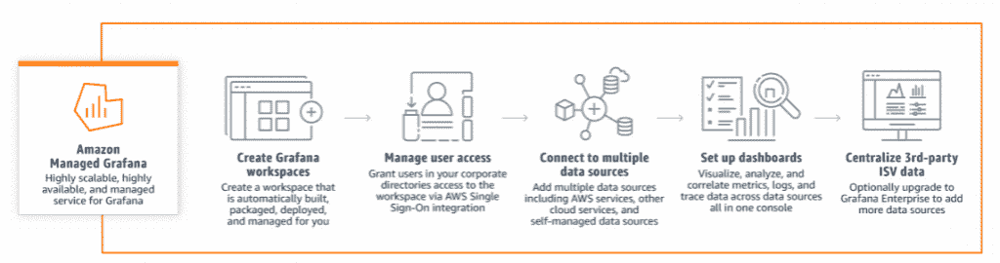
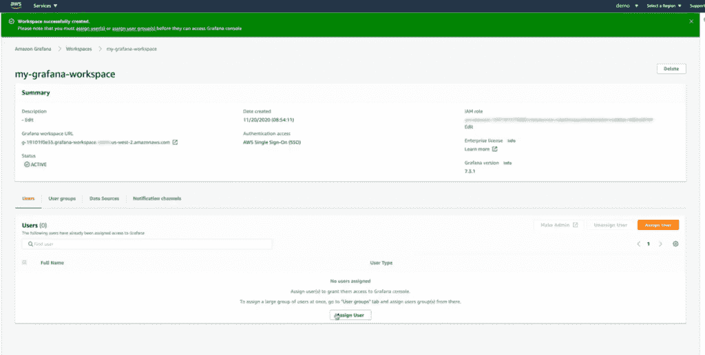

# 格拉夫纳并不担心 AWS 商业化

> 原文：<https://thenewstack.io/grafana-is-not-worried-about-aws-commercialization/>

亚马逊网络服务(AWS)现在正在提供广受欢迎的 [Grafana](https://grafana.com/) 开源监控前端作为商业服务，作为另一个观望测试案例，看看当 AWS 选择围绕一个受欢迎的开源产品构建商业服务产品时会发生什么。

在[亚马逊管理 Grafana](https://aws.amazon.com/grafana/) 作为 AWS 提供的服务于上周[普遍可用](https://aws.amazon.com/blogs/aws/amazon-managed-grafana-is-now-generally-available-with-many-new-features/)后，此举引发了关于 Grafana 实验室潜在商业风险的问题。可以想象，如果 AWS 的 Grafana 服务导致通过其渠道使用 Grafana 服务业务的用户减少，这些风险可能包括 Grafana Labs 的收入损失。Grafana 的另一个潜在风险是，如果 AWS 与 Grafana 分道扬镳，提供类似的可观测性平台，与 Grafana 直接竞争(理论上，也与 AWS Grafana 竞争)。

以前，组织可以在其 AWS 托管的环境中实施和运行 Grafana Enterprise 和 Grafana Cloud，Grafana、Loki 和 Cortex 的开源版本，以及 Prometheus。现在的变化是，Grafana Enterprise 和其他 Grafana 工具现在可以在 AWS 直接向其客户提供的产品中使用。这解决了 Grafana 用户可能面临的潜在操作和实施挑战。

企业管理协会(EMA)的分析师 Torsten Volk 告诉《新堆栈》。“亚马逊管理的 Prometheus 和亚马逊管理的 Grafana 之间的集成现在非常容易使用，只需将 AWS 工作区的 URL 粘贴到 Grafana Prometheus 数据源中，”Volk 说。“因此，Grafana 作为 Kubernetes 工作负载在 AWS 上的首选控制面板而受益，而 AWS 则通过标准开源工具提供超级简单的监控功能而受益。”

Grafana 实验室发言人说，Grafana 将从 AWS 管理的 Grafana 服务中获得收入。“我们与 AWS 的官方合作为 Grafana 实验室创造收入提供了多种途径，”发言人告诉 New Stack。发言人补充说，Grafana Labs 还将受益于 Splunk、Snowflake、MongoDB、Dynatrace、AppDynamics 和其他“与 Grafana Enterprise 升级直接相关”的数据源插件。

到本文发表时，AWS 还没有发表评论。

与此同时，AWS 在今年早些时候选择将 Elasticsearch、流行的分析引擎 T1 和 T2 的 Kibana T3 分开，并推出了它所谓的 OpenSearch 项目。出于多种原因，此举引起了社区中一些人的质疑和担忧。然而，其他观察人士表示，AWS 此举是必要的，以对抗 Elasticsearch 使用这些开源项目的商业模式。

AWS 在 2019 年开始提供 [MongoDB](https://www.mongodb.com/cloud/atlas/?utm_content=inline-mention) 作为其云产品的一部分，并为 MongoDB 提供商业支持服务，这可以被视为类似的举动。与此同时，MongoDB 现在基于其开源堆栈提供商业服务。

然而，根据 Volk 的说法，与亚马逊提供 Elastic 和 MongoDB 作为托管服务的区别在于，“Grafana Labs 和 AWS 之间似乎存在实际的合作关系，”Volk 说。“通过让 Grafana 满意，AWS 可以提供内置的深度 Kubernetes 监控和可观测性，这是在与 Azure 和 GKE 的激烈竞争中的一个主要优势，”Volk 说。

今年 8 月，Grafana Labs 宣布已经筹集了 2.2 亿美元的 C 轮投资，估值为 30 亿美元。这是两年前宣布的 A 轮融资估值的 10 倍以上。

“Grafana 最新的 2.2 亿美元表明了可观察性话题在今天有多热门，并使人们直观地理解为什么这可能会变成一种互利的关系，而 AWS 在短期内几乎没有动力支持 Grafana 的 GitHub 回购，”Volk 说。

<svg xmlns:xlink="http://www.w3.org/1999/xlink" viewBox="0 0 68 31" version="1.1"><title>Group</title> <desc>Created with Sketch.</desc></svg>