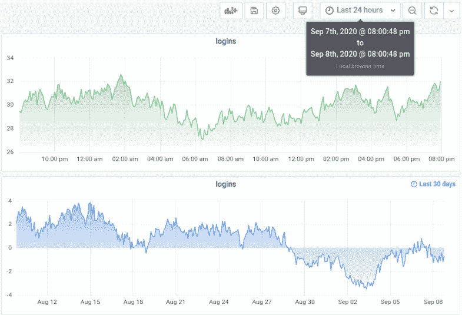
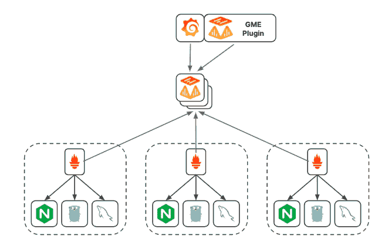
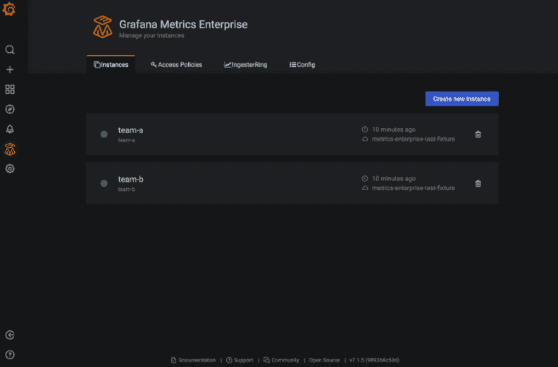

# Grafana Labs 投资加强与 Prometheus 的企业集成

> 原文：<https://thenewstack.io/grafana-labs-invests-in-strengthening-enterprise-integrations-with-prometheus/>

Grafana 已经成为一个流行的云本地可观察性仪表板，用于记录、度量和可追溯性。许多 Grafana 用户还学习如何将 Grafana 作为一个项目或一个[家庭可视化工具](https://grafana.com/blog/2019/10/29/how-to-set-up-this-next-level-personal-home-dashboard-in-your-kitchen/)(这是作者推荐的)来运行，以此来熟悉 Grafana 和 Prometheus 的时间序列数据监控，以及其他工具，如 Telegraf 和 InfluxDB。

但是，在组织范围内采用和实施可能会更加困难，尤其是对于资源紧张的组织。据该公司称，为了帮助加快其作为查询和访问各种数据源信息的方式的使用，Grafana Labs 投资了 5000 万美元的风险投资，以扩大其可视化工具的覆盖范围。

为此，Grafana 最近用 7.2 的[版本扩展了 Grafana 7.0，以包括更多的数据修改选项，用于可视化，包括时间范围、图表和其他选项。商业版 Grafana Metrics Enterprise (GME)也已发布。](https://grafana.com/blog/2020/09/23/grafana-v7.2-released-with-custom-date-formats-new-transforms-and-overrides/?utm_source=tw&utm_medium=social)

Grafana 表示，它还试图通过使用其仪表板来消除采用 Prometheus 的许多障碍。这些改进包括为普罗米修斯公司的 Grafana 仪表板提供更好的安全性、可靠性和其他好处。

Grafana Labs 的产品副总裁 [Tom Wilkie](https://www.linkedin.com/in/tomwilkie/?originalSubdomain=uk) 说:“Prometheus……越来越受欢迎，但在企业层面采用这项技术还有很多挑战，他也是 Prometheus 的维护者和 [Cortex](https://github.com/cortexlabs/cortex) 的共同创造者。

Grafana 帮助解决的具体问题包括 Prometheus 的单进程模型如何“要求您在功能上分割部署以应对增长——这增加了管理开销和复杂性，”Wilkie 说。" GME 会自动对数据进行分片，以实现真正的水平可伸缩性."

威尔基说，GME 帮助解决的另一个问题是普罗米修斯的高可用性模型如何依赖成对的普罗米修斯服务器来抓取相同的目标。

“当服务器出现故障，或者需要重启以应用更新时，您的图表中就会出现缺口，”Wilkie 说。GME 使用发电机式复制来实现真正的高可用性，当节点出现故障时，您的图表中不会出现缺口

“Prometheus 也没有内置的访问控制或多租户功能，所以这些必须使用定制软件或通过给不同的团队不同的 Prometheus 实例来实现，”威尔基说 GME 同时具备访问控制和多租户功能，允许多个团队完全隔离地安全共享同一个集群，”Wilkie 说。

最后，GME 是建立在云计算原生计算基金会的 Cortex 项目上的，“该项目因难以上手而臭名昭著，”威尔基说。“GME 添加了一个易于使用的嵌入在 Grafana 中的用户界面，用于管理您的 GME 集群，并作为一个单一的二进制，单一进程部署，没有依赖性，”威尔基说。

GME 背后的开发努力也旨在帮助 Grafana 降低运营成本，提高安全性，并最终提高健壮性。Wilkie 说，通过集中管理他们的监控堆栈，同一组织内的不同团队可以安全地共享一个可扩展的 GME 集群。

Wilkie 说，由于“需要管理的事情更少”，GME 提供了一种基于推送的代理架构，将 Prometheus(数据模型、PromQL、性能和集成)的优势带给了那些由于网络拓扑、安全规则或合规性控制而难以实施 Prometheus 拉式模型的组织。

Prometheus 指标的扩展和长期存储的简化和自动化。威尔基说:“GME 建立在 CNCF 的 Cortex 项目基础上，并使用与 Grafana Cloud 的 Prometheus 服务相同的成熟技术，因此您可以相信它可以扩展到最大组织的需求。”

云计算原生计算基金会(CNCF)和 InfluxData 是新堆栈的赞助商。

来自 Pixabay 的 Couleur 的特写图像。

<svg xmlns:xlink="http://www.w3.org/1999/xlink" viewBox="0 0 68 31" version="1.1"><title>Group</title> <desc>Created with Sketch.</desc></svg>