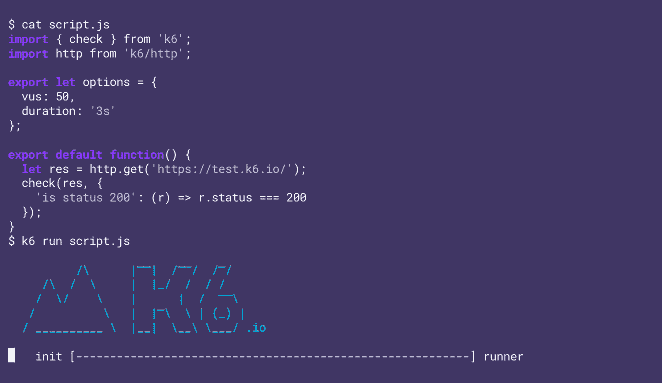
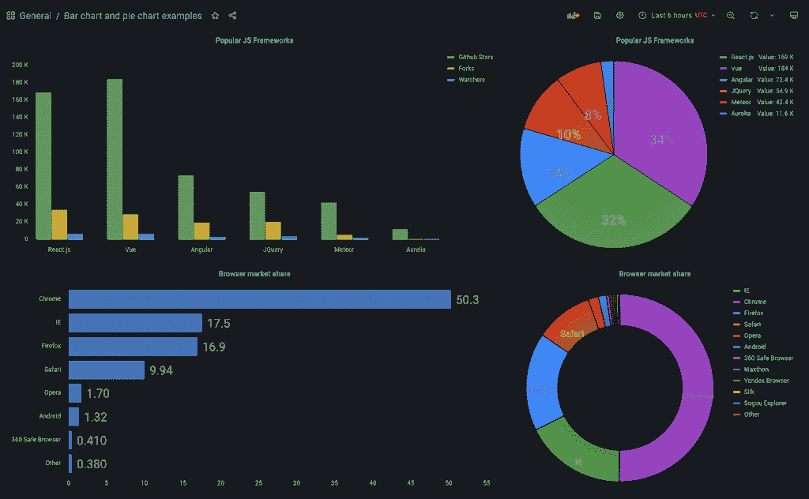

# Grafana Labs 购买 k6 直接增加了可观察性控制台的负载测试

> 原文：<https://thenewstack.io/grafana-labs-purchase-of-k6-adds-load-testing-directly-to-observability-console/>

Observability 软件提供商 [Grafana Labs 的](https://grafana.com/)上周收购了开源负载测试工具和服务提供商 [k6](https://k6.io/) 将为用户提供更加深度集成的 Grafana 控制台测试功能。这一举措也强调了对软件发布进行持续和主动的前期和后期生产可观察性的重要性。

Grafana Labs 的首席执行官兼联合创始人 [Raj Dutt](https://www.linkedin.com/in/radutt) 在回答问题的电子邮件中告诉新的堆栈，通过将可扩展测试添加到其可观察性堆栈，日志、指标和跟踪 k6 服务将直接在 Grafana 的控制台上可用，并与 Grafana 提供的其他指标数据相集成。

“k6 允许团队测试性能和可伸缩性，作为开发过程或后期制作的一部分，”他说。“随着敏捷开发、持续交付和持续开发的趋势，QA、测试和生产之间的界限比以往任何时候都更加模糊，这使得团队如何对待测试需要一个新的范例。K6 在软件开发生命周期的早期集成时最有价值，这使团队能够持续测试回归，并在投入生产之前发现问题，从而使他们能够更快地创新，风险更小。”

目前，用户可以运行 k6 负载测试，并让 Grafana stack 观察他们正在测试的系统和应用程序，“这包括一个非常广泛的视图，从系统资源指标到服务之间的实际跟踪和延迟”，一直到日志本身，”Dutt 说。

随着时间的推移，Grafana 将加强这种集成，并提供更加无缝的体验，在一个统一的界面中进行创建、运行和观察的设置和配置。

“最终，我们将通过观察在更高负载下对基础设施和应用的影响，帮助用户可视化和强化他们的系统，并使开发人员能够避免面向客户的生产问题，并在日益严格的开发运维流程中做出更明智的决策。”

k6 的开源负载测试工具和 SaaS 产品，除了负载测试，还提供混沌和可靠性测试，以及性能和综合监控。能够在软件开发的整个生产管道中集成 k6 进行负载测试的功能，对于那些以前由于担心降低生产发布速度而放弃测试的开发人员来说是很有用的。

[企业管理协会(EMA)](https://www.enterprisemanagement.com/) 的分析师 [Torsten Volk](https://www.linkedin.com/in/torstenvolk) 告诉 The New Stack，“我们大多数参与软件开发的人都被无数次地用‘合理的假设’取代负载测试，这些假设是我们认为整体微服务或应用在特定类型的负载下会如何表现。”。“即使是经验丰富的开发主管也会落入这个陷阱，因为创建一个甚至是半真实的负载测试的设置通常是一件痛苦的事情，并且会增加总体开发成本。如果 Grafana 和 K6 能够提供开发人员只需轻轻一按开关就能打开和关闭的交钥匙仪表盘和负载生成器，那么这将是一个非常有吸引力的产品。”

同时，此次收购也表明 Grafana Labs 认识到，真正的可观察性不仅取决于对指标、日志和跟踪的响应，还允许 DevOps 团队在软件发布前后通过单一界面主动进行推断和测试。这种分析数据的能力有助于加快软件发布前后的应用交付、调试和修复。

“可观察性供应商已经努力了一段时间，让开发人员和 IT 运营人员一起使用他们的平台，”Volk 说。“通过在其平台上添加一个经典的开发工具，Grafana 加倍增强了其现有的吸引软件工程团队注意力的能力。这是一个非常聪明的战略举措，因为它放大了 Grafana 在市场上已经很强的差异化。

当被问及 Grafana Labs 在收购 k6 后是否有一天会不仅仅是一个可观测性提供商时，Dutt 在他的电子邮件中提出了以下观点:

> *   可观察性最终是为了帮助开发人员以更低的风险更快地行动，我们认为最好的方法是尽可能早地发现问题，并且理想地从一开始就防止它们出现在产品中。
> *   随着软件和基础设施越来越复杂，失败会以新的和意想不到的方式发生(事实上，这正是行业开始使用“可观察性”而不是“监控”这个词的原因)。开发人员需要新的测试方法，使他们能够经济高效地模拟真实世界的场景。K6 为这个问题提供了一个现代的、开源的解决方案，我们把它看作是可观察性的自然延伸，这一切都是为了找到问题的根源。
> *   K6 在软件开发生命周期的早期帮助开发人员，以一种无风险的方式帮助找到这些根本原因。团队不必猜测假日促销是否会使他们的电子商务网站宕机，他们可以使用相同的可观察性平台来了解他们测试的行为，甚至是个人的跟踪和日志。

<svg xmlns:xlink="http://www.w3.org/1999/xlink" viewBox="0 0 68 31" version="1.1"><title>Group</title> <desc>Created with Sketch.</desc></svg>